<div align="center">
  
 

</div>

<h1 align="center"> Universidad Peruana de Ciencias Aplicadas <h1 align="center">

<h1 align="center"> Carrera: Ingeniería de Software </h1>

<h1 align="center"> Periodo 2025 - 2 </h1>

<h1 align="center"> Código de curso: 1ASI0730</h1>

<h1 align="center"> Nombre del curso: Aplicaciones Web</h1>

<h1 align="center"> NRC: 7452  </h1>

<h1 align="center"> Docente: Mori Paiva, Hugo Allan </h1>

<h1 align="center"> Informe del Trabajo Final (TF) </h1>

<h3 align="center"> Startup: DaL Company </h3>

<h3 align="center"> Product: BusTrack </h3>

<h3 align="center"> Relación de integrantes: </h3>
<div align="center">

| Member                           |    Code    |
| :------------------------------- | :--------: |
| Fátima Belén Florez Shimabukuro | U202320610 |
| Mathias Andree Cardenas Huaman | U202316353 |
| Elizabeth Noelia Apaza Bocanegra | U20231c197 |
| Diego Andres Avalos Cordova | U202313922 |
| Joaquin Alberto Cuentas Peña | U20201f788 |

</div>

<h3 align="center">Diciembre, 2025</h3>

<br><br>

<h3 align="center">Registro de Versiones del Informe</h3>

<div align="center">

| Versión | Fecha | Autor | Descripción de modificación |
| :-----: | :---: | :---: | :-------------------------- |
|  |  |  |  |

</div>

<br><br>

<div align="center">

# Project Report Collaboration Insights

</div>

| URL de la organización del proyecto |
| ----------------------------------- |
| [https://github.com/2025-2-AplicacionesWeb-DalComp](https://github.com/2025-2-AplicacionesWeb-DalComp) |

| URL del repositorio del reporte |
| ------------------------------- |
| [https://github.com/2025-2-AplicacionesWeb-DalComp/Project-report-BusTrack-](https://github.com/2025-2-AplicacionesWeb-DalComp/Project-report-BusTrack-) |

| URL del repositorio de la landing page |
| -------------------------------------- |
| [https://github.com/2025-2-AplicacionesWeb-DalComp/Landing-page](https://github.com/2025-2-AplicacionesWeb-DalComp/Landing-page) |

| URL del repositorio del Frontend |
| -------------------------------------- |
| [https://github.com/2025-2-AplicacionesWeb-DalComp/BusTrack-Frontend](https://github.com/2025-2-AplicacionesWeb-DalComp/BusTrack-Frontend) |

| URL del repositorio del Backend |
| -------------------------------------- |
| [https://github.com/2025-2-AplicacionesWeb-DalComp/BusTrack-Backend](https://github.com/2025-2-AplicacionesWeb-DalComp/BusTrack-Backend) |


<br><br>

# Contenido

## Tabla de Contenidos

### [Registro de versiones del informe](#registro-de-versiones-del-informe)

### [Project Report Collaboration Insights](#project-report-collaboration-insights)

### [Contenido](#contenido)

### [Student Outcome](#student-outcome-1)

### [Capítulo I: Introducción](#capítulo-i-introducción-1)

- [1.1. Startup Profile](#11-startup-profile)
  - [1.1.1. Descripción de la Startup](#111-description-de-la-startup)
  - [1.1.2. Perfiles de integrantes del equipo](#112-perfiles-de-integrantes-del-equipo)
- [1.2. Solution Profile](#12-solution-profile)
  - [1.2.1 Antecedentes y problemática](#121-antecedentes-y-problemática)
  - [1.2.2 Lean UX Process](#122-lean-ux-process)
    - [1.2.2.1. Lean UX Problem Statements](#1221-lean-ux-problem-statements)
    - [1.2.2.2. Lean UX Assumptions](#1222-lean-ux-assumptions)
    - [1.2.2.3. Lean UX Hypothesis Statements](#1223-lean-ux-hypothesis-statements)
    - [1.2.2.4. Lean UX Canvas](#1224-lean-ux-canvas)
- [1.3. Segmentos objetivo](#13-segmentos-objetivo)

### [Capítulo II: Requirements Elicitation & Analysis](#capítulo-ii-requirements-elicitation--analysis-1)

- [2.1. Competidores](#21-competidores)
  - [2.1.1. Análisis competitivo](#211-análisis-competitivo)
  - [2.1.2. Estrategias y tácticas frente a competidores](#212-estrategias-y-tácticas-frente-a-competidores)
- [2.2. Entrevistas](#22-entrevistas)
  - [2.2.1. Diseño de entrevistas](#221-diseño-de-entrevistas)
  - [2.2.2. Registro de entrevistas](#222-registro-de-entrevistas)
  - [2.2.3. Análisis de entrevistas](#223-análisis-de-entrevistas)
- [2.3. Needfinding](#23-needfinding)
  - [2.3.1. User Personas](#231-user-personas)
  - [2.3.2. User Task Matrix](#232-user-task-matrix)
  - [2.3.3. User Journey Mapping](#233-user-journey-mapping)
  - [2.3.4. Empathy Mapping](#234-empathy-mapping)
- [2.4. Big Picture Event Storning](#24-big-picture-event-storning)
- [2.5. Ubiquitous Language](#25-ubiquitous-language)
 
### [Capítulo III: Requirements Specification](#capítulo-iii-requirements-specification-1)

- [3.1. To-Be Scenario Mapping](#31-to-be-scenario-mapping)
- [3.1. User Stories](#32-user-stories)
- [3.2. Impact Mapping](#33-impact-mapping)
- [3.3. Product Backlog](#34-product-backlog)

### [Capítulo IV: Product Design](#capítulo-iv-product-design-1)

- [4.1. Style Guidelines](#41-style-guidelines)
  - [4.1.1. General Style Guidelines](#411-general-style-guidelines)
  - [4.1.2. Web Style Guidelines](#412-web-style-guidelines)
- [4.2. Information Architecture](#42-information-architecture)
  - [4.2.1. Organization Systems](#421-organization-systems)
  - [4.2.2. Labeling Systems](#422-labeling-systems)
  - [4.2.3. SEO Tags and Meta Tags](#423-seo-tags-and-meta-tags)
  - [4.2.4. Searching Systems](#424-searching-systems)
  - [4.2.5. Navigation Systems](#425-navigation-systems)
- [4.3. Landing Page UI Design](#43-landing-page-ui-design)
  - [4.3.1. Landing Page Wireframe](#431-landing-page-wireframe)
  - [4.3.2. Landing Page Mock-up](#432-landing-page-mock-up)
- [4.4. Web Applications UX/UI Design](#44-web-applications-uxui-design)
  - [4.4.1. Web Applications Wireframes](#441-web-applications-wireframes)
  - [4.4.2. Web Applications Wireflow Diagrams](#442-web-applications-wireflow-diagrams)
  - [4.4.3. Web Applications Mock-ups](#443-web-applications-mock-ups)
  - [4.4.4. Web Applications User Flow Diagrams](#444-web-applications-user-flow-diagrams)
- [4.5. Web Applications Prototyping](#45-web-applications-prototyping)
- [4.6. Domain-Driven Software Architecture](#46-domain-driven-software-architecture)
  - [4.6.1. Design-Level Event Storming](#461-design-level-event-storming)
  - [4.6.2. Software Architecture Context Diagram](#462-software-architecture-context-diagram)
  - [4.6.3. Software Architecture Container Diagrams](#463-software-architecture-container-diagrams)
  - [4.6.4. Software Architecture Components Diagrams](#464-software-architecture-components-diagrams)
- [4.7. Software Object-Oriented Design](#47-software-object-oriented-design)
  - [4.7.1. Class Diagrams](#471-class-diagrams)
- [4.8. Database Design](#48-database-design)
  - [4.8.1. Database Diagram](#481-database-diagram)

### [Capítulo V: Product Implementation, Validation & Deployment](#capítulo-v-product-implementation-validation--deployment-1)

- [5.1. Software Configuration Management](#51-software-configuration-management)
  - [5.1.1. Software Development Environment Configuration](#511-software-development-environment-configuration)
  - [5.1.2. Source Code Management](#512-source-code-management)
  - [5.1.3. Source Code Style Guide & Conventions](#513-source-code-style-guide--conventions)
  - [5.1.4. Software Deployment Configuration](#514-software-deployment-configuration)
- [5.2. Landing Page, Services & Applications Implementation](#52-landing-page-services--applications-implementation)
  - [5.2.1. Sprint 1](#521-sprint-1)
    - [5.2.1.1. Sprint Planning 1](#5211-sprint-planning-1)
    - [5.2.1.2. Aspect Leaders and Collaborators](#5212-aspect-leaders-and-collaborators)
    - [5.2.1.3. Sprint Backlog 1](#5213-sprint-backlog-1)
    - [5.2.1.4. Development Evidence for Sprint Review](#5214-development-evidence-for-sprint-review)
    - [5.2.1.5. Execution Evidence for Sprint Review](#5215-execution-evidence-for-sprint-review)
    - [5.2.1.6. Services Documentation Evidence for Sprint Review](#5216-services-documentation-evidence-for-sprint-review)
    - [5.2.1.7. Software Deployment Evidence for Sprint Review](#5217-software-deployment-evidence-for-sprint-review)
    - [5.2.1.8. Team Collaboration Insights during Sprint](#5218-team-collaboration-insights-during-sprint)
  - [5.2.2. Sprint 2](#522-sprint-2)
    - [5.2.2.1. Sprint Planning 2](#5221-sprint-planning-2)
    - [5.2.2.2. Aspect Leaders and Collaborators](#5212-aspect-leaders-and-collaborators)
    - [5.2.2.3. Sprint Backlog 2](#5223-sprint-backlog-2)
    - [5.2.2.4. Development Evidence for Sprint Review](#5224-development-evidence-for-sprint-review)
    - [5.2.2.5. Execution Evidence for Sprint Review](#5225-execution-evidence-for-sprint-review)
    - [5.2.2.6. Services Documentation Evidence for Sprint Review](#5226-services-documentation-evidence-for-sprint-review)
    - [5.2.2.7. Software Deployment Evidence for Sprint Review](#5227-software-deployment-evidence-for-sprint-review)
    - [5.2.2.8. Team Collaboration Insights during Sprint](#5228-team-collaboration-insights-during-sprint)
  - [5.2.3. Sprint 3](#523-sprint-3)
    - [5.2.3.1. Sprint Planning 3](#5231-sprint-planning-3)
    - [5.2.3.2. Aspect Leaders and Collaborators.](#5232-aspect-leaders-and-collaborators)
    - [5.2.3.3. Sprint Backlog 3](#5233-sprint-backlog-3)
    - [5.2.3.4. Development Evidence for Sprint Review](#5234-development-evidence-for-sprint-review)
    - [5.2.3.5. Execution Evidence for Sprint Review](#5235-execution-evidence-for-sprint-review)
    - [5.2.3.6. Services Documentation Evidence for Sprint Review](#5236-services-documentation-evidence-for-sprint-review)
    - [5.2.3.7. Software Deployment Evidence for Sprint Review](#5237-software-deployment-evidence-for-sprint-review)
    - [5.2.3.8. Team Collaboration Insights during Sprint](#5238-team-collaboration-insights-during-sprint)
- [5.3. Validation Interviews](#53-validation-interviews)
  - [5.3.1. Diseño de entrevistas](#531-diseño-de-entrevistas)
  - [5.3.2. Registro de entrevistas](#532-registro-de-entrevistas)
  - [5.3.3. Evaluaciones según heurísticas](#533-evaluaciones-según-heurísticas)
- [5.4. Video About-The-Product](#54-video-about-the-product)
<br><br>

### *ABET – EAC - Student Outcome 5*

| Criterio específico | Acciones realizadas | Conclusiones |
| :--- | :--- | :--- |
| **Trabaja en equipo para proporcionar liderazgo en forma conjunta** |                                                                       **TB1**<br>                                                                                                                            <br>**Mathias Andree Cardenas Huaman**<br>                                                                                                      Tomé un rol activo en las discusiones del equipo, proponiendo ideas y organizando apartados como las User Stories, Impact Mapping y Product Backlog, que sirvieron como guía de avance. Brindé apoyo a mis compañeros cuando tenían dudas, asegurando que todos pudiéramos contribuir.<br>                                                                                                                                               <br>**Fátima Belén Florez Shimabukuro**<br>                                                                                                    Asumí un rol activo en la construcción de la documentación y diseño del proyecto, elaborando puntos clave como el Startup Profile, Solution Profile, wireframes, mock-ups y wireflows. Además, colaboré en la definición de la arquitectura del sistema mediante diagramas de contexto, contenedores y componentes.<br>                                                                                                                                                                                                                                                                 <br>**Diego Andres Avalos Cordova**<br>                                                                                                          Asumí un rol activo en el análisis del proyecto, desarrollando apartados clave como el estudio de competidores (con sus estrategias y SWOT), la síntesis de entrevistas con resultados porcentuales, y los entregables de la User Task Matrix y el User Journey Mapping. Además, compartí constantemente mis avances para orientar al grupo y facilitar la coordinación.<br>                                                                                                                                                                                                           <br>**Joaquin Alberto Cuentas Peña**<br>                                                                                                       Asumí el rol de líder al crear la organización de BusTrack y los repositorios de trabajo. Brindé indicaciones a mi equipo y viceversa acerca del proceso de gitflow para que todos podamos trabajar en github en equipo.<br>                                                                                                                                                                                                               <br>**Elizabeth Noelia Apaza Bocanegra**<br>                                                                                                Contribuí a la fase de análisis y diseño centrado en el usuario mediante el **Lean UX Process** (Problem Statements, Assumptions, Hypothesis, Lean UX Canvas), la definición de **segmentos objetivo** y el diseño y registro de **entrevistas**. Además, elaboré **User Personas** y **Empathy Maps**, que guiaron al equipo en la comprensión de los usuarios.<br>                                                                                                                                                                                                                              <br>**TP**<br>                                                                                                                                      <br>**Diego Andres Avalos Cordova**<br>                                                                                                       Durante TP1 participé activamente en la planificación y ejecución del Sprint 2. En Inicio de Sesión, apoyé la integración del login con los módulos posteriores, asegurando que la navegación hacia la primera interfaz fuera consistente y funcional. En Primera Interfaz luego del Inicio, colaboré en la interacción de la pantalla inicial con los módulos de rutas y paraderos, verificando que los datos se mostraran correctamente y la navegación fuera intuitiva.<br>                                                                                                                                                                                                                                                                           <br>**Mathias Andree Cardenas Huaman**<br>                                                                                                Implementé estándares de codificación en Vue.js y sistemas de routing e internacionalización que sirvieron como base para las contribuciones de mis compañeros. Promoví un ambiente donde cada miembro podía aportar desde su expertise, tomando decisiones técnicas de forma colaborativa y documentando procesos para asegurar cohesión en el desarrollo.<br>                                                                                                                                                                                                                             <br>**Fátima Belén Florez Shimabukuro**<br>                                                                                                  Demostré aprendizaje ágil implementando login, registro y homepage cumpliendo el backlog y los objetivos del sprint. También apliqué buenas prácticas y convenciones de código, dejando artefactos y documentación claros. Por último iteré con mejora continua corrigiendo errores a partir de observaciones y validaciones del equipo.<br>                                                                                                                                                                                                                                                 <br>**Elizabeth Noelia Apaza Bocanegra**<br>                                                                                               Participé activamente en la planificación y ejecución del Sprint 2, colaborando con mis compañeros para alinear objetivos y distribuir tareas de forma efectiva. En conjunto con Mathias Cárdenas desarrollé el **perfil de usuario**, implementando el **historial de rutas** y el **apartado de notificaciones**. Mantuvimos una comunicación constante para asegurar una integración fluida y cumplir con los objetivos del sprint.<br>                                                                                                                                                    <br>**Joaquin Alberto Cuentas Peña**<br>                                                                                                          Para el presente entregable trabajé de forma grupal y eficiente al ayudar a mi equipo en la creación del repositorio del frontend. Asímismo lo hice para la distribución de las ramas, lo que permitió un excelente resultado final del front.<br>                                                                                                                                                                                                   <br>**TB2**<br>                                                                                                                             <br>**Mathias Andree Cardenas Huaman**<br>                                                                                                        En el Sprint 3 trabajé en el backend junto a Elizabeth, especialmente en la funcionalidad de edición de perfil. Coordiné tareas, revisé la lógica del módulo y apoyé al equipo resolviendo dudas técnicas. También participé en decisiones sobre cómo estructurar e integrar correctamente los *endpoints*.<br>                                                                                                                                                                                                                                                                           <br>**Elizabeth Noelia Apaza Bocanegra**<br>                                                                                                      En el Sprint 3 trabajé en el backend, especialmente en la funcionalidad de edición de perfil junto a mi compañero. Definimos *endpoints*, revisamos la lógica y coordinamos la integración. Además, realicé las entrevistas correspondientes que apoyaron la toma de decisiones del equipo y resolví dudas técnicas para facilitar el avance del resto.<br>                                                                                                                                                                                                                                        <br>**Fátima Belén Florez Shimabukuro**<br>                                                                                                  Durante el desarrollo del Sprint 3 asumí un rol activo en la implementación del módulo de Notifications, coordinando mi avance con los demás integrantes para asegurar su correcta integración con el backend general. Implementé completamente la lógica de creación y consulta de notificaciones, incluyendo comandos, *queries*, repositorios y controladores siguiendo el patrón DDD utilizado por el equipo.<br>                                                                                                                                                             <br>**Joaquin Alberto Cuentas Peña**<br>                                                                                                       Durante el desarrollo del backend de mi proyecto, colaboré activamente con mis compañeros, coordinando tareas, compartiendo decisiones técnicas y asegurando que todos tuvieran la información necesaria para avanzar.<br>                                                                                                                                                                                                                     <br>**Diego Andres Avalos Cordova**<br>                                                                                                             En esta entrega ayudé con la creación del backend, especialmente el apartado de paradas. También actualicé las conclusiones y el Sprint 3.<br>                                                                                                                                                          **TF**<br>                                                                                                                                         <br>**Mathias Andree Cardenas Huaman**<br>                                                                                                        En <br>                                                                                                                                                                                                                                                                                                 <br>**Elizabeth Noelia Apaza Bocanegra**<br>                                                                                                      En <br>                                                                                                                                                                                                                                                                                               <br>**Fátima Belén Florez Shimabukuro**<br>                                                                                                  Durante <br>                                                                                                                                                                                                                                                                                            <br>**Joaquin Alberto Cuentas Peña**<br>                                                                                                       Durante <br>                                                                                                                                                                                                                                                                                            <br>**Diego Andres Avalos Cordova**<br>                                                                                                             En <br>                                                                                                             |                                                                                                                                                                                 **TB1**<br>                                                                                                                                         <br>**Mathias Andree Cardenas Huaman**<br>                                                                                                        Mi participación permitió ejercer un liderazgo compartido, en el que no solo coordiné, sino que también motivé y complementé el trabajo de los demás, fortaleciendo la unión del equipo.<br>                                                                                                                                                                                                                                                           <br>**Fátima Belén Florez Shimabukuro**<br>                                                                                                       Mi participación permitió definir con claridad la idea de la startup y aportar al diseño y arquitectura.<br>                                                                                                                                                                                  <br>**Diego Andres Avalos Cordova**<br>                                                                                                           Mi aporte permitió que el equipo contara con insumos claros y organizados para la toma de decisiones, ejerciendo un liderazgo colaborativo en el que apoyé y motivé a mis compañeros mientras impulsábamos el progreso conjunto.<br>                                                                                                                                                                                                        <br>**Joaquin Alberto Cuentas Peña**<br>                                                                                                          Mi participación permitió que todo el equipo presentara sus avances óptimamente. Además las secciones que yo avancé, como la *landing page*, permitieron que otros integrantes avanzaran oportunamente sus partes.<br>                                                                                                                                                                                                                 <br>**Elizabeth Noelia Apaza Bocanegra**<br>                                                                                                      Mi participación fortaleció el enfoque centrado en el usuario y facilitó la toma de decisiones dentro del equipo, ejerciendo un liderazgo compartido que contribuyó a orientar el proyecto.<br>                                                                                                                                                                                                                                                   <br>**TP**<br>                                                                                                                             <br>**Diego Andres Avalos Cordova**<br>                                                                                                           Mi participación permitió integrar estas funcionalidades de manera eficiente, fortaleciendo el trabajo colaborativo y asegurando que el flujo inicial de la aplicación fuera estable y coherente con el resto del sistema.<br>                                                                                                                                                                                                            <br>**Mathias Andree Cardenas Huaman**<br>                                                                                                 Establecí objetivos claros y planifiqué tareas desglosando *features* complejas en componentes manejables, permitiendo desarrollar simultáneamente el perfil, rutas favoritas y configuración de cuenta. Creé un entorno inclusivo mediante componentes base reutilizables y convenciones de código que aceleraron el desarrollo colectivo. La adaptación continua ante desafíos técnicos y el seguimiento constante de *milestones* nos permitió cumplir metas manteniendo calidad y consistencia en el producto final.<br>                                                                                                                                                                                                                    <br>**Fátima Belén Florez Shimabukuro**<br>Pude ejercer un liderazgo compartido al coordinar tareas y asegurar una distribución equitativa del trabajo. También motivé la participación de todos y mantuve una retroalimentación constante.<br>                                                                                                                                                                                            <br>**Elizabeth Noelia Apaza Bocanegra**<br>                                                                                                      Mi participación permitió integrar las funcionalidades desarrolladas de forma eficiente, fortaleciendo el trabajo colaborativo y aportando al cumplimiento de los objetivos del sprint.<br>                                                                                                                                                                                                                                               <br>**Joaquin Alberto Cuentas Peña**<br>                                                                                                          Mi participación permitió que el resto de integrantes del equipo desarrollaran sus tareas de manera óptima. Al explicar a mis compañeros el funcionamiento de las ramas de git se permitió tener un mejor flujo de trabajo.<br>                                                                                                                                                                                                             <br>**TB2**<br>                                                                                                                           <br>**Mathias Andree Cardenas Huaman**<br>                                                                                                      Este Sprint fortaleció mi liderazgo compartido, permitiéndome guiar y apoyar al equipo en momentos clave para mantener el progreso sin bloqueos.<br>                                                                                                                                                                                                                                                                                     <br>**Elizabeth Noelia Apaza Bocanegra**<br>                                                                                                    Este Sprint fortaleció mi liderazgo compartido, contribuyendo tanto en lo técnico como en la validación del proyecto mediante entrevistas, lo que permitió mantener un trabajo ordenado y alineado.<br>                                                                                                                                                                                                                                       <br>**Fátima Belén Florez Shimabukuro**<br>                                                                                                Contribuí de manera activa a la estructura del backend y aseguré que el módulo de notificaciones se integrara correctamente dentro de la arquitectura general.<br>                                                                                                                                                                                                                                                                  <br>**Joaquin Alberto Cuentas Peña**<br>                                                                                                  Trabajamos arduamente en equipo para completar una primera versión de nuestros *web services*. Todos propusimos ideas y fue gracias a ello que cumplimos con el objetivo.<br><br>**Diego Andres Avalos Cordova**<br>Mi participación permitió integrar estas funcionalidades de manera eficiente, fortaleciendo el trabajo colaborativo y asegurando que el flujo inicial de la aplicación fuera estable y coherente con el resto del sistema.<br>                                                                                                                                                        <br>**TF**<br>                                                                                                                                      <br>**Mathias Andree Cardenas Huaman**<br>                                                                                                      Este <br>                                                                                                                                                                                                                                                                                               <br>**Elizabeth Noelia Apaza Bocanegra**<br>                                                                                                    Este <br>                                                                                                                                                                                                                                                                                               <br>**Fátima Belén Florez Shimabukuro**<br>                                                                                                Contribuí <br>                                                                                                                                                                                                                                                                                          <br>**Joaquin Alberto Cuentas Peña**<br>                                                                                                  Trabajamos <br>                                                                                                                                                                                                                                                                                         <br>**Diego Andres Avalos Cordova**<br>                                                                                                           Mi <br>                                                                                 |
| **Crea un entorno colaborativo e inclusivo, establece metas, planifica tareas y cumple objetivos.** |                                        **TB1**<br>                                                                                                                                         <br>**Mathias Andree Cardenas Huaman**<br>                                                                                                          En conjunto con el grupo establecimos metas semanales, y yo avancé secciones clave como las Style Guidelines, la Information Architecture y el EventStorming con Lenguaje Ubicuo. Siempre compartí mis avances para que todos estuvieran informados y alineados.<br>                                                                                                                                                                                   <br>**Fátima Belén Florez Shimabukuro**<br>                                                                                                    Junto con el equipo, definimos objetivos y estructuramos las tareas para alcanzar las metas de cada entrega. Para mantener al equipo alineado y obtener un *feedback* continuo, compartí los progresos de las entrevistas, diagramas y diseños.<br>                                                                                                                                                                                                   <br>**Diego Andres Avalos Cordova**<br>                                                                                                           En las reuniones grupales participé en la definición de metas y me encargué de avanzar en secciones críticas como el análisis competitivo, la matriz de tareas de usuario y los mapas de experiencia (User Journey). Siempre socialicé la información procesada para que todos tuvieran una visión compartida y se mantuviera el ritmo de trabajo.<br>                                                                                                                                                                                                                                          <br>**Joaquin Alberto Cuentas Peña**<br>                                                                                                         Con mis avances en el capítulo 5, pude brindar recordatorios a mis compañeros para que sus aportaciones aparezcan en las evidencias. Esto permitió, que todo el equipo nos pongamos las pilas para concluir el entregable.<br>                                                                                                                                                                                                                              <br>**Elizabeth Noelia Apaza Bocanegra**<br>                                                                                                        Compartí los resultados del análisis de usuarios con mis compañeros y colaboré en el **Software Object-Oriented Design**, elaborando los **diagramas de clases (4.7.1)** y el **diccionario de clases (4.7.2)**. Estos aportes permitieron una mejor coordinación y base técnica para avanzar en conjunto.<br>                                                                                                                                                                                                                                                                                <br>**TP**<br>                                                                                                                            <br>**Diego Andres Avalos Cordova**<br>                                                                                                             Apoyé la integración del login con los módulos posteriores. Primera Interfaz luego del Inicio: Colaboré en la interacción de la pantalla inicial con los módulos de rutas y paraderos. Perfil de Usuario: Desarrollé la visualización del historial de rutas y la gestión de notificaciones. Paraderos Cercanos: Implementé la búsqueda y visualización de paraderos, integrando la información con las rutas disponibles.<br>                                                                                                                                                            <br>**Mathias Andree Cardenas Huaman**<br>                                                                                                          Creé un entorno inclusivo mediante componentes base reutilizables y convenciones de código que aceleraron el desarrollo colectivo. La adaptación continua ante desafíos técnicos y el seguimiento constante de *milestones* nos permitió cumplir metas manteniendo calidad y consistencia en el producto final.<br>                                                                                                                                                                                                                                                                                 <br>**Fátima Belén Florez Shimabukuro**<br>                                                                                                         Me integré de forma organizada y colaborativa. Además aporté en la implementación del *front end*. Finalmente, mantuve foco en los objetivos del Sprint 2 y la calidad del entregable.<br>                                                                                                                                                                                                                                                               <br>**Elizabeth Noelia Apaza Bocanegra**<br>                                                                                                        Mi participación favoreció la coordinación entre tareas y la alineación de avances, contribuyendo a un entorno colaborativo que aseguró el cumplimiento de objetivos y la calidad final del entregable.<br>                                                                                                                                                                                                                                        <br>**Joaquin Alberto Cuentas Peña**<br>                                                                                                   Considero que favorecí a un entorno colaborativo en mi equipo al brindar ayuda de manera cordial cuando un integrante lo requirió. Esto permitió tener mayor confianza entre todos nosotros.<br>                                                                                                                                                                                                                                               <br>**TB2**<br>                                                                                                                        <br>**Mathias Andree Cardenas Huaman**<br>                                                                                                 Contribuí a la planificación del Sprint 3 definiendo metas claras para el backend. Mantuvimos comunicación constante y colaboré en pruebas, documentación y organización de tareas para que todos puedan avanzar.<br>                                                                                                                                                                                                                               <br>**Elizabeth Noelia Apaza Bocanegra**<br>                                                                                               Participé activamente en la planificación del Sprint 3, ayudando a definir metas claras y organizando tareas del backend. Compartí avances, apoyé en pruebas e integración, y aporté información clave proveniente de las entrevistas realizadas.<br>                                                                                                                                                                                                   <br>**Fátima Belén Florez Shimabukuro**<br>                                                                                                       En el módulo de Notificaciones, participé en la planificación y definición de metas del equipo para asegurar que este *bounded context* se integrara correctamente con el resto del backend. Desarrollé la creación y consulta de notificaciones, implementando comandos, *queries*, repositorios y controladores siguiendo el estándar arquitectónico acordado.<br>                                                                                                                                                                                                                         <br>**Joaquin Alberto Cuentas Peña**<br>                                                                                                            Promoví un espacio de trabajo donde todos los integrantes del equipo podían aportar ideas y participar en las decisiones técnicas del backend.<br>                                                                                                                                                      <br>**Diego Andres Avalos Cordova**<br>                                                                                                             Apoyé la integración del login con los módulos posteriores. Primera Interfaz luego del Inicio: Colaboré en la interacción de la pantalla inicial con los módulos de rutas y paraderos. Perfil de Usuario: Desarrollé la visualización del historial de rutas y la gestión de notificaciones. Paraderos Cercanos: Implementé la búsqueda y visualización de paraderos, integrando la información con las rutas disponibles.<br>                                                                                                                                                                       <br>**TF**<br>                                                                                                                                      <br>**Mathias Andree Cardenas Huaman**<br>                                                                                                 Contribuí<br>                                                                                                                                                                                                                                                                                           <br>**Elizabeth Noelia Apaza Bocanegra**<br>                                                                                               Participé<br>                                                                                                                                                                                                                                                                                           <br>**Fátima Belén Florez Shimabukuro**<br>                                                                                                       En<br>                                                                                                                                                                                                                                                                                                  <br>**Joaquin Alberto Cuentas Peña**<br>                                                                                                            Promoví<br>                                                                                                                                                                                                                                                                                             <br>**Diego Andres Avalos Cordova**<br>                                                                                                             Apoyé                                                                 |                                                                       **TB1**<br>                                                                                                                            <br>**Mathias Andree Cardenas Huaman**<br>                                                                                                          Pude trabajar de forma colaborativa y organizada, cumpliendo con mis tareas en los tiempos previstos. Esto ayudó a que el equipo alcanzara los objetivos y mantuviera un ambiente de confianza e inclusión.<br>                                                                                                                                                                                                                                        <br>**Fátima Belén Florez Shimabukuro**<br>                                                                                                         He colaborado con el equipo en la planificación de tareas y compartido avances para mantenernos alineados. Mi participación permitió cumplir los objetivos de cada entrega y fomentar un entorno colaborativo e inclusivo que fortaleció el trabajo en equipo.<br>                                                                                                                                                                                 <br>**Diego Andres Avalos Cordova**<br>                                                                                                             Pude integrarme de manera efectiva con el equipo, aportando resultados en los plazos acordados y ayudando a mantener un ambiente de confianza y organización. Esto contribuyó al logro de los objetivos generales y al fortalecimiento del trabajo colaborativo.<br>                                                                                                                                                                                 <br>**Joaquin Alberto Cuentas Peña**<br>                                                                                                            Pude ejercer mi liderazgo colaborativo desde las tareas que me fueron asignadas y estas ayudaron a otros integrantes.<br>                                                                                                                                                                               <br>**Elizabeth Noelia Apaza Bocanegra**<br>                                                                                                        Pude integrarme de manera organizada y colaborativa, aportando tanto en la perspectiva de los usuarios como en el diseño técnico. Esto permitió cumplir las metas del equipo y mantener un entorno de trabajo inclusivo y alineado.<br>                                                                                                                                                                                                         <br>**TP**<br>                                                                                                                           <br>**Diego Andres Avalos Cordova**<br>                                                                                                             Mi participación permitió integrar las funcionalidades desarrolladas de forma eficiente, fortaleciendo el trabajo colaborativo y asegurando consistencia y funcionalidad.<br>                                                                                                                                                                                                                                                          <br>**Mathias Andree Cardenas Huaman**<br>                                                                                                          Comprobé que la planificación detallada y la organización son esenciales para el trabajo en equipo. Al dividir las tareas complejas en componentes más pequeños y establecer metas claras, facilité que pudiéramos avanzar de manera ordenada y complementaria. La experiencia me mostró que crear un ambiente donde todos nos sentimos incluidos y con claridad sobre nuestros objetivos es fundamental para lograr resultados consistentes y de calidad juntos.<br>                                                                                                                                                                                                                                                                                             <br>**Fátima Belén Florez Shimabukuro**<br>                                                                                                         Me integré de forma organizada y colaborativa. Además aporté en la implementación del *front end*. Finalmente, mantuve foco en los objetivos del Sprint 2 y la calidad del entregable.<br>                                                                                                                                                                                                                                                <br>**Elizabeth Noelia Apaza Bocanegra**<br>                                                                                                        Mi participación favoreció la coordinación entre tareas y la alineación de avances, contribuyendo a un entorno colaborativo que aseguró el cumplimiento de objetivos y la calidad final del entregable.<br>                                                                                                                                                                                                                                        <br>**Joaquin Alberto Cuentas Peña**<br>                                                                                                            La integración y confianza dentro del equipo fue óptima y permitió cumplir con los objetivos del trabajo, y ello se logró, en parte, por la empatía mostrada por mi persona.<br>                                                                                                                                                                                                                                                                  <br>**TB2**<br>                                                                                                                         <br>**Mathias Andree Cardenas Huaman**<br>                                                                                                          Ayudé a crear un ambiente colaborativo y ordenado, lo que permitió cumplir los objetivos del Sprint. Este proceso reforzó mis habilidades de trabajo en equipo, organización y apoyo técnico.<br>                                                                                                                                                                                                                                      <br>**Elizabeth Noelia Apaza Bocanegra**<br>                                                                                                        Contribuí a un ambiente colaborativo y bien organizado, lo que permitió cumplir los objetivos del Sprint. El trabajo me permitió fortalecer mis habilidades de comunicación, planificación y apoyo técnico al equipo.<br>                                                                                                                                                                                                                               <br>**Fátima Belén Florez Shimabukuro**<br>                                                                                                         Mi participación permitió que el módulo de notificaciones se completara de manera organizada y alineada con los objetivos del sprint.<br>                                                                                                                                                               <br>**Joaquin Alberto Cuentas Peña**<br>                                                                                                            Se cumplió el objetivo, dado que nos comunicamos eficazmente por nuestro grupo de WhatsApp y de manera anticipada, lo que favoreció el desarrollo del proyecto.<br>                                                                                                                                                                                                                                                                                       <br>**Diego Andres Avalos Cordova**<br>                                                                                                             Mi participación permitió integrar las funcionalidades desarrolladas de forma eficiente, fortaleciendo el trabajo colaborativo y asegurando consistencia y funcionalidad. <br>                                                                                                                                                                                                                                                                      <br>**TF**<br>                                                                                                                         <br>**Mathias Andree Cardenas Huaman**<br>                                                                                                          Ayudé<br>                                                                                                                                                                                                                                                                                               <br>**Elizabeth Noelia Apaza Bocanegra**<br>                                                                                                        Contribuí  <br>                                                                                                                                                                                                                                                                                         <br>**Fátima Belén Florez Shimabukuro**<br>                                                                                                         Mi<br>                                                                                                                                                                                                                                                                                                  <br>**Joaquin Alberto Cuentas Peña**<br>                                                                                                            Se                                                                                                                                                                                                                                                                                                      <br>**Diego Andres Avalos Cordova**<br>                                                                                                             Mi                            |

# Capítulo I: Introducción

## 1.1. Startup Profile

### 1.1.1. Descripción de la startup

Descripción del producto: BusTrack es una plataforma web que ofrece información confiable y actualizada sobre rutas, horarios y tiempos de llegada de buses y transporte público en áreas urbanas de Lima Metropolitana. Los usuarios pueden buscar rutas, guardar trayectos frecuentes y recibir notificaciones en tiempo real sobre la llegada de los buses. Además, la aplicación incorpora servicios de mapas y APIs externas para brindar estimaciones más precisas de los tiempos de viaje, mejorando la planificación diaria de movilidad. Está especialmente diseñada para estudiantes y trabajadores que dependen del transporte público en zonas urbanas, facilitando sus viajes diarios y ofreciéndoles una experiencia más eficiente y agradable.

- Misión: Nuestra misión es desarrollar una plataforma web que optimice la experiencia del transporte público urbano, ofreciendo información precisa, en tiempo real y adaptada a las necesidades de estudiantes y trabajadores.

- Visión: Nuestra visión es contribuir a que el transporte público en el Perú sea más eficaz, seguro y accesible, reduciendo los tiempos de espera en zonas urbanas y mejorando la calidad de vida de los ciudadanos que dependen de este servicio.


### 1.1.2. Perfiles de integrantes del equipo

| Perfil | Alumno |
|--------|-------------|
|  <br><br> _**Figura 1.** Fotografía del integrante Mathias Andree Cardenas Huaman_. <br> _**Fuente:** elaboración propia._
|  **Nombre:** Mathias Andree Cardenas Huaman <br><br> **Código:** U202316353 <br><br> **Descripción:** Actualmente estoy cursando el sexto ciclo de la carrera de Ingeniería de Software. Soy proactivo y comunicativo, tengo habilidades para el trabajo en equipo y la resolución de problemas. También me gusta plantearme objetivos desafiantes para mejorar. Me encanta el curso y mi meta es completarlo con la máxima nota posible. |
|  <br><br> _**Figura 2.** Fotografía de la integrante Elizabeth Noelia Apaza Bocanegra._ <br> _**Fuente:** elaboración propia._ | **Nombre:** Elizabeth Noelia Apaza Bocanegra <br><br> **Código:** U20231C197 <br><br> **Descripción:** Soy estudiante de la carrera de Ingeniería de Software, tengo 19 años y me defino como una persona responsable, organizada y con facilidad para colaborar con los demás. Disfruto mucho del trabajo en equipo porque me permite intercambiar ideas y seguir aprendiendo de mi carrera. Me interesa desarrollar constantemente nuevas habilidades y busco aportar siempre con una comunicación clara y efectiva en cada proyecto. Mi objetivo es fortalecer mi formación académica y aprovechar cada experiencia para crecer tanto en lo profesional como en lo personal. |
|  <br><br> _**Figura 3.** Fotografía de la integrante Fátima Belén Florez Shimabukuro._  <br> _**Fuente:** elaboración propia._| **Nombre:** Fátima Belén Florez Shimabukuro <br><br>  **Código:** U202320610 <br><br> **Descripción:** Soy estudiante de la carrera de Ingeniería de Software y actualmente curso el quinto ciclo. Considero que mis habilidades de trabajo en equipo y mi puntualidad serán importantes para el desarrollo del trabajo. Asimismo, cuento con conocimientos en C++, Python, HTML y SQL.|
|  <br><br> _**Figura 4.** Fotografía del integrante Joaquín Alberto Cuentas Peña._  <br> _**Fuente:** elaboración propia._| **Nombre:** Joaquin Alberto Cuentas Peña <br><br> **Código:** U20201f788 <br><br> **Descripción:** Soy estudiante de la UPC de la carrera de Ingeniería de Software y me encuentro cursando el sexto ciclo. Cuento con habilidades de programación en C++ y Python, así como aptitudes para el desarrollo en UX y UI. Asimismo, en cuanto a habilidades extracurriculares, he contribuido en proyectos con edición de video y fomentando una actitud colaborativa en el equipo. |
|  <br><br> _**Figura 5.** Fotografía del integrante Diego Andrés Ávalos Córdova._  <br> _**Fuente:** elaboración propia._| **Nombre:** Diego Andres Ávalos Cordova <br><br> **Código:** U202313922 <br><br> **Descripción:** Soy estudiante de la carrera de Ingeniería de Software en la UPC y actualmente curso el sexto ciclo. Me apasiona el campo de la ciberseguridad y mi objetivo es especializarme en esta área para convertirme en un profesional capaz de aportar soluciones innovadoras en la protección de la información. Tengo conocimientos en C++, JavaScript, HTML y Python, y me encuentro en constante aprendizaje de nuevos lenguajes y tecnologías que fortalezcan mis habilidades técnicas. Además, me interesa participar en proyectos que me permitan crecer tanto a nivel académico como profesional, desarrollando experiencia práctica y aportando valor en el ámbito tecnológico. |


## 1.2. Solution Profile

La solución propuesta busca responder de manera directa y efectiva a la problemática identificada en el transporte urbano. Este apartado presenta una visión general del enfoque de la solución, partiendo del análisis de los antecedentes y de las necesidades reales de los segmentos objetivo. Además, establece las bases conceptuales que guiarán la construcción del producto digital.

### 1.2.1. Antecedentes y problemática

El transporte urbano en Lima Metropolitana se ha convertido, en los últimos años, en uno de los problemas más críticos de la ciudad, evidenciando deficiencias tanto en seguridad vial como en eficiencia del servicio. En 2023 se registraron 41 627 accidentes de tránsito, lo que representó un aumento del 10,2% respecto al año anterior (ComexPerú, 2024). Además, Lima se ubica en el puesto 7 a nivel mundial en el ranking de congestión vehicular, según el TomTom Traffic Index 2024, un estudio internacional que analiza las condiciones del tráfico en más de 500 ciudades del mundo. Esta situación tiene un impacto significativo en la calidad de vida de los limeños, que en su mayoría dependen de un transporte poco confiable: el 34,4% se moviliza en coasters o combis y el 42,2% de los usuarios se siente insatisfecho con el servicio (ComexPerú, 2024).

Por otro lado, la magnitud del sistema de transporte en la capital evidencia la complejidad del problema. Según la ATU, en Lima y Callao se realizan diariamente 24 millones de viajes, de los cuales el 87% es cubierto por el transporte público convencional, que opera mediante 507 rutas y una flota de 22 000 vehículos. En contraste, solo el 12,1% corresponde a sistemas formales como los corredores complementarios, el Metro de Lima y el Metropolitano (Gob.pe, 2024). Para afrontar esta situación, la ATU ha iniciado un proceso de reorganización de rutas y renovación gradual de la flota, promoviendo el uso de buses híbridos, eléctricos y a gas natural. Sin embargo, estos avances resultan insuficientes frente a la creciente demanda y el predominio del transporte informal, lo que mantiene el descontento ciudadano y refuerza la urgencia de implementar soluciones tecnológicas innovadoras que permitan mejorar la movilidad urbana. 

En este contexto, surge BusTrack como una propuesta tecnológica orientada a optimizar la planificación y la experiencia de viaje de los usuarios, respondiendo a la urgencia de contar con soluciones innovadoras y confiables.

Para la elaboración de la descripción de los antecedentes y la problemática, hemos aplicado la técnica **5W+2H (Who, What, Where, When, Why, How & How Much)**: 

- **What (Qué):** El problema principal es la ineficiencia del sistema de transporte urbano en Lima Metropolitana, reflejada en altos índices de accidentes de tránsito, congestión vehicular e insatisfacción ciudadana. La mayoría de los viajes se realizan en sistemas convencionales con baja regulación, lo que genera inseguridad, informalidad y demoras constantes.

- **When (Cuándo):** El problema se presenta a diario, especialmente en horas punta, cuando la congestión vehicular alcanza niveles críticos y los limeños enfrentan largas esperas para llegar a sus destinos.

- **Where (Dónde):** La problemática se concentra en Lima Metropolitana y el Callao, zonas con alta densidad poblacional y más de 507 rutas de transporte convencional. La infraestructura vial es insuficiente y los sistemas formales, como el Metropolitano, los corredores complementarios y el Metro, solo cubren el 12,1% de la demanda.

- **Who (Quién):** El problema afecta principalmente a estudiantes y trabajadores que dependen de combis, coasters y buses convencionales, así como a la ciudadanía en general, que sufre las consecuencias en términos de tiempo perdido, inseguridad y menor productividad.

- **Why (Por qué):** Este problema ocurre debido a la dependencia excesiva del transporte convencional, la superposición de rutas y la incapacidad de los sistemas formales de cubrir la demanda existente.

- **How (Cómo):** Los usuarios enfrentan largas esperas, vehículos inseguros y viajes en condiciones de exceso de pasajeros, donde los buses circulan sobrecargados y sin garantizar comodidad ni seguridad. La congestión incrementa los tiempos de desplazamiento y provoca un mayor número de accidentes. La falta de fiscalización permite que colectivos y unidades informales circulen sin controles técnicos ni seguros, elevando el riesgo para los pasajeros.

- **How Much (¿Cuánto impacta?):** El impacto es considerable, debido a que cada limeño pierde en promedio 157 horas al año en congestión vehicular y la ciudad registra más de 41 000 accidentes de tránsito anuales. Además, estos problemas generan costos económicos, sociales y ambientales que afectan directamente la calidad de vida de los ciudadanos.


### 1.2.2. Lean UX Process

Los pasajeros de transporte público en Lima enfrentan incertidumbre diaria: no saben con precisión cuánto demorará en llegar un bus ni cuánto tiempo tomará el viaje. Esta falta de información genera estrés, pérdida de productividad y, en muchos casos, el uso de alternativas más costosas o inseguras.

Asimismo, las empresas de transporte carecen de herramientas para monitorear sus unidades en tiempo real, lo que impide mejorar el servicio y reduce la confianza de los usuarios.

BusTrack propone una solución que centraliza información en tiempo real sobre la ubicación de los buses, estimaciones precisas de llegada, rutas actualizadas y notificaciones de seguridad. A diferencia de las redes sociales o aplicaciones genéricas de mapas, nuestra plataforma está diseñada específicamente para las condiciones del transporte urbano local, generando confianza y seguridad en los usuarios.

**Pregunta clave de diseño:**

¿Cómo podemos desarrollar una plataforma que no solo brinde datos en tiempo real sobre el transporte público, sino que también aumente la confianza y reduzca la incertidumbre en los desplazamientos diarios?


#### 1.2.2.1. Lean UX Problem Statements

Los pasajeros que viajan con frecuencia en Lima, especialmente estudiantes y trabajadores, enfrentan una constante incertidumbre al no saber con exactitud cuándo llegará su autobús ni cuánto tiempo tomará el trayecto. Esta falta de información genera estrés, pérdida de tiempo y exposición a paraderos inseguros.

Por otro lado, los administradores y supervisores de flota carecen de herramientas digitales eficaces para supervisar unidades, coordinar incidentes y prever demoras, lo que afecta la puntualidad del servicio y el nivel de satisfacción de los pasajeros.

BusTrack tiene como objetivo conectar a ambos grupos a través de una plataforma que proporcione información en tiempo real, paneles de gestión y notificaciones inteligentes, promoviendo así viajes más seguros, eficientes y puntuales.


#### 1.2.2.2. Lean UX Assumptions

#### Supuestos principales para BusTrack

- Creemos que los pasajeros usarán la app de manera recurrente si la información de tiempos y rutas es precisa y confiable.

- Creemos que los operadores de transporte adoptarán la plataforma si esta les permite monitorear flotas y mejorar la satisfacción del cliente.

- Creemos que la confianza de los usuarios se fortalecerá mediante transparencia en los datos y notificaciones claras sobre retrasos o cambios de ruta.

- Suponemos que la falta de información confiable es la principal causa de insatisfacción con el transporte público.

- Asumimos que la implementación de herramientas tecnológicas puede contribuir a reducir la percepción de inseguridad al brindar alternativas claras y ordenadas de movilidad.

---

#### ¿Quién es el usuario?

**Primarios:**  
Pasajeros frecuentes (estudiantes, trabajadores).  

**Secundarios:**  
Empresas de transporte que necesitan gestionar sus unidades.

---

#### Business Outcomes esperados

- Conseguir **50 000 usuarios activos** en el primer año.

- Reducir en un **30% la percepción de incertidumbre** en los tiempos de espera.

- Lograr que el **70% de las rutas principales** estén integradas en la app.

- Aumentar en un **20% la satisfacción general de los pasajeros** en encuestas de movilidad urbana.

---

#### User Outcomes esperados

- Los pasajeros planifican sus viajes con mayor confianza y menos estrés.

- Los operadores optimizan el control de sus flotas y mejoran su reputación.

#### 1.2.2.3. Lean UX Hypothesis Statements

#### Hipótesis y criterios de validación para BusTrack

#### 1. Geolocalización en tiempo real
- **Hipótesis:** Creemos que implementar un sistema de geolocalización en tiempo real de las unidades de transporte aumentará la confianza de los usuarios (estudiantes y trabajadores) al reducir la incertidumbre en los tiempos de espera.
- **Validación:** Sabremos que esto es cierto cuando observemos un incremento en el uso recurrente de la aplicación dentro del primer mes de lanzamiento.

---

#### 2. Notificaciones de llegada
- **Hipótesis:** Creemos que ofrecer notificaciones sobre la llegada de los buses reducirá el tiempo de espera percibido por los pasajeros y disminuirá su frustración.
- **Validación:** Sabremos que esto es cierto cuando al menos el 60% de los usuarios reporten una disminución en su frustración relacionada con los tiempos de espera.  

---

#### 3. Interfaz intuitiva y accesible
- **Hipótesis:** Creemos que una interfaz intuitiva, simple y accesible facilitará la adopción tecnológica en distintos grupos de edad y niveles de experiencia digital.
- **Validación:** Sabremos que esto es cierto cuando el 70% de los usuarios, independientemente de su rango etario, puedan completar las funciones principales sin necesidad de soporte.

---

#### 4. Calificaciones de rutas y unidades
- **Hipótesis:** Creemos que permitir a los usuarios calificar rutas y unidades fomentará la mejora del servicio por parte de las empresas de transporte.
- **Validación:** Sabremos que esto es cierto cuando se registren al menos 200 calificaciones en el primer trimestre y las empresas implementen mejoras a partir de esos datos.  

---

#### 5. Historial de rutas frecuentes
- **Hipótesis:** Creemos que integrar un sistema de historial de rutas frecuentes aumentará la retención de usuarios, especialmente pasajeros frecuentes que repiten trayectos.
- **Validación:** Sabremos que esto es cierto cuando el 50% de los usuarios registrados utilicen esta funcionalidad al menos una vez por semana.

---

#### 6. Panel de monitoreo en tiempo real
- **Hipótesis:** Creemos que si los supervisores tienen acceso a un panel de monitoreo en tiempo real, se reducirá el número de incidentes no atendidos y aumentará la puntualidad de las unidades.
- **Validación:** Sabremos que esto es cierto cuando el 70% de los supervisores reporten una disminución en los tiempos de respuesta ante retrasos o fallas.

---

#### 7. Información operativa básica
- **Hipótesis:** Creemos que proporcionar información operativa básica (como la ubicación del bus en tiempo real) ayudará a mejorar la toma de decisiones de los administradores.
- **Validación:** Sabremos que esto es cierto cuando al menos el 60% de supervisores y administradores utilicen de forma recurrente el módulo básico de monitoreo.

---

#### 1.2.2.4. Lean UX Canvas

| **Sección** | **Contenido** |
|-------------|---------------|
| **Business Problem** | Los usuarios del transporte público en Lima Metropolitana enfrentan largos tiempos de espera, desinformación sobre los horarios y baja confianza en la puntualidad de las unidades. Esto genera frustración, pérdida de tiempo y afecta la percepción de seguridad en el servicio. Al mismo tiempo, las empresas de transporte carecen de herramientas digitales básicas para visualizar la posición de sus unidades y coordinar incidencias de manera eficiente. |
| **Business Outcomes** | - Conseguir **50 000 usuarios activos** en el primer año.<br>- Reducir en un **30% la percepción de incertidumbre** en los tiempos de espera.<br>- Lograr que el **70% de las rutas principales** estén integradas en la app.<br>- Aumentar en un **20% la satisfacción general** de los pasajeros en encuestas de movilidad urbana. |
| **Users and Customers** | **Primarios:** Estudiantes y trabajadores que dependen del transporte público para asistir a clases o llegar puntualmente al trabajo.<br><br>**Secundarios:** Supervisores y administradores de flota que necesitan controlar y optimizar la operación en tiempo real. |
| **User Benefits** | - **Estudiantes y trabajadores:** Obtienen certeza en los horarios, reducen tiempos de espera, planifican mejor sus viajes y se sienten más seguros gracias a notificaciones inteligentes en tiempo real.<br><br>- **Supervisores y administradores:** Visualizan la ubicación de sus unidades y reciben alertas simples que permiten reaccionar con mayor rapidez ante incidencias habituales.|
| **Solution Ideas** | - Geolocalización en tiempo real de buses.<br>- Estimaciones precisas de llegada.<br>- Mapas interactivos. <br>- Notificaciones sobre retrasos y cambios.<br>- Panel básico de monitoreo para empresas. |
| **Hypotheses** | - Creemos que mostrar buses en tiempo real aumentará la confianza de los pasajeros.<br>- Creemos que enviar notificaciones sobre retrasos mejorará la satisfacción de los usuarios.<br>- Creemos que un panel básico de monitoreo permitirá a supervisores y administradores tomar decisiones operativas con mayor rapidez. |
| **What's the most important thing we need to learn first?** | ¿Los pasajeros confían y usan de forma recurrente la información en tiempo real para planificar sus viajes? |
| **What’s the least amount of work we need to do to learn the next most important thing?** | MVP: Una app funcional con mapa de rutas principales, localización en tiempo real en una zona piloto y sistema básico de notificaciones. Validar si los usuarios utilizan la app en sus trayectos diarios. |


## 1.3. Segmentos objetivo

### Segmento objetivo Nº 1: Pasajeros de transporte público (estudiantes y trabajadores)

### Aspectos demográficos
- Sexo: masculino y femenino.  
- Edad: jóvenes y adultos entre 18 y 50 años.  

### Aspectos geográficos
- Nacionalidad: peruana.  
- Zona geográfica: principalmente Lima Metropolitana y Callao, donde se concentra el 87% de los viajes en transporte convencional.  
- También tienen potencial en ciudades intermedias como Arequipa, Trujillo y Chiclayo.  

### Aspectos psicográficos
- Personas que dependen del transporte público como su principal medio de movilidad.  
- Buscan reducir la incertidumbre, los tiempos de espera y la inseguridad en sus trayectos diarios.  
- Valoran aplicaciones fáciles de usar, con información confiable y en tiempo real.  
- Su motivación principal es la puntualidad y la eficiencia para llegar a sus destinos, ya sea a clases o a centros laborales.  

---

### Segmento objetivo Nº 2: Empresas de transporte urbano (operadores y administradores de flota)

### Aspectos demográficos
- Tipo de entidad: empresas medianas y grandes que operan buses, coasters o combis.  
- Personal involucrado: administradores de rutas, supervisores y propietarios de líneas.  

### Aspectos geográficos
- Ubicación: Lima Metropolitana y Callao, con posibilidad de expansión a otras ciudades de alta demanda.  

### Aspectos psicográficos
- Buscan herramientas tecnológicas que permitan optimizar la gestión de flotas y mejorar la eficiencia operativa.  
- Necesitan fortalecer la confianza de los pasajeros mediante transparencia en horarios, puntualidad y seguridad.  
- Están interesados en soluciones que integren datos de movilidad y faciliten la toma de decisiones.  
- Su motivación principal es mejorar la reputación, competitividad y rentabilidad en un mercado dominado por el transporte informal.  


# Capítulo II: Requirements Elicitation & Analysis

## 2.1. Competidores

El mercado de aplicaciones de transporte en Lima Metropolitana está en proceso de crecimiento, con actores internacionales y locales que buscan resolver los problemas de movilidad de los ciudadanos. Algunos priorizan la geolocalización, otros la venta de pasajes o la planificación de rutas, pero en conjunto conforman un ecosistema en el que **BusTrack** debe posicionarse con un enfoque diferencial en buses y transporte urbano en tiempo real.

## Principales Competidores

#### Moovit (Internacional)

Moovit es una de las aplicaciones de movilidad urbana más reconocidas a nivel mundial. En Lima ofrece información sobre rutas de buses, trenes, corredores y otros medios de transporte público. Es una aplicación con presencia global y disponible en la ciudad, que permite planificar viajes en transporte público y muestra opciones intermodales (bus, tren, bicicleta, etc.). Además, usa datos compartidos por la comunidad para estimar tiempos de llegada.

- **Fortaleza:** escala internacional e integración con múltiples ciudades.

#### Google Maps (Internacional)

Google Maps es un servicio masivo y gratuito utilizado en todo el mundo. Ofrece mapas, rutas y tráfico en tiempo real. Integra opciones de transporte público, aunque en Lima su nivel de detalle en buses y colectivos es limitado.

- **Fortaleza:** precisión cartográfica.  
- **Debilidad:** falta de especialización en transporte urbano limeño.

#### TuRuta (Perú)

TuRuta es una aplicación peruana creada para ayudar a los limeños a encontrar rutas de transporte público. Es un competidor directo al enfocarse en la experiencia de buses y colectivos. Se trata de un proyecto local pensado específicamente para Lima Metropolitana, que se alimenta en gran medida de la colaboración de la comunidad.

- **Fortaleza:** cercanía al público limeño.  
- **Debilidad:** dificultad para mantener datos actualizados y confiables.

#### RedBus (Perú – Interprovincial)

RedBus está enfocado principalmente en la venta de pasajes interprovinciales. Es un competidor indirecto, ya que digitaliza el acceso a información y reservas de transporte. No compite en transporte urbano, pero es un referente en movilidad digitalizada en el país.

- **Fortalezas:** confianza en métodos de pago y amplia cobertura en el país.  
- **Debilidad:** orientado a viajes de larga distancia, no a transporte urbano.

### 2.1.1 Análisis Competitivo

El análisis competitivo permite comparar a **BusTrack** con los principales actores del mercado de movilidad urbana en Lima Metropolitana. Esta comparación facilita identificar ventajas diferenciales, brechas del mercado y oportunidades para fortalecer la propuesta de valor.

<table>
<thead>
  <tr>
    <th colspan="6">Competitive Analysis Landscape</th>
  </tr>
</thead>
<tbody>
  <tr>
    <td colspan="2"><strong>¿Por qué realizar este análisis?</strong></td>
    <td colspan="4">
      Este análisis permite investigar, evaluar y comparar el comportamiento de los competidores directos e indirectos en el mercado de movilidad urbana, con el fin de identificar oportunidades estratégicas para el posicionamiento de BusTrack
    </td>
  </tr>
  <tr>
    <td colspan="2"><div align="center"><strong>Nombre</strong></div></td>
    <td align="center"><strong>Moovit</strong></td>
    <td align="center"><strong>Google Maps</strong></td>
    <td align="center"><strong>TuRuta</strong></td>
    <td align="center"><strong>RedBus</strong></td>
  </tr>
  <tr>
    <td colspan="2"><div align="center"><strong>Logo</strong></div></td>
    <td align="center"></td>
    <td align="center">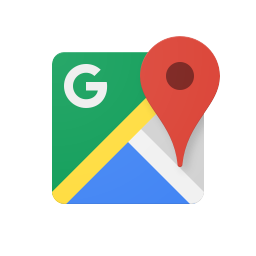</td>
    <td align="center"></td>
    <td align="center"></td>
  </tr>
  <tr>
    <td rowspan="2"><strong>Perfil</strong></td>
    <td><strong>Overview</strong></td>
    <td>
      Aplicación internacional de movilidad urbana con cobertura global. Ofrece rutas, horarios y planificación multimodal (bus, tren, bicicleta). Opera en Lima con datos colaborativos
    </td>
    <td>
      Servicio global de mapas y tráfico en tiempo real. Incluye opciones de transporte público, aunque con detalle limitado para buses limeños
    </td>
    <td>
      App peruana enfocada en transporte público limeño, basada en información colaborativa sobre rutas de buses y colectivos
    </td>
    <td>
      Plataforma especializada en venta de pasajes interprovinciales. No opera rutas urbanas, pero es referente en digitalización del transporte
    </td>
  </tr>
  <tr>
    <td><strong>Ventaja Competitiva<br>¿Qué valor ofrece?</strong></td>
    <td>
      Precisión global, experiencia en movilidad urbana y amplia integración multimodal
    </td>
    <td>
      Cartografía precisa, navegación confiable y datos de tráfico actualizados
    </td>
    <td>
      Conocimiento local del transporte limeño y fácil uso para usuarios cotidianos
    </td>
    <td>
      Compra segura de pasajes, métodos de pago confiables y reputación consolidada
    </td>
  </tr>
  <tr>
    <td rowspan="2"><strong>Perfiles de Marketing</strong></td>
    <td><strong>Mercado objetivo</strong></td>
    <td>Usuarios urbanos que buscan planificar rutas multimodales</td>
    <td>Usuarios globales que necesitan mapas, navegación y tráfico</td>
    <td>Pasajeros limeños frecuentes que usan buses o colectivos</td>
    <td>Viajeros que realizan desplazamientos interprovinciales</td>
  </tr>
  <tr>
    <td><strong>Estrategias de marketing</strong></td>
    <td>Publicidad global, alianzas con gobiernos y operadores</td>
    <td>Integración con Android y ecosistema Google; marketing masivo</td>
    <td>Redes sociales, enfoque local y participación comunitaria</td>
    <td>Marketing digital, alianzas con empresas de transporte</td>
  </tr>
  <tr>
    <td rowspan="3"><strong>Perfil de Producto</strong></td>
    <td><strong>Productos y Servicios</strong></td>
    <td>Rutas, horarios, planificación multimodal, notificaciones básicas</td>
    <td>Mapas, tráfico, transporte público, navegación y GPS</td>
    <td>Rutas de buses y colectivos en Lima; colaboración ciudadana</td>
    <td>Venta de pasajes, reservas y métodos de pago seguros</td>
  </tr>
  <tr>
    <td><strong>Precios y Costos</strong></td>
    <td>Gratuito</td>
    <td>Gratuito</td>
    <td>Gratuito</td>
    <td>Comisiones y precios de pasajes</td>
  </tr>
  <tr>
    <td><strong>Canales de Distribución</strong><br>(Web y/o Móvil)</td>
    <td>Web y móvil</td>
    <td>Web y móvil</td>
    <td>Móvil</td>
    <td>Web y móvil</td>
  </tr>
  <tr>
    <td rowspan="4"><strong>Análisis SWOT</strong></td>
    <td><strong>Fortalezas</strong></td>
    <td>- Amplia cobertura global <br><br> - Integración multimodal <br><br> - Datos colaborativos amplios</td>
    <td>- Cartografía precisa <br><br> - Tráfico en tiempo real <br><br> - Ecosistema digital fuerte</td>
    <td>- Conocimiento local <br><br> - Interfaz sencilla <br><br> - Enfoque en transporte limeño</td>
    <td>- Confianza en pagos <br><br> - Amplia cobertura interprovincial <br><br> -Marca consolidada</td>
  </tr>
  <tr>
    <td><strong>Debilidades</strong></td>
    <td>- Datos poco precisos en Lima <br><br> -Baja personalización local</td>
    <td>- No especializado en transporte urbano limeño</td>
    <td>- Datos desactualizados <br><br> - Dependencia de la comunidad <br><br> -Sin tiempo real</td>
    <td>- No cubre transporte urbano <br><br> - Funcionalidad limitada para rutas limeñas</td>
  </tr>
  <tr>
    <td><strong>Oportunidades</strong></td>
    <td>Integrarse con operadores locales y mejorar datos en tiempo real</td>
    <td>Expandir detalle de transporte urbano en ciudades emergentes</td>
    <td>Incorporar APIs oficiales y mayor precisión en rutas y horarios</td>
    <td>Ampliar servicios hacia transporte urbano</td>
  </tr>
  <tr>
    <td><strong>Amenazas</strong></td>
    <td>Mejoras locales podrían desplazar a apps especializadas</td>
    <td>Regulaciones de datos y competencia global</td>
    <td>Competidores con información más precisa y tiempo real</td>
    <td>Competidores con ecosistemas más robustos</td>
  </tr>
</tbody>
</table>

_**Figura 6.** Logotipos de los principales competidores analizados: Moovit, Google Maps, TuRuta y RedBus._ <br> _**Fuente:** elaboración propia a partir de material público de cada marca._

<br>


BusTrack puede diferenciarse mediante información confiable en tiempo real, un enfoque exclusivamente local y la integración de APIs oficiales para ofrecer datos verificados sobre buses y rutas urbanas. Esto cubre vacíos que los competidores actuales aún no resuelven completamente.

<br>

### 2.1.2 Estrategias y tácticas frente a competidores

Para destacar frente a las aplicaciones presentes en el mercado, **BusTrack** aplicará una estrategia basada en la personalización local y la diferenciación tecnológica, con un enfoque progresivo en innovación y calidad de datos.

### 1. Enfoque en la realidad limeña
- Integrar información de buses y paraderos tanto formales como informales.  
- Incorporar APIs y datos oficiales de municipalidades para aumentar la confiabilidad del servicio.  

### 2. Alianzas estratégicas
- Establecer colaboración con operadores de transporte urbano y universidades para captar usuarios frecuentes.  
- Explorar acuerdos con entidades públicas de transporte para mejorar la base de datos y validar rutas en tiempo real.  

### 3. Valor agregado para el usuario
- Ofrecer notificaciones en tiempo real sobre la llegada de buses.  
- Permitir guardar rutas frecuentes y mostrar estimaciones basadas en el tráfico local.  
- Incluir alertas de seguridad, como sugerencias de paraderos recomendados o zonas de riesgo.  

### 4. Campañas de posicionamiento digital
- Mantener una presencia activa en redes sociales para atraer principalmente a estudiantes y trabajadores.  
- Desarrollar estrategias de marketing enfocadas en el ahorro de tiempo, la seguridad y la eficiencia del transporte urbano.  
- Fomentar la construcción de una comunidad de usuarios que compartan información dentro de la plataforma.  

### 5. Innovación tecnológica gradual
- Desarrollar una futura aplicación móvil con geolocalización más precisa.  
- Implementar funciones predictivas que estimen tiempos de llegada basados en patrones históricos de tráfico.  

Con estas estrategias, **BusTrack** busca convertirse en una opción confiable y útil para los ciudadanos de Lima Metropolitana, apostando por la innovación tecnológica y por brindar información clara y en tiempo real que facilite la movilidad diaria de estudiantes, trabajadores y usuarios frecuentes del transporte público.


## 2.2. Entrevistas

Como parte del proceso de validación del modelo de negocio de BusTrack, se plantean entrevistas semiestructuradas dirigidas a los dos segmentos objetivos: pasajeros de transporte público y empresas de transporte urbano. El propósito es identificar sus motivaciones, comportamientos, expectativas y principales frustraciones en relación con la movilidad urbana, así como validar la propuesta de valor de la plataforma.

### 2.2.1. Diseño de entrevistas

## Segmento 1: Pasajeros de Transporte Público

**Objetivo:** Entender las frustraciones en el uso del transporte diario

### Datos generales
- Nombre  
- Edad  
- Distrito de residencia  
- Ocupación (estudiante, trabajador, etc.)  
- Frecuencia de uso del transporte público (diaria, varias veces por semana, esporádica)  

### Motivaciones y comportamientos
- ¿Qué medio de transporte público usas con más frecuencia (bus, coaster, combi, Metropolitano, Metro)?  
- ¿Qué situaciones específicas te generan más preocupación al viajar?
- ¿Qué pasos sigues normalmente antes de salir de casa para tomar el bus?
- ¿Has usado alguna aplicación para movilizarte en la ciudad (Waze, Google Maps, Moovit, etc.)? ¿Cómo fue tu experiencia?  
- ¿Qué importancia le das a recibir información en tiempo real sobre la llegada de buses?  

### Miedos, expectativas y canales
- ¿Qué problemas enfrentas con mayor frecuencia en tus traslados (tiempo de espera, congestión, inseguridad, falta de información)?  
- ¿Qué haría que confíes en una aplicación como BusTrack para planificar tus viajes?  
- ¿Te gustaría recibir notificaciones sobre la llegada del bus, retrasos o desvíos de ruta? 
- ¿Qué redes sociales o aplicaciones móviles usas más para informarte en tu día a día?  
- ¿Cómo medirías que una aplicación realmente mejora tu experiencia de viaje?  

---

## Segmento 2: Empresas de Transporte Urbano

**Objetivo:** Comprender los procesos operativos de las empresas de transporte urbano

### Datos generales
- Nombre del entrevistado  
- Cargo (administrador, supervisor de rutas, propietario)  
- Empresa / línea de transporte  
- Número de unidades en operación  
- Zonas o rutas que cubren  

### Operaciones y herramientas
- ¿Cómo gestionan actualmente la ubicación y monitoreo de sus buses?  
- ¿Qué herramientas usan para controlar sus buses y qué limitaciones encuentran en ellas?
- ¿Qué información reciben de los conductores y cómo la gestionan?  
- ¿Han utilizado aplicaciones para comunicarse con pasajeros? Si ese es el caso, ¿les fue útil? y qué problemas encontraron?
- ¿Cuáles son los mayores retos para mantener la puntualidad y la seguridad de los viajes?  

### Expectativas y valor esperado
- ¿Qué tipo de datos o reportes serían más valiosos para su gestión diaria (tiempos de llegada, cantidad de pasajeros, retrasos)?  
- ¿Qué funcionalidades de una aplicación como BusTrack les motivarían a adoptarla?  
- ¿Cómo creen que una plataforma de información en tiempo real podría mejorar la confianza de los pasajeros?  
- ¿Qué beneficios esperan obtener al implementar una solución tecnológica (mayor satisfacción, competitividad, reducción de costos)?  
- ¿Qué barreras internas o externas ven para adoptar una aplicación digital de gestión de transporte?

### 2.2.2. Registro de entrevistas

### Segmento 1: Pasajeros de Transporte Público (Estudiantes y Trabajadores)  


| **Entrevista 1** |
|--------|
| **Entrevistado:** Mariana Rafael |
| **Sexo:** Femenino |
| **Edad:** 20 |
| **Ocupación:** Estudiante universitario |
| **Medio utilizado:** Zoom |
| **Link de entrevista:** <https://youtu.be/fcO25GbbaRY> |
| **Resumen de entrevista:** La entrevistada utiliza principalmente corredores de la ATU y el Metropolitano para ir a la universidad o salir con amigos. Sus principales preocupaciones son la inseguridad, los desvíos inesperados y los costos del transporte. Considera esencial contar con información en tiempo real y notificaciones confiables para optimizar su tiempo y aumentar la confianza en el transporte público. |


| **Entrevista 2** |
|-----------|
| **Entrevistado:** Alessandro Bravo |
| **Sexo:** Masculino |
| **Edad:** 20 |
| **Ocupación:** Estudiante universitario |
| **Medio utilizado:** Zoom |
| **Link de entrevista:** <https://www.youtube.com/watch?v=5rFwJUM-JS4> | 
| **Resumen de entrevista:** El entrevistado viaja diariamente en buses y combis, tomando hasta tres por día desde San Martín de Porres. Sus principales preocupaciones son el tiempo de espera, la inseguridad y la falta de información confiable. Usa aplicaciones como Moovit, aunque señala que no siempre están actualizadas. Valora recibir notificaciones en tiempo real sobre ubicación, desvíos y precios para llegar a tiempo a clases y optimizar sus traslados. |
 
<br>

### Segmento 2: Empresas de Transporte Urbano

| **Entrevista 3** |
|-----------|
| **Entrevistado:** Octavio |
| **Sexo:** Masculino |
| **Edad:** 35 |
| **Ocupación:** Supervisor de rutas |
| **Medio utilizado:** Zoom |
| **Link de entrevista:** <https://youtu.be/MOjHcLv6YDY> |
| **Resumen de entrevista:** El entrevistado gestiona la flota mediante llamadas a los choferes y el uso de Excel y hojas de ruta, recibiendo solo información básica sobre tráfico y fallas mecánicas. Considera valiosos los reportes automáticos y la ubicación exacta de buses para mejorar la operación. Reconoce que una plataforma como BusTrack podría incrementar la confianza de los pasajeros, aunque identifica barreras como el costo y la resistencia de algunos conductores a adoptar tecnología. |


| **Entrevista 4** |
|-----------|
| **Entrevistado:** Jean Paul Condori |
| **Sexo:** Masculino |
| **Edad:** 40 |
| **Ocupación:** Administrador de flota |
| **Medio utilizado:** Zoom |
| **Link de entrevista:** <https://youtu.be/JAEwGB9mBGk> |
| **Resumen de entrevista:** El entrevistado gestiona las unidades mediante grupos de WhatsApp y cuadernos físicos, recibiendo información de los conductores sobre retrasos, cambios de ruta y controles policiales. Identifica retos como tráfico, bloqueos y falta de procesos modernos. Considera útil contar con reportes sobre rutas, horarios y cantidad de pasajeros. Percibe a BusTrack como una oportunidad para implementar monitoreo en tiempo real, aunque también identifica barreras relacionadas con la confianza y la adaptación tecnológica de los conductores. |

<br>

### 2.2.3. Análisis de entrevistas

A partir de las entrevistas realizadas, se agruparon las respuestas más representativas de cada segmento para identificar patrones comunes, necesidades y oportunidades de mejora.

### Segmento 1: Pasajeros de Transporte Público (Estudiantes y Trabajadores)  

| **Preguntas** | **Respuestas Generales** |
|---|---|
| ¿Qué medio de transporte público usas con más frecuencia (bus, coaster, combi, Metropolitano, Metro)? | Los más utilizados son buses y combis para recorridos diarios, además de corredores de la ATU y el Metropolitano para trayectos largos o frecuentes. |
| ¿Qué situaciones específicas te generan más preocupación al viajar? | Principalmente la inseguridad (robos durante los trayectos) y la incertidumbre por desvíos de ruta o cambios inesperados. |
| ¿Qué pasos sigues normalmente antes de salir de casa para tomar el bus? | Consultan previamente rutas y paraderos en el celular, investigan precios y tiempos estimados. Algunos usan apps como “TuRuta” o Moovit, aunque no siempre confían en su precisión. |
| ¿Has usado alguna aplicación para movilizarte en la ciudad (Waze, Google Maps, Moovit, etc.)? ¿Cómo fue tu experiencia? | Sí, principalmente Moovit. Sin embargo, señalan que no siempre está actualizada, lo que genera retrasos y confusión en la planificación de viajes. |
| ¿Qué importancia le das a recibir información en tiempo real sobre la llegada de buses? | Se considera muy importante, ya que permite organizar mejor el tiempo y evitar esperas innecesarias. |
| ¿Qué problemas enfrentas con mayor frecuencia en tus traslados (tiempo de espera, congestión, inseguridad, falta de información)? | Las largas esperas sin información, congestión en horas punta e inseguridad dentro de buses y paraderos. |
| ¿Qué haría que confíes en una aplicación como BusTrack para planificar tus viajes? | Que muestre información actualizada y verificada sobre ubicación de buses, precios y posibles desvíos. También que garantice seguridad validando a los conductores. |
| ¿Te gustaría recibir notificaciones sobre la llegada del bus, retrasos o desvíos de ruta? | Sí, especialmente sobre retrasos y desvíos, ya que afectan la puntualidad en clases y el trabajo. |
| ¿Qué redes sociales o aplicaciones móviles usas más para informarte en tu día a día? | Principalmente TikTok, Instagram, X (Twitter) y canales de noticias digitales. |
| ¿Cómo medirías que una aplicación realmente mejora tu experiencia de viaje? | En la práctica, comprobando que reduce tiempos de espera, brinda información confiable y hace el viaje más seguro y eficiente. |

**Insights:**

Se identificó una fuerte necesidad de control en los pasajeros, quienes experimentan ansiedad e inseguridad ante la falta de información sobre los tiempos de llegada de los buses. La inmediatez es un valor clave, ya que los usuarios prefieren aplicaciones que proporcionen datos actualizados en tiempo real sobre rutas y horarios.

La confianza está estrechamente relacionada con la seguridad, por lo que esperan validación de conductores, monitoreo de unidades y rutas verificadas. Finalmente, su motivación principal es de carácter práctico, pues buscan optimizar el tiempo de viaje y reducir la incertidumbre más que explorar aplicaciones por simple novedad. 

<br>

### Segmento 2: Empresas de Transporte Urbano
| **Preguntas** | **Respuestas Generales** |
|---|---|
| ¿Cómo gestionan actualmente la ubicación y monitoreo de sus buses? | No cuentan con un sistema especializado, dependen de llamadas rápidas a los choferes y grupos de WhatsApp para reportar ubicación en ruta. |
| ¿Qué herramientas usan para controlar sus buses y qué limitaciones encuentran en ellas? | Usan cuadernos, hojas de ruta y, en algunos casos, Excel para registrar salidas, llegadas y control básico de operaciones. |
| ¿Qué información reciben de los conductores y cómo la gestionan? | Se reportan retrasos, tráfico, problemas mecánicos e incidentes en ruta (como policías o semáforos dañados) mediante mensajes o llamadas, y se gestionan manualmente. |
| ⁠¿Han utilizado aplicaciones para comunicarse con pasajeros? Si ese es el caso, ¿les fue útil y qué problemas encontraron? | No cuentan con un canal digital para pasajeros; algunos han considerado apps, pero aún no las aplican. |
| ¿Cuáles son los mayores retos para mantener la puntualidad y la seguridad de los viajes? | El tráfico, bloqueos, obras en las vías y la falta de información en tiempo real. Además, la limpieza de buses y la coordinación con choferes a distancia dificultan la operación. |
| ¿Qué tipo de datos o reportes serían más valiosos para su gestión diaria (tiempos de llegada, cantidad de pasajeros, retrasos)? | Horarios exactos de salida y llegada, ubicación en tiempo real, retrasos por incidentes y cantidad de pasajeros transportados por vuelta. |
| ¿Qué funcionalidades de una aplicación como BusTrack les motivarían a adoptarla? | Monitoreo en tiempo real de las unidades, reportes automáticos y alertas inmediatas de incidencias o desvíos. |
| ¿Cómo creen que una plataforma de información en tiempo real podría mejorar la confianza de los pasajeros? | Brindando horarios verificados de salida y llegada para que los pasajeros planifiquen mejor su tiempo y perciban mayor confiabilidad. |
| ¿Qué beneficios esperan obtener al implementar una solución tecnológica (mayor satisfacción, competitividad, reducción de costos)? | Mayor satisfacción de los pasajeros, incremento de usuarios, reducción de quejas y mayor control interno de la operación. |
| ¿Qué barreras internas o externas ven para adoptar una aplicación digital de gestión de transporte? | Los costos de implementación, la resistencia de los choferes a adaptarse y la desconfianza inicial hacia nuevas tecnologías. |

**Insights:**

Las empresas de transporte urbano presentan una gestión operativa manual y poco eficiente, sustentada en llamadas telefónicas, registros en papel o en hojas de cálculo, lo que limita la trazabilidad y control de la flota. La falta de visibilidad en tiempo real impide tomar decisiones oportunas y afecta la puntualidad de los servicios.

Se observó además una resistencia cultural hacia la adopción tecnológica, especialmente entre conductores con menor experiencia digital. Aun así, los entrevistados expresaron alto interés en obtener reportes automáticos y datos analíticos para mejorar la gestión. Las barreras económicas y de capacitación continúan siendo los principales obstáculos para la implementación de soluciones tecnológicas como BusTrack.

<br>

## 2.3. Needfinding

En esta etapa se identifican y analizan las necesidades reales de los usuarios para asegurar que BusTrack responda a las expectativas y problemas detectados durante la investigación. Para ello, se desarrollan los User Personas, el User Task Matrix, los User Journey Maps y los Empathy Maps, permitiendo comprender profundamente los comportamientos, motivaciones y frustraciones de cada segmento objetivo.

### 2.3.1. User Personas

### Segmento Objetivo 1: Pasajeros de Transporte Público

### Estudiante universitario

| **Atributo**     | **Valor** |
|------------------|-----------|
| **Name**         | Manuel Suarez |
| **Age**          | 24 años |
| **Occupation**   | Estudiante universitario |
| **Status**       | Soltero |
| **Location**     | Lima, Perú |
| **Tier**         | Pasajero frecuente |
| **Archetype**    | Usuario Pragmático |
| **Image**        |  <br><br> _**Figura 7.** Imagen representativa del User Persona “Manuel Suárez”, estudiante universitario usuario frecuente de transporte público._ <br> _**Fuente:** elaboración propia._ |
| **Quote**        | "Lo que más necesito es saber con certeza cuándo llegará el bus para no perder tiempo ni arriesgarme en el paradero." |
| **Motivations**  | Incentive: 80/100<br>Fear: 75/100<br>Achievement: 80/100<br>Growth: 65/100<br>Power: 40/100<br>Social: 85/100 |
| **Goals**        | - Llegar puntual a clases sin depender de información incierta.<br>- Optimizar su tiempo para estudiar y evitar esperas innecesarias.<br>- Sentirse seguro en trayectos diarios, especialmente en paraderos con poca iluminación o vigilancia. |
| **Frustrations** | - No saber con exactitud cuándo pasará el bus.<br>- Perder tiempo en paraderos inseguros o llenos.<br>- Apps como Moovit no siempre muestran retrasos reales ni desvíos de ruta.<br> - Estrés cuando llega tarde por demoras inesperadas.|
| **Biography**    | Manuel estudia en una universidad en el centro de Lima y vive en un distrito alejado. Sale temprano todos los días y realiza entre dos y tres transbordos para llegar a clases. Antes de salir, revisa aplicaciones como Moovit o Google Maps para planificar su ruta, pero muchas veces la información no es confiable, ya que los buses se retrasan, no aparecen en el mapa o toman desvíos sin aviso. Esto lo obliga a esperar largos minutos en paraderos inseguros, lo que le genera ansiedad y pérdida de tiempo valioso. En días de evaluación, su principal preocupación es llegar puntual. Usa activamente redes sociales y confía en aplicaciones cuando le brindan datos claros y en tiempo real.|
| **Personality**  | Extrovert: 60/100<br>Thinking: 80/100<br>Judging: 70/100 |
| **Technology**   | IT and Internet: 85/100<br>Software: 70/100<br>Mobile Apps: 90/100<br>Social Networks: 95/100 |
| **Brands**       | WhatsApp, Google Maps, TikTok, Moovit, TuRuta |

<br>

## Trabajador

| **Atributo**     | **Valor** |
|------------------|-----------|
| **Name**         | Alejandro Medina |
| **Age**          | 32 años |
| **Occupation**   | Empleado administrativo |
| **Status**       | Soltero |
| **Location**     | Lima, Perú |
| **Tier**         | Pasajero frecuente |
| **Archetype**    | Viajero Organizado |
| **Image**        |  <br><br> _**Figura 8.** Imagen representativa del User Persona “Alejandro Medina”, trabajador administrativo que usa transporte público a diario._  <br> _**Fuente:** elaboración propia._ |
| **Quote**        | "Necesito que el transporte sea puntual porque llegar tarde al trabajo no es una opción." |
| **Motivations**  | Incentive: 80/100<br>Fear: 75/100<br>Achievement: 85/100<br>Growth: 65/100<br>Power: 50/100<br>Social: 70/100 |
| **Goals**        | - Llegar puntual al trabajo evitando esperas innecesarias.<br>- Optimizar su tiempo de traslado para tener más tiempo libre al final del día.<br>- Usar una app confiable que proporcione información precisa sobre buses y tráfico en tiempo real.<br> - Reducir el estrés diario asociado al transporte público. |
| **Frustrations** | - Largas esperas sin información clara sobre la llegada del bus.<br>- Aplicaciones desactualizadas que no muestran desvíos o retrasos reales.<br>- Perder tiempo en trayectos mal planificados.<br> - Inseguridad en paraderos, sobre todo en horarios nocturnos. |
| **Biography**    | Alejandro trabaja en una oficina en el centro de Lima y vive en un distrito periférico. Sale muy temprano todos los días para evitar el tráfico, pero aun así pasa más de dos horas en transporte público entre ida y vuelta. Usa Moovit para revisar rutas antes de salir, aunque con frecuencia se frustra cuando los buses no llegan a la hora estimada o toman desvíos sin aviso. La puntualidad es crucial en su trabajo, por lo que la falta de información confiable le genera ansiedad. Una aplicación que le brinde datos en tiempo real y alertas claras significaría más control sobre su tiempo y menos estrés.|
| **Personality**  | Extrovert: 55/100<br>Thinking: 85/100<br>Judging: 70/100 |
| **Technology**   | IT and Internet: 85/100<br>Software: 65/100<br>Mobile Apps: 80/100<br>Social Networks: 85/100 |
| **Brands**       | WhatsApp, Moovit, Facebook, TikTok |

<br>

## Segmento Objetivo 2: Empresas de Transporte Urbano

##  Administrador de flota

| **Atributo**     | **Valor** |
|------------------|-----------|
| **Name**         | Luis Palacios |
| **Age**          | 38 años |
| **Occupation**   | Administrador de flota en empresa de transporte urbano |
| **Status**       | Soltero |
| **Location**     | Lima, Perú |
| **Tier**         | Empresa de transporte urbano |
| **Archetype**    | Gestor Eficiente |
| **Image**        |  <br><br> _**Figura 9.** Imagen representativa del User Persona “Luis Palacios”, administrador de flota en una empresa de transporte urbano._  <br> _**Fuente:** elaboración propia._|
| **Quote**        | "Si puedo monitorear mis buses en tiempo real, puedo ofrecer un mejor servicio y ganar más pasajeros." |
| **Motivations**  | Incentive: 85/100<br>Fear: 65/100<br>Achievement: 90/100<br>Growth: 70/100<br>Power: 75/100<br>Social: 70/100 |
| **Goals**        | - Monitorear en tiempo real la ubicación y estado de todas las unidades.<br>- Detectar y resolver incidencias operativas rápidamente.<br>- Mejorar la puntualidad general y reducir reclamos de usuarios.<br>- Digitalizar procesos manuales para optimizar tiempos y costos.<br>- Usar herramientas que faciliten decisiones estratégicas. |
| **Frustrations** | - Depender de llamadas, WhatsApp y cuadernos para coordinar.<br>- No tener visibilidad clara del estado de las rutas en tiempo real.<br>- Dificultad para anticipar retrasos o desvíos.<br>- Perder tiempo consolidando datos manualmente en Excel. |
| **Biography**    | Luis es administrador en una empresa de transporte urbano que opera 18 buses en Lima Metropolitana. Su día comienza muy temprano revisando reportes manuales y coordinando con supervisores mediante llamadas y mensajes. Debe responder rápidamente a incidencias como desvíos o congestión, pero la falta de información centralizada dificulta la toma de decisiones oportunas. Además, debe presentar reportes detallados a la gerencia, lo que implica un gran esfuerzo manual. Busca una plataforma que brinde control total en tiempo real, reduzca errores y modernice la gestión de flota para competir con el transporte informal. |
| **Personality**  | Extrovert: 65/100<br>Thinking: 85/100<br>Judging: 70/100 |
| **Technology**   | IT and Internet: 75/100<br>Software: 60/100<br>Mobile Apps: 65/100<br>Social Networks: 60/100 |
| **Brands**       | WhatsApp, Excel, Facebook |

<br>

##  Supervisor de Rutas

| **Atributo**     | **Valor** |
|------------------|-----------|
| **Name**         | José Ramírez |
| **Age**          | 40 años |
| **Occupation**   | Supervisor de rutas en empresa de transporte urbano |
| **Status**       | Soltero |
| **Location**     | Lima, Perú |
| **Tier**         | Empresa de transporte urbano |
| **Archetype**    | Supervisor Operativo |
| **Image**        |  <br><br> _**Figura 10.** Imagen representativa del User Persona “José Ramírez”, supervisor de rutas en una empresa de transporte urbano._  <br> _**Fuente:** elaboración propia._ |
| **Quote**        | "Lo más difícil es coordinar con los choferes en medio del tráfico y asegurar que los buses lleguen a tiempo." |
| **Motivations**  | Incentive: 70/100<br>Fear: 60/100<br>Achievement: 80/100<br>Growth: 60/100<br>Power: 65/100<br>Social: 70/100 |
| **Goals**        | - Coordinar eficientemente la operación diaria de múltiples rutas.<br>- Anticipar problemas de tráfico o desvíos antes de que afecten a los pasajeros.<br>- Reducir reclamos por incumplimiento de horarios.<br>- Estandarizar reportes e incidencias.<br>- Recibir alertas automáticas para actuar más rápido. |
| **Frustrations** | - Depender de WhatsApp y llamadas individuales.<br>- No contar con un panel centralizado para incidencias en tiempo real.<br>- Perder tiempo obteniendo información fragmentada.<br>- No poder anticipar bloqueos o retrasos.<br>- Dificultad para demostrar su desempeño ante la administración. |
| **Biography**    | José supervisa varias rutas de transporte urbano en Lima Metropolitana. Su jornada comienza antes de las seis de la mañana y consiste en coordinar con conductores, verificar operaciones y reaccionar rápidamente a incidencias en el tránsito. Su principal herramienta son grupos de WhatsApp, llamadas y cuadernos físicos, lo que ocasiona retrasos y decisiones tardías. A menudo se entera tarde de bloqueos o accidentes, generando retrasos acumulados. Además, debe entregar reportes diarios elaborados manualmente. Una plataforma que centralice la información, envíe alertas automáticas y permita monitoreo en tiempo real transformaría su trabajo y reduciría la presión operativa. |
| **Personality**  | Extrovert: 65/100<br>Thinking: 75/100<br>Judging: 80/100 |
| **Technology**   | IT and Internet: 65/100<br>Software: 50/100<br>Mobile Apps: 75/100<br>Social Networks: 60/100 |
| **Brands**       | WhatsApp, Excel, Facebook |

<br>

### 2.3.2. User Task Matrix

### Segmento Objetivo 1
      
| Tarea / Funcionalidad                | Manuel Suarez (Estudiante Universitario) | Alejandro Medina (Trabajador) | Adulto mayor | Turista |
|--------------------------------------|------------|------------|--------------|---------|
| Consultar rutas y horarios           | Alta       | Alta       | Alta         | Alta    |
| Recibir notificaciones en tiempo real| Alta       | Alta       | Media        | Media   |
| Guardar trayectos frecuentes         | Alta       | Alta       | Media        | Baja    |
| Revisar estimaciones según tráfico   | Media      | Alta       | Baja         | Media   |
| Identificar paraderos cercanos       | Media      | Media      | Alta         | Alta    |
| Alertas de seguridad en paraderos    | Media      | Media      | Alta         | Media   |
| Consultar rutas hacia puntos turísticos | Baja    | Baja       | Baja         | Alta    |
| Administración de datos (rol admin)  | Baja       | Baja       | Baja         | Baja    |

En el User Task Matrix del Segmento 1 se observa que cada grupo de usuarios tiene prioridades distintas: los estudiantes y trabajadores buscan principalmente rapidez e información en tiempo real; los adultos mayores se enfocan en la seguridad y en identificar paraderos cercanos; y los turistas necesitan rutas claras hacia lugares de interés. Aunque las tareas administrativas no se perciben directamente, son clave para mantener la información confiable. En general, BusTrack debe centrarse en ofrecer datos precisos, opciones personalizadas y una experiencia segura para todos.

<br>

### Segmento Objetivo 2

| Tarea / Funcionalidad                | Luis Palacios (Administrador de Flota) | José Ramírez (Supervisor de Rutas) | Propietario |
|--------------------------------------|------------|------------|--------------|
| Monitorear buses en tiempo real      | Alta       | Alta       | Media        |
| Generar reportes automáticos         | Alta       | Media      | Alta         |
| Gestionar incidencias y alertas en ruta  | Alta       | Alta       | Media        |
| Comunicar cambios de ruta a choferes | Alta       | Alta       | Baja         |
| Analizar costos operativos y optimizarlos | Media    | Baja      | Alta         |
| Mejorar puntualidad y satisfacción del pasajero | Alta | Alta | Alta |
| Planificar mantenimiento preventivo de buses | Media | Alta | Media |
| Decidir adopción de nuevas tecnologías | Media | Baja | Alta |
| Administrar permisos y accesos en la plataforma | Alta | Media | Baja |

En el User Task Matrix del Segmento 2 se observa que el supervisor de rutas y el administrador de flota priorizan tareas operativas como el monitoreo en tiempo real, la generación de reportes y la gestión de incidencias, mientras que los propietarios se enfocan en aspectos estratégicos como la reducción de costos y la adopción de nuevas tecnologías. Esto evidencia que las empresas necesitan una solución que combine eficiencia operativa y capacidad estratégica, garantizando puntualidad, satisfacción del pasajero y modernización de procesos.

<br>

### 2.3.3. User Journey Mapping

A continuación se presentan los User Journey Maps desarrollados para los dos segmentos objetivo de BusTrack: Pasajeros y Empresas de transporte. Cada mapa describe el flujo actual del usuario, destacando acciones, emociones, problemas y oportunidades de mejora que BusTrack busca resolver.

### Segmento 1: Pasajeros

#### User Persona 1 – Manuel Suárez (Estudiante Universitario)

**Descripción breve:** Este mapa muestra cómo un estudiante organiza su viaje diario utilizando BusTrack, centrado en la precisión del tiempo estimado de llegada, la ansiedad por retrasos y la necesidad de información confiable en tiempo real.

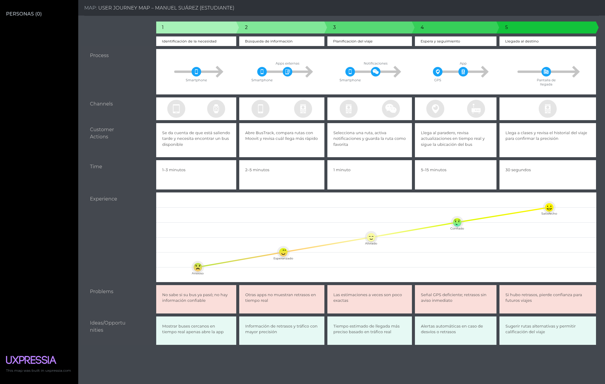

<br>

_**Figura 11.** User Journey Map de Manuel Suárez (estudiante universitario), que muestra su flujo de viaje diario y las oportunidades de mejora que aborda BusTrack._  <br> _**Fuente:** elaboración propia._


___

#### User Persona 2 – Alejandro Medina (Trabajador)

**Descripción breve:** Este mapa visualiza cómo un trabajador depende de la aplicación para adaptarse a condiciones de tráfico variables y evitar retrasos, destacando su necesidad de alertas inmediatas y estimaciones precisas.

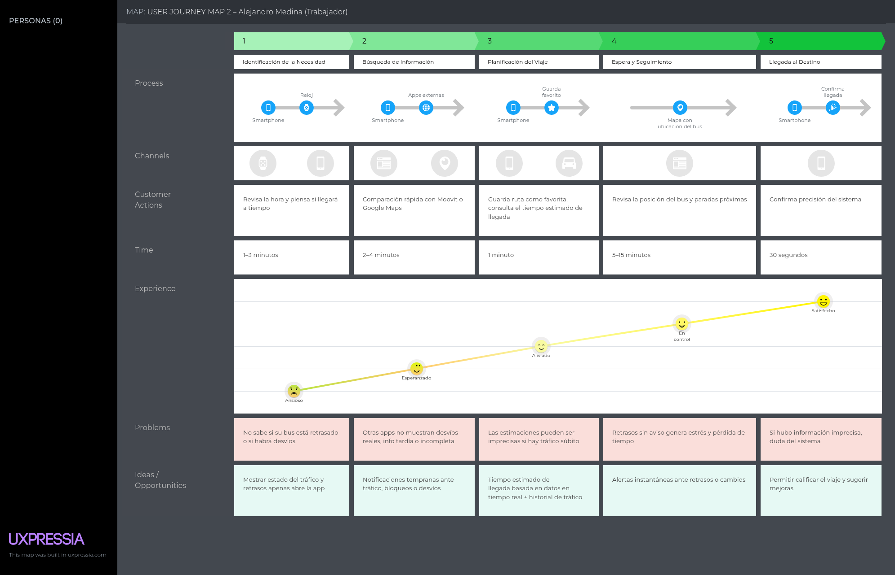

<br> _**Figura 12.** User Journey Map de Alejandro Medina (trabajador administrativo), ilustrando sus interacciones con el transporte público y el uso de BusTrack para reducir retrasos._ <br> _**Fuente:** elaboración propia._

<br>

___

<br>

### Segmento 2: Empresas de transporte

#### User Persona 3 – Luis Palacios (Administrador de Flota)

**Descripción breve:** El mapa muestra cómo el administrador enfrenta procesos manuales, comunicación dispersa y falta de datos centralizados para la toma de decisiones, resaltando la oportunidad de automatización y monitoreo en tiempo real que ofrece BusTrack.

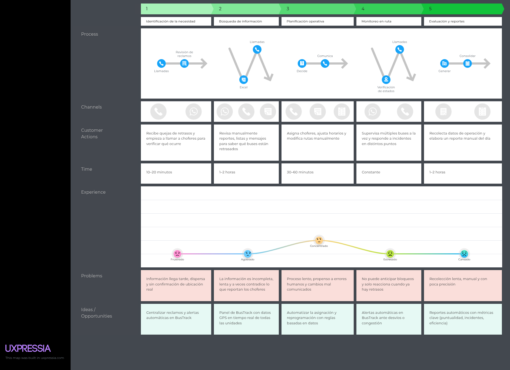

<br> _**Figura 13.** User Journey Map de Luis Palacios (administrador de flota), que detalla sus tareas operativas y cómo BusTrack mejora el monitoreo de buses._  <br> _**Fuente:** elaboración propia._

___

#### User Persona 4 – José Ramírez (Supervisor de Rutas)

**Descripción breve:** Este Journey Map refleja la complejidad del monitoreo de múltiples unidades en tiempo real, la presión operativa y los errores causados por la comunicación manual, destacando la necesidad de alertas automáticas y paneles centralizados.

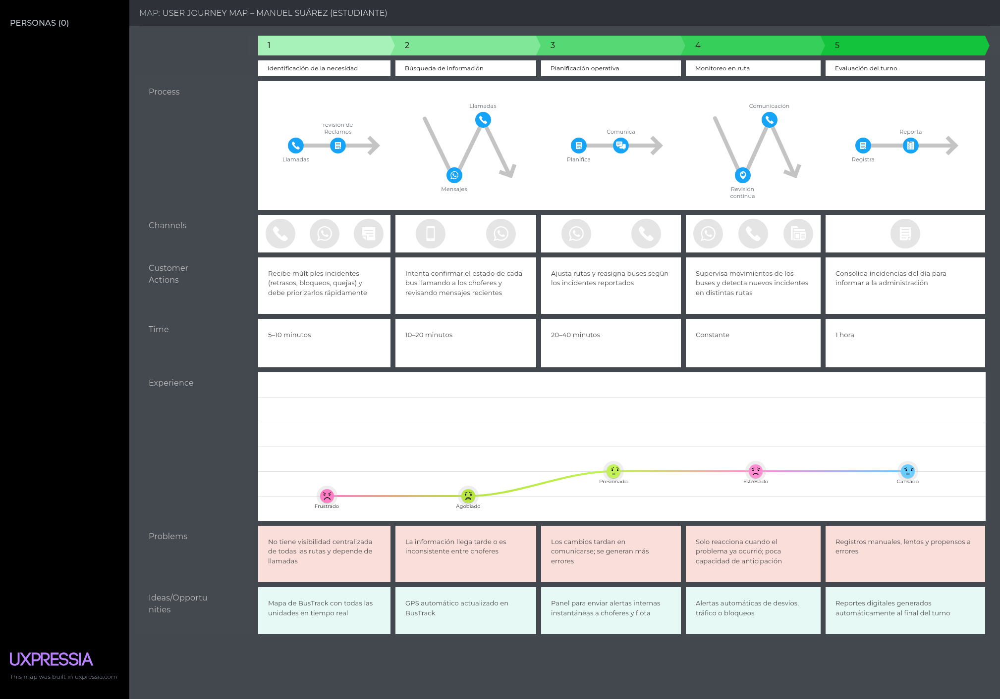

<br> _**Figura 14.** User Journey Map de José Ramírez (supervisor de rutas), representando la coordinación de unidades y la necesidad de alertas en tiempo real._  <br> _**Fuente:** elaboración propia._

<br>

### 2.3.4. Empathy Mapping

A continuación se presentan los mapas de empatía elaborados para cada uno de los perfiles de usuario identificados. Cada imagen incluye su respectiva descripción, tal como fue solicitado.

<br>

**Segmento 1: Estudiante universitario (Ejemplo: Manuel Suárez)**

**Descripción:** Mapa de empatía del estudiante universitario Manuel Suárez, donde se detallan sus emociones, pensamientos, dolores, motivaciones y percepciones relacionadas con su experiencia usando el transporte público en Lima.

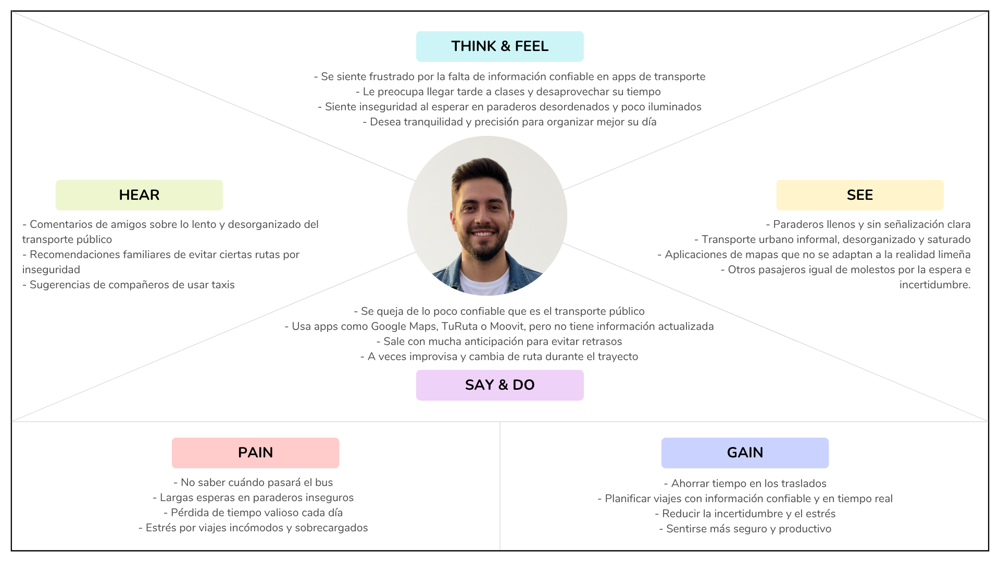

<br> _**Figura 15.** Mapa de empatía del estudiante universitario Manuel Suárez, donde se resumen lo que ve, piensa, siente y hace en relación con su experiencia usando el transporte público en Lima._  <br> _**Fuente:** elaboración propia._


---

**Segmento 1: Empleado administrativo (Ejemplo: Alejandro Medina)**

**Descripción:** Mapa de empatía del trabajador administrativo Alejandro Medina, mostrando su comportamiento, frustraciones, expectativas y necesidades al movilizarse diariamente hacia su centro laboral.


<br> _**Figura 16.** Mapa de empatía de Alejandro Medina, trabajador administrativo, que refleja sus frustraciones, expectativas y necesidades frente a los retrasos y la inseguridad en el transporte urbano._ <br> _**Fuente:** elaboración propia._

---

**Segmento 2: Administrador de flota en empresa de transporte urbano (Ejemplo: Luis Palacios)**

**Descripción:** Mapa de empatía del administrador de flota Luis Palacios, donde se analizan sus preocupaciones, necesidades operativas, puntos de dolor y objetivos relacionados con la gestión de buses y supervisión de rutas.

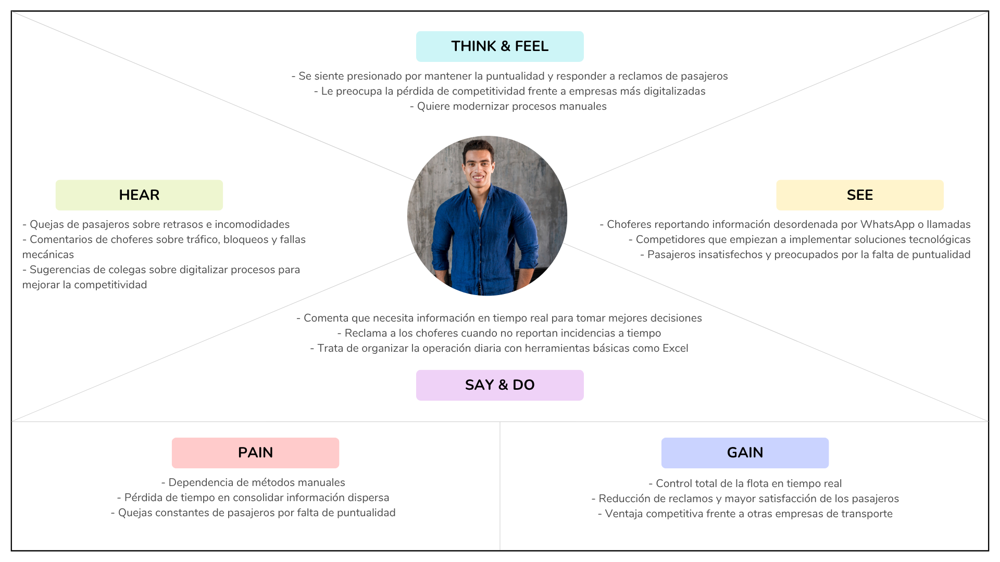

<br> _**Figura 17.** Mapa de empatía de Luis Palacios, administrador de flota, donde se analizan sus preocupaciones operativas, puntos de dolor y objetivos de gestión de buses._  <br> _**Fuente:** elaboración propia._

---

**Segmento 2: Supervisor de rutas en empresa de transporte urbano (Ejemplo: José Ramírez)**

**Descripción:** Mapa de empatía del supervisor de rutas José Ramírez, que refleja sus dificultades diarias, retos operativos, motivaciones y oportunidades de mejora en la coordinación del transporte urbano.

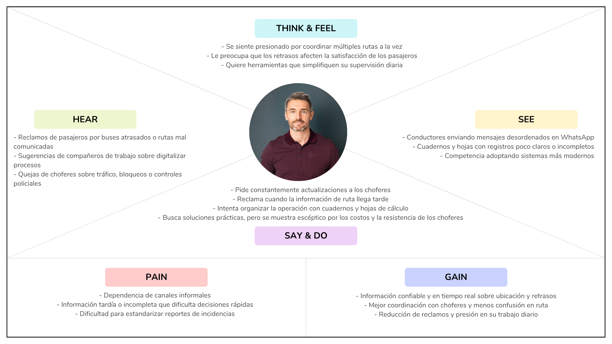

<br> _**Figura 18.** Mapa de empatía de José Ramírez, supervisor de rutas, que muestra sus retos diarios en la coordinación de unidades y su percepción sobre soluciones tecnológicas como BusTrack._  <br> _**Fuente:** elaboración propia._

<br>

## 2.4. Big Picture Event Storming

El Big Picture Event Storming permite visualizar de manera global todos los eventos clave del sistema BusTrack, mostrando cómo interactúan los distintos actores a lo largo del flujo completo del servicio.

**Descripción:** El diagrama representa el flujo completo del sistema BusTrack dividido en cuatro fases: Planificación del viaje, Ejecución y monitoreo del viaje, Post viaje y seguimiento y Aprendizaje y mejora. Muestra los eventos generados por los actores principales (pasajero, sistema, chofer, supervisor y administrador) y cómo estos interactúan en cada etapa. La representación permite comprender la secuencia de eventos, los flujos alternativos y las dependencias entre funcionalidades, alineándose con las historias de usuario implementadas.

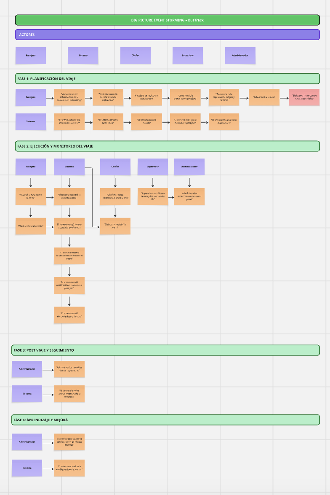

<br> _**Figura 19.** Big Picture Event Storming de BusTrack, que muestra los eventos clave del sistema y la interacción entre los actores a lo largo de las cuatro fases del servicio._ <br> _**Fuente:** elaboración propia._


Link del miro: https://miro.com/app/board/uXjVJg4DnAQ=/?share_link_id=181609109423

<br>

## 2.5. Ubiquitous Language

| **Término**                          | **Definición**                                                                                       |
| ------------------------------------ | ---------------------------------------------------------------------------------------------------- |
| **Pasajero**                         | Usuario final de BusTrack que consulta rutas, horarios y viaja en transporte público.                |
| **Empresa de transporte**            | Entidad que gestiona los buses, rutas y horarios registrados en la aplicación.                       |
| **Ruta**                             | Trayecto definido entre un origen y un destino que sigue un bus.                                     |
| **Horario**                          | Horas establecidas para salidas y llegadas de buses en una ruta.                                     |
| **Bus**                              | Vehículo de transporte público registrado en BusTrack con identificación y ubicación GPS.            |
| **Notificación**                     | Alerta enviada al pasajero sobre retrasos, desvíos o llegada próxima del bus.                        |
| **Reporte**                          | Resumen básico de alertas o estados operativos visibles en el panel web, limitado a la información disponible en el monitoreo de buses y en la gestión simple de alertas. En la versión actual del proyecto, no incluye reportes automáticos ni análisis avanzados; dichos elementos corresponden a funcionalidades previstas como trabajo futuro. |
| **Favoritos**                        | Rutas que el pasajero guarda para consultarlas rápidamente en futuros viajes.                        |
| **Panel de control**                 | Interfaz usada por la empresa de transporte para monitorear la flota y generar reportes.             |
| **Tiempo estimado de llegada (ETA)** | Predicción calculada por el sistema sobre el tiempo que falta para que un bus llegue a la parada.    |


<br><br>

# Capítulo III: Requirements Specification

## 3.1 To-Be Scenario Mapping

A continuación, se presentan los To-Be Scenario Maps desarrollados para los dos segmentos objetivo de BusTrack: pasajeros y empresas de transporte.

### To-Be Scenario Map – Pasajeros

**Descripción:**  
El mapa muestra la experiencia futura del pasajero al utilizar BusTrack. Se observa cómo, en cada fase (abrir la app, buscar ruta, revisar ubicación, monitorear el viaje), el usuario realiza acciones guiadas por la información en tiempo real, reduciendo incertidumbre y mejorando su percepción de control. A nivel emocional, el usuario pasa de la ansiedad típica del transporte público a la tranquilidad, confianza y satisfacción gracias a las funcionalidades de la aplicación.


<br> _**Figura 20.** To-Be Scenario Map del pasajero de BusTrack, que muestra la experiencia futura deseada desde la planificación del viaje hasta la calificación del servicio, reduciendo la ansiedad y aumentando la confianza gracias a la información en tiempo real._ <br>  _**Fuente:** elaboración propia._


---

### To-Be Scenario Map – Empresa de Transporte

**Descripción:**  
El mapa presenta la experiencia futura de una empresa de transporte utilizando el panel web de BusTrack. A lo largo de las fases (ingreso al panel, revisión de buses y gestión de alertas), se observa un flujo operativo más eficiente, basado en datos en tiempo real y reportes automáticos. Emocionalmente, el usuario empresarial pasa de la incertidumbre operativa a una sensación de control, seguridad y optimización continua.

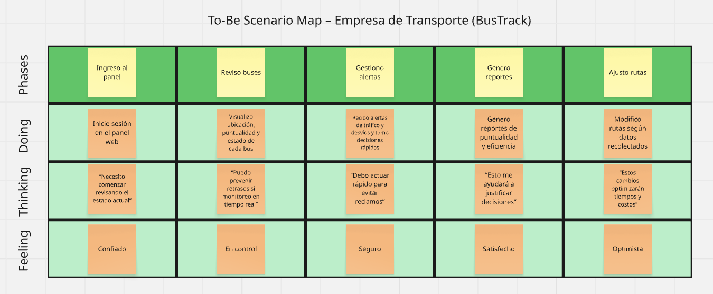

<br> _**Figura 21.** To-Be Scenario Map de la empresa de transporte, donde se representa el uso del panel web de BusTrack._  <br> _**Fuente:** elaboración propia._

<br>

Enlace de miro: https://miro.com/app/board/uXjVJhIqCHk=/?share_link_id=990352521858

## 3.2. User Stories

Para el caso de BusTrack, se han definido un total de cinco épicas, las cuales representan los bloques funcionales principales de la solución: gestión de rutas y horarios, monitoreo en tiempo real, administración de flota, experiencia del usuario en la aplicación y desarrollo de la Landing Page. 

A partir de estas épicas se han identificado un conjunto de **15 User Stories funcionales**, asociadas a los usuarios principales del sistema. Estas historias describen las interacciones clave que los usuarios deberán realizar dentro de la aplicación y permiten establecer el alcance funcional del producto.

Adicionalmente, se han incluido **Technical Stories** orientadas al desarrollo del backend y del RESTful API. Dichas historias están definidas desde el rol de *Developer* y permiten garantizar la integración entre el frontend, la Landing Page y los servicios internos de la plataforma.

### Épicas del Sistema

Las siguientes épicas representan los bloques funcionales principales del producto BusTrack. Cada épica agrupa un conjunto de User Stories que definen las funcionalidades asociadas tanto al pasajero como a las empresas de transporte, así como los componentes de interfaz y backend necesarios para soportar dichas capacidades.

| Código | Nombre de la Épica | Descripción |
|--------|---------------------|-------------|
| **E01** | **Gestión de rutas y horarios** | Incluye todas las funcionalidades que permiten a los pasajeros buscar rutas, visualizar horarios, consultar alternativas y guardar rutas frecuentes para optimizar su planificación diaria. |
| **E02** | **Monitoreo en tiempo real** | Agrupa las capacidades relacionadas con la visualización de ubicación del bus, seguimiento del trayecto, notificaciones de retrasos y alertas por desvíos. Estas funcionalidades reducen la incertidumbre del usuario durante el viaje. |
| **E03** | **Administración de flota** | Reúne las herramientas dirigidas a las empresas de transporte: monitoreo del estado de los buses, gestión de alertas, generación de reportes automáticos y toma de decisiones basadas en datos. |
| **E04** | **Experiencia del usuario en la app** | Contiene funcionalidades orientadas al pasajero final: registro, login, edición de perfil, calificación del servicio y personalización de rutas. |
| **E05** | **Landing Page y presencia digital** | Incluye los elementos informativos de la plataforma: presentación de la solución, beneficios, misión y visión del proyecto, y acceso a los módulos principales. |

<br>

### Historias de Usuario

| ID   | Epic ID | Épica                        | Nombre | Historia                                                                                         | Criterios de Aceptación |
|------|---------|------------------------------|--------|--------------------------------------------------------------------------------------------------|--------------------------|
| US01 | E01 | Gestión de rutas y horarios  | Buscar rutas | Como pasajero, quiero buscar una ruta en el mapa para encontrar la mejor opción de transporte. | **Positivo:** Dado origen y destino válidos, cuando hago clic en “Buscar ruta”, entonces se muestran las rutas disponibles. <br> **Negativo:** Dado que ingreso un destino inválido, cuando busco, entonces aparece “Ruta no encontrada”. |
| US02 | E01 | Gestión de rutas y horarios  | Visualizar horarios | Como pasajero, quiero visualizar el horario del próximo bus para organizar mi tiempo. | **Positivo:** Dado que selecciono una ruta válida, cuando abro “Ver horarios”, entonces veo el horario del próximo bus. <br> **Negativo:** Dado que la ruta no tiene horarios disponibles, cuando intento verlos, entonces aparece “Horarios no disponibles”. |
| US03 | E01 | Gestión de rutas y horarios  | Guardar rutas frecuentes | Como pasajero, quiero guardar mis rutas frecuentes para acceder a ellas rápidamente. | **Positivo:** Dado que selecciono una ruta, cuando presiono “Guardar como favorita”, entonces la ruta se guarda. <br> **Negativo:** Dado que la ruta ya está guardada, cuando intento guardarla otra vez, entonces aparece “Esta ruta ya está guardada”. |
| US04 | E02 | Monitoreo en tiempo real     | Ver ubicación del bus | Como pasajero, quiero ver la ubicación del bus en el mapa para saber cuánto tardará. | **Positivo:** Dado GPS activo, cuando abro la ruta, entonces veo la ubicación en el mapa. <br> **Negativo:** Dado que el bus no tiene señal GPS, cuando abro la ruta, entonces aparece “Ubicación no disponible”. |
| US05 | E02 | Monitoreo en tiempo real     | Notificaciones de retraso | Como pasajero, quiero recibir notificaciones si hay atraso para ajustar mi plan. | **Positivo:** Dado retraso mayor a 10 minutos, cuando ocurre, entonces recibo una notificación. <br> **Negativo:** Dado que desactivé notificaciones, cuando ocurre un retraso, entonces no recibo alertas. |
| US06 | E02 | Monitoreo en tiempo real     | Alertas de desvío | Como pasajero, quiero recibir alertas si un bus cambia de ruta. | **Positivo:** Dado un desvío registrado, cuando la ruta cambia, entonces recibo la alerta. <br> **Negativo:** Dado que no tengo conexión, cuando ocurre el desvío, entonces no recibo notificaciones. |
| US07 | E03 | Administración de flota      | Monitorear buses | Como administrador de flota, quiero monitorear mis buses en tiempo real. | **Positivo:** Dado buses operativos, cuando abro el panel, entonces veo el estado de cada unidad. <br> **Negativo:** Dado error del servidor, cuando accedo, entonces aparece “Error de conexión”. |
| US08 | E03 | Administración de flota      | Configurar alertas internas | Como administrador, quiero configurar alertas para incidentes de tráfico. | **Positivo:** Dado alertas activadas, cuando ocurre un incidente, entonces recibo una notificación. <br> **Negativo:** Dado que desactivo alertas, cuando ocurre un incidente, entonces no recibo notificación. |
| US09 | E04 | Experiencia del usuario      | Registro de pasajero | Como nuevo pasajero, quiero registrarme para personalizar mis rutas. | **Positivo:** Dado que completo los campos, cuando presiono “Registrarse”, entonces se crea la cuenta. <br> **Negativo:** Dado campos vacíos, cuando intento registrarme, entonces aparece “Complete todos los campos”. |
| US10 | E04 | Experiencia del usuario      | Editar perfil | Como pasajero, quiero editar mis datos personales. | **Positivo:** Dado datos válidos, cuando guardo cambios, entonces el perfil se actualiza. <br> **Negativo:** Dado correo inválido, cuando guardo, entonces aparece “Correo no válido”. |
| US11 | E05 | Landing Page   | Información de la solución | Como visitante, quiero ver información de la solución para entender su utilidad. | **Positivo:** Dado ingreso al home, cuando reviso “Solución”, entonces veo un resumen claro. <br> **Negativo:** Dado error de carga, cuando ingreso, entonces aparece “Información no disponible”. |
| US12 | E05 | Landing Page   | Beneficios | Como visitante, quiero conocer los beneficios de la aplicación. | **Positivo:** Dado acceso a la sección, cuando reviso, entonces veo al menos tres beneficios. <br> **Negativo:** Dado contenido incompleto, cuando navego, entonces aparece “Información en actualización”. |
| US13 | E05 | Landing Page   | Misión y visión | Como visitante, quiero conocer la misión y visión de la empresa. | **Positivo:** Dado ingreso a “Nosotros”, cuando reviso, entonces veo misión y visión claramente. <br> **Negativo:** Dado error de carga, cuando ingreso, entonces aparece “Contenido no disponible”. |
| US14 | E04 | Experiencia del usuario | Acceso diferenciado | Como usuario, quiero elegir si ingreso como pasajero o empresa. | **Positivo:** Dado selección del tipo de usuario, cuando continúo, entonces accedo al módulo correspondiente. <br> **Negativo:** Dado que no selecciono nada, cuando continúo, entonces aparece “Seleccione un tipo de usuario”. |
| US15 | E03 | Administración de flota | Acceso para empresas | Como empresa, quiero acceder a un módulo exclusivo con funciones avanzadas. | **Positivo:** Dado que ingreso correctamente, cuando abro “Monitoreo”, entonces veo buses activos y alertas. <br> **Negativo:** Dado un error de carga, cuando ingreso al módulo, entonces aparece “Módulo no disponible”. |


<br>

### Technical Stories (RESTful API)

Las siguientes Technical Stories describen los endpoints mínimos del RESTful API necesarios para soportar los flujos implementados en BusTrack para pasajeros y empresas de transporte, sin incluir funcionalidades de dashboard ni reportes.

| ID   | Epic ID | Nombre                                      | Historia (Technical Story)                                                                                                                                                  | Criterios de Aceptación |
|------|---------|---------------------------------------------|----------------------------------------------------------------------------------------------------------------------------------------------------------------------------|--------------------------|
| TS01 | E01     | Endpoint: Buscar rutas                      | Como **Developer**, quiero implementar el endpoint `GET /api/routes/search` para obtener las rutas disponibles según origen y destino, de modo que el buscador del mapa funcione correctamente. | **Positivo:** Dado que el cliente envía una petición GET con parámetros `origin` y `destination` válidos, cuando el servicio procesa la solicitud, entonces retorna código **200** y un JSON con la lista de rutas encontradas. <br><br> **Negativo (parámetros inválidos):** Dado que faltan `origin` o `destination`, cuando se realiza la petición, entonces la API retorna código **400** con el mensaje `"Parámetros inválidos"`. <br><br> **Negativo (error interno):** Dado que ocurre un error inesperado en el servidor, cuando se procesa la solicitud, entonces la API retorna código **500** con un mensaje de error genérico. |
| TS02 | E01     | Endpoint: Rutas favoritas del pasajero      | Como **Developer**, quiero implementar los endpoints `GET /api/users/{userId}/favorites` y `POST /api/users/{userId}/favorites` para que la vista de “Rutas favoritas” pueda listar y guardar rutas frecuentes. | **Positivo (listar):** Dado que el usuario tiene rutas favoritas guardadas, cuando el frontend realiza un `GET /api/users/{userId}/favorites`, entonces la API retorna código **200** y un JSON con la lista de rutas. <br><br> **Positivo (agregar):** Dado que se envía una ruta que aún no está en favoritos, cuando el frontend ejecuta un `POST` con los datos de la ruta, entonces la API retorna código **201** y la ruta queda registrada. <br><br> **Negativo (duplicado):** Dado que la ruta ya existe en favoritos, cuando se intenta registrar nuevamente con `POST`, entonces la API retorna código **409** y el mensaje `"Ruta ya registrada en favoritos"`. |
| TS03 | E03     | Endpoint: Monitoreo de flota de la empresa  | Como **Developer**, quiero implementar el endpoint `GET /api/companies/{companyId}/buses` para que la vista de “Monitoreo en tiempo real” pueda listar los buses de la empresa con su estado básico. | **Positivo:** Dado que la empresa tiene buses registrados, cuando el frontend realiza `GET /api/companies/{companyId}/buses`, entonces la API retorna código **200** y un JSON con la lista de buses (id, ruta actual, estado, última posición conocida). <br><br> **Negativo (sin buses):** Dado que la empresa aún no tiene buses configurados, cuando se hace la petición, entonces la API retorna código **200** y una lista vacía. <br><br> **Negativo (companyId inválido):** Dado que el `companyId` no existe, cuando se consulta el endpoint, entonces la API retorna código **404** con el mensaje `"Empresa no encontrada"`. |
| TS04 | E03     | Endpoint: Alertas internas de la empresa    | Como **Developer**, quiero implementar los endpoints `GET /api/companies/{companyId}/alerts` y `POST /api/companies/{companyId}/alerts` para que la vista de “Alertas internas” pueda listar y registrar incidentes. | **Positivo (listar):** Dado que existen alertas registradas, cuando el frontend ejecuta `GET /api/companies/{companyId}/alerts`, entonces la API retorna código **200** y un JSON con la lista de alertas (tipo, hora, estado). <br><br> **Positivo (registrar):** Dado que se envía una alerta válida, cuando el frontend realiza un `POST` con los datos de la alerta, entonces la API retorna código **201** y la alerta queda registrada. <br><br> **Negativo (datos inválidos):** Dado que el cuerpo del `POST` está incompleto, cuando se intenta registrar la alerta, entonces la API retorna código **400** con el mensaje `"Datos de alerta inválidos"`. |

<br>

## 3.3. Impact Mapping

El Impact Mapping permite conectar los objetivos del negocio con los actores principales, los cambios esperados en su comportamiento y los entregables del sistema que harán posible esos impactos. A continuación, se presentan los mapas desarrollados para los dos segmentos principales: pasajeros y empresas de transporte.

### Segmento Pasajeros

**Descripción:** Este mapa muestra cómo los objetivos de negocio orientados a reducir el tiempo de espera y aumentar el uso activo de la aplicación se conectan con los dos principales perfiles de pasajeros. El impacto esperado es que los usuarios consulten BusTrack antes de salir de casa para elegir su ruta y horario. Para lograrlo, los deliverables clave son el *buscador de rutas* y el *gestor de rutas favoritas*, de los cuales se derivan las User Stories asociadas a la búsqueda de rutas, visualización de horarios y guardado de rutas frecuentes.


<br> _**Figura 22.** Impact Map del segmento de pasajeros, que conecta los objetivos de negocio de BusTrack con los cambios de comportamiento esperados en estudiantes y trabajadores, y los deliverables asociados (buscador de rutas, rutas favoritas)._  <br> _**Fuente:** elaboración propia._


___

### Segmento Empresas de transporte

**Descripción:** Este mapa relaciona los objetivos de negocio orientados a la adopción del sistema por empresas de transporte y la reducción de quejas operativas. Los actores principales son el administrador de flota y el supervisor de rutas, cuyo impacto deseado es que monitoreen buses en tiempo real y ajusten rutas usando datos de operación. 

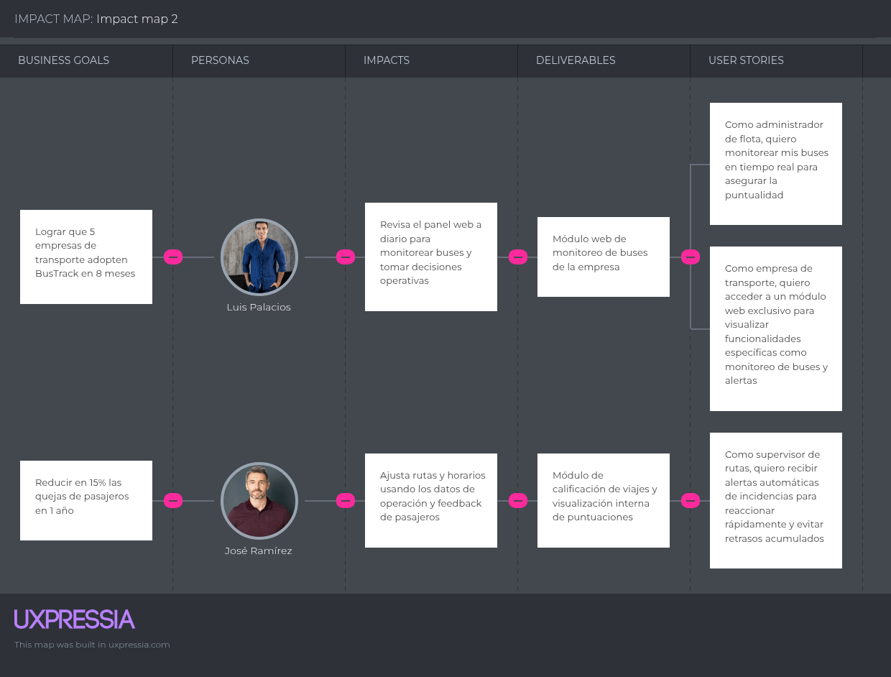

<br> _**Figura 23.** Impact Map del segmento de empresas de transporte, que relaciona los objetivos de adopción del sistema con los impactos deseados en administradores y supervisores de flota._  _**Fuente:** elaboración propia._


## 3.4. Product Backlog

| # Orden | User Story Id | Título                            | Descripción                                                                                                                | Story Points |
| ------- | ------------- | --------------------------------- | -------------------------------------------------------------------------------------------------------------------------- | ------------ |
| 1       | US01          | Buscar rutas                      | Como pasajero, quiero buscar una ruta en el mapa para encontrar la mejor opción de transporte.                             | 3            |
| 2       | US02          | Visualizar horarios               | Como pasajero, quiero visualizar el horario del próximo bus para organizar mi tiempo.                                      | 2            |
| 3       | US03          | Guardar rutas frecuentes          | Como pasajero, quiero guardar mis rutas frecuentes para acceder más rápido a ellas.                                        | 3            |
| 4       | US04          | Ver ubicación del bus             | Como pasajero, quiero ver la ubicación del bus en el mapa para saber cuánto tardará en llegar.                             | 5            |
| 5       | US05          | Recibir notificaciones de retraso | Como pasajero, quiero recibir notificaciones si hay atraso para ajustar mi plan de viaje.                                  | 5            |
| 6       | US06          | Alertas de desvío                 | Como pasajero, quiero recibir alertas si un bus cambia de ruta para evitar confusiones.                                    | 5            |
| 7       | US07          | Monitorear buses en ruta          | Como administrador de flota, quiero monitorear en tiempo real la ubicación de mis buses para asegurar la puntualidad.      | 5            |
| 8       | US08          | Configurar alertas internas       | Como administrador, quiero configurar alertas para incidentes de tráfico y gestionar mejor las incidencias.                | 5            |
| 9       | US09          | Registro de pasajero              | Como nuevo pasajero, quiero registrarme en la aplicación para personalizar mis rutas.                                      | 3            |
| 10      | US10          | Editar perfil                     | Como pasajero, quiero editar mis datos personales para mantener mi información actualizada.                                | 3            |
| 11      | US11          | Información de la solución        | Como visitante de la web, quiero ver información concisa de la solución para entender su utilidad.                         | 2            |
| 12      | US12          | Beneficios de la aplicación       | Como visitante de la web, quiero conocer los beneficios de la aplicación para entender cómo puede ayudarme.                | 2            |
| 13      | US13          | Misión y visión                   | Como visitante, quiero conocer la misión y visión de la empresa para entender su propósito y enfoque.                      | 1            |
| 14      | US14          | Acceso diferenciado               | Como usuario, quiero elegir si ingreso como pasajero o empresa para ver solo las opciones que me corresponden.             | 3            |
| 15      | US15          | Acceso para empresas              | Como empresa, quiero acceder a un módulo exclusivo con las funciones disponibles para la gestión de flota.                 | 5            |


Enlace de Trello: <https://trello.com/b/MhxlfsAK>
<br><br>

# Capítulo IV: Product Design

## 4.1. Style Guidelines.

La presente sección define las pautas visuales y de identidad gráfica empleadas en BusTrack. Su objetivo es garantizar coherencia, claridad y accesibilidad en todos los elementos de la interfaz, alineando la experiencia del usuario con la propuesta de valor y el enfoque profesional de la plataforma web.

### 4.1.1. General Style Guidelines

- **Branding**  
  Las directrices generales de estilo de BusTrack se definen a partir de la identidad visual reflejada en la landing page desarrollada. El objetivo es asegurar coherencia, legibilidad y accesibilidad en todas las plataformas. La marca está representada por un logo que combina un ícono de bus y un marcador de ubicación, acompañado por el nombre de la startup en tipografía sans-serif bold. Este diseño transmite movilidad, confianza y simplicidad.
<p align="center">
  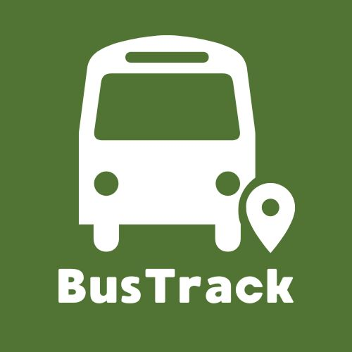
</p>


_**Figura 24.** Logo de BusTrack, que combina un ícono de bus y un marcador de ubicación para representar el transporte urbano geolocalizado._  <br> _**Fuente:** elaboración propia._

<br>

- **Paleta de colores**  
  La paleta refuerza valores de sostenibilidad, frescura y accesibilidad.  <br><br>
  * **Verde principal** (#4D7B2D aprox.): utilizado en encabezados, títulos, botones y barra de navegación. Representa sostenibilidad, confianza y movilidad. <br>
    
    
  * **Verde claro** (#EAF4E0 aprox.): empleado en fondos de secciones secundarias (Beneficios, Misión, Visión). Aporta frescura y ligereza.  <br>
    
    
  * **Blanco** (#FFFFFF): color de fondo predominante para dar limpieza y contraste.  <br>
  
    
    
  * **Gris oscuro / Negro** (#212121 aprox.): utilizado en textos secundarios y párrafos para la legibilidad.<br>
    

  * **Rojo de alerta** `#D90000`: reservado para acciones destructivas o críticas, como botones de “Cerrar sesión” en la página de empresas y “Borrar historial” en la página de pasajeros.<br>
  

  * **Amarillo de advertencia** `#F9FAB6`: se usa en la página de empresa para resaltar buses en **mantenimiento**, buses con **retraso de X minutos**, alertas de **gravedad media** y problemas **pendientes** aún no resueltos.<br>
  

  * **Rojo suave de error** `#FFC9C9`: empleado para indicar estados críticos en la página de empresa, como buses **inactivos** o **fuera de servicio**, así como alertas de **gravedad alta**.<br>
  

  * **Verde de estado OK** `#EBFAB6`: se utiliza para señalar buses **activos** y **en horario**, así como alertas de **gravedad baja** en la página de empresa.<br>
  

  * **Azul de acción para pasajeros** `#2479E8`: color principal de botones en las pantallas de pasajeros (por ejemplo, “Buscar ruta” o “Guardar ruta”), asociado a acciones de exploración y planificación del viaje.<br>
  

  * **Verde corporativo oscuro** `#255000`: aplicado a botones y elementos de acción en la página de empresas, otorgando un tono más serio y profesional para operaciones de gestión de flota.<br>
  

- **Tipografía**  
  Se utiliza una tipografía sans-serif, principalmente **Montserrat** en sus variantes regular y bold. La combinación busca transmitir modernidad, claridad y confianza, manteniendo legibilidad en distintos tamaños y dispositivos.
<p align="center">
  
</p>

_**Figura 25.** Muestra de la tipografía Montserrat utilizada como base para los textos de BusTrack._  <br> _**Fuente:** elaboración propia._

- **Spacing**  
  * Alrededor del logo: dejar un margen libre equivalente al alto de la letra **B** de “BusTrack”.  
  * Botones: padding interno mínimo de 12–16 px para asegurar comodidad en la interacción.  
  * Textos: interlineado de 1.5 para mejorar la lectura en pantallas.  
  * Secciones web: separar bloques de contenido con márgenes verticales de 48–64 px para evitar saturación visual y garantizar orden.

### 4.1.2. Web Style Guidelines

Las directrices específicas para la versión web de BusTrack buscan garantizar consistencia visual, accesibilidad y adaptabilidad en distintos dispositivos.

* **Diseño responsive**
  - Estructura modular con secciones claramente diferenciadas (Hero, Cómo usar, Beneficios, Sobre Nosotros).  
  - Uso de grillas en desktop (por ejemplo, tres columnas en Beneficios y Cómo usar) y reordenamiento en formato vertical en mobile.

* **Botones y elementos interactivos**
  - Botón primario (ejemplo: “Iniciar Sesión”) en fondo blanco con borde verde, que se rellena en verde al pasar el cursor (*hover*).  
  - Tamaño mínimo de 44 px para accesibilidad en pantallas táctiles.  
  - Estados definidos: normal, hover, activo y deshabilitado.

* **Jerarquía de textos**
  - Encabezados en tipografía sans-serif (Montserrat) en negrita (H1 y H2) para lograr impacto visual.  
  - Párrafos y descripciones en sans-serif regular para asegurar legibilidad en pantalla.  
  - Colores de texto adaptados al fondo: verde sobre blanco y negro/gris sobre verde claro.

* **Imágenes y multimedia**
  - Iconografía simple en formato SVG para garantizar escalabilidad.  
  - Imágenes optimizadas con bordes redondeados para mantener coherencia visual.

<br>

## 4.2. Information Architecture

Esta sección describe la arquitectura de información de BusTrack, detallando la organización, etiquetado, navegación y sistemas de búsqueda utilizados. Su propósito es asegurar que los usuarios puedan acceder de manera rápida e intuitiva a las funcionalidades principales de la plataforma.

### 4.2.1. Organization Systems

La información en BusTrack se organiza en una estructura jerárquica y modular que facilita la navegación del usuario, tanto en la landing page como en la aplicación web.

El siguiente organigrama de contenidos representa visualmente la estructura jerárquica del sitio. El diagrama inicia con la sección principal **Hero Section**, que agrupa el mensaje introductorio y el botón de acceso. Luego se despliega en tres bloques informativos: **“Cómo usar BusTrack”**, **“Beneficios”** y **“Sobre Nosotros”**. Cada bloque se descompone en subapartados que detallan las funciones básicas del sistema, tales como buscar rutas, recibir alertas, consultar información en tiempo real, guardar rutas favoritas y acceder a la misión y visión de la startup.


<p align="center">
  
</p>

_**Figura 26.** Árbol de contenidos de BusTrack utilizado para representar la organización jerárquica de la información en la landing page._   <br> _**Fuente:** elaboración propia._

### 4.2.2. Labeling Systems

Los sistemas de etiquetado emplean un lenguaje claro, breve y orientado a la acción:

* Menú de navegación: “Cómo usar”, “Beneficios”, “Sobre Nosotros”.  
* Botón principal: “Iniciar Sesión”.  
* Secciones informativas: “Misión”, “Visión”.  
* Mensajes claros que transmiten utilidad inmediata, evitando tecnicismos.


### 4.2.3. SEO Tags and Meta Tags

Se emplearán etiquetas optimizadas para mejorar el posicionamiento en buscadores:

* **Meta Title:** *BusTrack – Encuentra tu bus en tiempo real*.  
* **Meta Description:** Aplicación web que muestra ubicación de buses, horarios en vivo y alertas para viajar más seguro y sin esperas innecesarias.  
* **Keywords:** transporte público, buses en tiempo real, rutas de bus, movilidad urbana, BusTrack Perú.  
* **Etiquetas alt en imágenes:** descripciones breves y precisas que indiquen el contenido visual y su propósito.


### 4.2.4. Searching Systems

BusTrack incorporará un sistema de búsqueda interno enfocado en la funcionalidad clave:

* **Búsqueda de rutas:** el usuario podrá ingresar su punto de origen y destino para obtener información de buses disponibles.  
* **Acceso a rutas favoritas:** opción para guardar y consultar rápidamente rutas frecuentes.  
* **Resultados en tiempo real:** tiempos estimados de llegada (ETA) y alertas sobre tráfico o desvíos en las rutas seleccionadas.
  
### 4.2.5. Navigation Systems

El sistema de navegación busca ser intuitivo y accesible:

* **Navegación principal (top bar):** Inicio, Cómo usar, Beneficios, Sobre Nosotros, Iniciar Sesión.  
* **Navegación secundaria:** botones de acción dentro de cada sección (por ejemplo, “Guardar rutas favoritas”).  
* **Estructura responsive:** en dispositivos móviles, el menú se transforma en un ícono de hamburguesa para ahorrar espacio.  
* **Flujo del usuario:** el recorrido esperado es Inicio → Conocer cómo funciona → Revisar beneficios → Iniciar sesión → Usar BusTrack.

## 4.3. Landing Page UI Design

En esta sección se presentan los wireframes y mockups de la landing page de BusTrack. El diseño visual propuesto busca comunicar de forma clara el valor de la solución, facilitando que los visitantes comprendan sus beneficios y accedan a las principales funcionalidades del sistema.

### 4.3.1. Landing Page Wireframe
Las imágenes muestran los wireframes iniciales de la landing page de BusTrack. El prototipo incluye secciones básicas y representativas. Además, se presentan accesos rápidos que permiten al usuario conocer cómo utilizar BusTrack, revisar sus principales ventajas y obtener información esencial de la startup.

### Desktop Web Browser

**Wireframe 1**

_Descripción:_ Este wireframe representa la página principal de la landing page de BusTrack. Incluye un botón para iniciar sesión y un menú de navegación en la parte superior con accesos a las secciones “Cómo usar”, “Beneficios” y “Sobre Nosotros”. En el cuerpo central se ubica un espacio para una imagen acompañada de un texto introductorio que presenta la plataforma.


<br>

_**Figura 27.** Wireframe de la página principal de la landing page de BusTrack en vista desktop, que muestra el menú de navegación, el texto introductorio y el botón principal de inicio de sesión.**_ <br> _**Fuente:** elaboración propia._


**Wireframe 2**

_Descripción:_ Este wireframe pertenece a la sección “Cómo usar”. El propósito es explicar de manera simple el funcionamiento de la plataforma. Cada paso incluye un espacio para una imagen representativa, un encabezado y una breve descripción.


<br>

_**Figura 28.** Wireframe de la sección “Cómo usar” en vista desktop, donde se presentan los pasos explicativos acompañados de iconografía y texto guía para comprender el funcionamiento de la plataforma._ <br> _**Fuente:** elaboración propia._


**Wireframe 3**

_Descripción:_ Este wireframe corresponde a la sección “Beneficios”. Presenta tres bloques que destacan las principales ventajas de la plataforma. Cada bloque incluye un espacio para un título, una breve descripción y una imagen.


<br>

_**Figura 29.** Wireframe de la sección “Beneficios” en vista desktop, estructurada en tres bloques que destacan las principales ventajas de BusTrack para los usuarios._ <br> _**Fuente:** elaboración propia._


**Wireframe 4**

_Descripción:_ Este wireframe corresponde a la sección “Sobre Nosotros”. Presenta la misión y visión de BusTrack, cada una acompañada de texto e imágenes representativas. Asimismo, incorpora un footer con la información de contacto de BusTrack, incluyendo correo electrónico, WhatsApp y enlaces a redes sociales.


<br>

_**Figura 30.** Wireframe de la sección “Sobre Nosotros” en vista desktop, que muestra la misión, visión y los datos de contacto de BusTrack en la parte inferior de la página._ <br> _**Fuente:** elaboración propia._


### Mobile Web Browser

Para la versión móvil, los wireframes muestran la adaptación responsiva de las mismas secciones, reorganizando los elementos en un formato vertical optimizado para pantallas pequeñas.

**Wireframe 1**

Descripción: Este wireframe corresponde a la página principal de la landing page en vista móvil. En la parte superior se muestra el nombre de la marca junto con el botón “Iniciar Sesión”. En el área central se incluye un espacio para la imagen principal de presentación, seguido de tres bloques horizontales destinados a texto introductorio sobre BusTrack.


<br>

_**Figura 31.** Wireframe de la página principal de la landing page en vista móvil, con navegación compacta y contenido central reorganizado para lectura vertical._ <br> _**Fuente:** elaboración propia._

**Wireframe 2**

Descripción: Este wireframe corresponde a la sección “Cómo usar” en vista móvil. La interfaz presenta tres pasos principales organizados verticalmente, cada uno con un espacio para imagen representativa, un título y líneas de texto descriptivo que explican el funcionamiento básico de la plataforma.


<br>

_**Figura 32.** Wireframe de la sección “Cómo usar” en vista móvil, donde los pasos se presentan de manera secuencial para facilitar la comprensión desde un dispositivo móvil._ <br> _**Fuente:** elaboración propia._

**Wireframe 3**

Descripción: Este wireframe corresponde a la sección “Beneficios de BusTrack” en vista móvil. Incluye dos bloques informativos, cada uno compuesto por un área para texto y un recuadro para imagen. Los elementos se encuentran dispuestos de forma vertical para mejorar la legibilidad en dispositivos pequeños.


<br>

_**Figura 33.** Wireframe de la sección “Beneficios” en vista móvil, con disposición vertical de los bloques que presentan las principales ventajas para el usuario._ <br> _**Fuente:** elaboración propia._

**Wireframe 4**

Descripción: Este wireframe corresponde a la sección “Sobre Nosotros” en vista móvil. Presenta dos bloques principales dedicados a la misión y visión de BusTrack, cada uno acompañado de un recuadro para imagen ilustrativa. En la parte inferior se incluye un footer con datos de contacto y accesos a redes sociales.


<br>

_**Figura 34.** Wireframe de la sección “Sobre Nosotros” en vista móvil, mostrando la misión, visión y datos de contacto con un diseño adaptado al formato vertical._ <br> _**Fuente:** elaboración propia._

### 4.3.2. Landing Page Mock-up
En esta sección se presentan los mockups finales del Landing Page de BusTrack, desarrollados a partir de los wireframes previos. 

### Desktop Web Browser


### Mobile Web Browser


Link del figma: https://www.figma.com/design/gfihE4UEnoiFtzf54xXuL8/

## 4.4. Web Applications UX/UI Design

### 4.4.1. Web Applications Wireframes
En esta sección se presentan los wireframes de la aplicación web.


_Descripción:_ Este wireframe corresponde a la pantalla de inicio de sesión. Presenta campos para ingresar correo electrónico y contraseña, un enlace para recuperar la contraseña, y un botón para continuar con el inicio de sesión. Además incluye un botón de registro si el usuario aún no tiene una cuenta.


_Descripción:_ Este wireframe corresponde a la pantalla de registro. Incluye la opción de continuar con Google, así como campos para ingresar correo, usuario y contraseña. Cuenta con un botón para crear la cuenta de usuario y un enlace para que los usuarios que ya tienen cuenta puedan iniciar sesión.


_Descripción:_ Este wireframe corresponde a la página de inicio que aparece al iniciar sesión. Incluye un menú superior con accesos directos a las funciones "Buscar Ruta", "Notificaciones", "Paraderos cercanos" y "Perfil". En el centro hay un campo de búsqueda y un mapa interactivo que permite al usuario visualizar rutas, ubicaciones y paraderos en tiempo real.


_Descripción:_ Este wireframe corresponde a la sección “Buscar Ruta”. Contiene dos campos de entrada para que el usuario ingrese el punto de origen y el destino, junto con un botón de búsqueda. 


_Descripción:_ Este wireframe representa la vista de resultados en la sección “Buscar Ruta”. Después de ingresar origen y destino, el sistema muestra una lista de opciones con la información básica de cada ruta y un botón de “Detalles”.


_Descripción:_ Este wireframe corresponde a la vista de “Detalles” dentro de la sección “Buscar Ruta”. Al seleccionar una opción de ruta, se muestra un mapa interactivo acompañado de un panel lateral que presenta información más detallada sobre la ruta elegida.


_Descripción:_ Este wireframe corresponde a la sección “Notificaciones”. Muestra una lista de notificaciones en tiempo real organizadas de la más reciente a la más antigua.


_Descripción:_ Este wireframe corresponde a la sección “Paraderos Cercanos”. Muestra un mapa interactivo donde el usuario puede visualizar la ubicación de los paraderos más cercanos, acompañado de una lista lateral que detalla el nombre de cada paradero y los buses que pasan por ellos.


_Descripción:_ Este wireframe corresponde a la sección “Perfil”. Permite al usuario visualizar y gestionar su información personal. Además, cuenta con un botón para cerrar sesión.


_Descripción:_ Este wireframe corresponde a la vista de “Detalles” dentro de la sección “Rutas favoritas”. Permite al usuario visualizar y gestionar las rutas que ha guardado previamente como favoritas. Además, cuenta con un botón de retorno para volver al perfil principal.


_Descripción:_ Este wireframe corresponde a la vista de “Detalles” dentro de la sección “Historial de viajes”. Presenta un registro visual de los viajes realizados por el usuario. Además, cuenta con un botón de retorno para volver al perfil principal.


_Descripción:_ Este wireframe corresponde a la vista de “Detalles” dentro de la sección “Notificaciones”. Permite al usuario personalizar los tipos de notificaciones que desea recibir, como alertas de llegada de buses, retrasos en las rutas, paraderos cercanos e inicio de viaje. Además, cuenta con un botón de retorno para volver al perfil principal.


_Descripción:_ Este wireframe corresponde a la vista de “Detalles” dentro de la sección “Configuración de cuenta”. Permite al usuario actualizar su información personal, incluyendo nombre, correo y contraseña, así como cambiar su foto de perfil. Además, cuenta con un botón para guardar los cambios y otro para de retorno para volver al perfil principal.


### 4.4.2. Web Applications Wireflow Diagrams
En esta sección se presentan los Wireflow Diagrams de BusTrack. Cada diagrama combina wireframes y flujos de navegación para representar de manera visual cómo los usuarios interactúan con la aplicación web.


### 4.4.3. Web Applications Mock-ups


Link del figma: https://www.figma.com/design/gfihE4UEnoiFtzf54xXuL8/

### 4.4.4. Web Applications User Flow Diagrams


## 4.5. Web Applications Prototyping
En esta sección se simula la navegación e interacción del usuario con la plataforma. Los diseños reflejan los flujos definidos en los User Flow Diagrams, priorizando la claridad, la usabilidad y la consistencia visual.


Link del video: https://drive.google.com/file/d/1jQzmb0z41K3b1MGZBZUukn5p4k0_au6g/

## 4.6. Domain-Driven Software Architecture
La arquitectura de software orientada al dominio nos permite estructurar el sistema en torno a los conceptos fundamentales del transporte urbano, asegurando que la lógica de negocio se ajuste con precisión a las necesidades de los usuarios. En esta sección aplicaremos Bounded Contexts para la gestión de usuarios, rutas, paraderos y notificaciones.


### 4.6.1. Design-Level Event Storming
En esta sección se detallan los procesos clave del dominio, identificando los segmentos objetivos junto con los sucesos, comandos y errores relevantes. Además, las funcionalidades se organizaron en bounded contexts, lo que permite reflejar la lógica del sistema de manera estructurada.


Link del miro: https://miro.com/app/board/uXjVJFjoDJw=/

### 4.6.2. Software Architecture Context Diagram

**Elementos**

- BusTrack: Plataforma central que gestiona rutas, paraderos y notificaciones en tiempo real
- Usuario Estudiante: Consulta rutas, paraderos cercanos y recibe notificaciones sobre los buses
- Empresa de Transporte: Proporciona datos de buses y gestiona información de flotas
- Google Maps API: Servicio externo de mapas y geolocalización
- ATU / Flotas de Transporte: Fuente oficial de datos de rutas y buses
- Servicio de Notificaciones: Permite el envío de alertas en tiempo real a los usuarios


**Leyenda**


### 4.6.3. Software Architecture Container Diagrams

La arquitectura de BusTrack adopta un estilo modular orientado a servicios, combinando una PWA en el frontend con un Backend API centralizado y un servicio de tiempo real basado en eventos. También, se emplea un enfoque event-driven para las notificaciones y actualizaciones de posición, mientras que las operaciones CRUD se gestionan mediante REST. El componente de Fleet Data Ingestion aplica un patrón de data normalization pipeline para procesar datos de GPS en distintos formatos provenientes de las empresas de transporte.


**Leyenda**


### 4.6.4. Software Architecture Components Diagrams

Cada contenedor del sistema BusTrack se descompone en componentes que implementan sus principales responsabilidades internas. A continuación se presentan los diagramas de componentes correspondientes a la Aplicación Web (PWA), el Backend API, el Servicio en Tiempo Real y el módulo de Ingesta de Datos de Flota.

**Web App (PWA)**

La PWA gestiona la interfaz del usuario final y las vistas operativas para pasajeros y personal de transporte.

- BuscarRutasView: búsqueda y visualización de rutas.
- ParaderoDetalleView: muestra información de paraderos.
- MapaInteractivo: renderiza rutas y ubicaciones.
- ApiClient: comunica con el Backend API (HTTP REST).
- ClientTiempoReal: suscripción WebSocket con el Servicio en Tiempo Real.
- AuthUI y SesionStore: control de autenticación y persistencia de sesión.
- AjustesNotificaciones: permisos para recibir alertas push.
- RouterSPA: navegación interna entre vistas.


**Leyenda**


**Backend API**

La API central implementa la lógica de negocio siguiendo una arquitectura por capas:

- Controladores (Controller): gestionan endpoints REST (AuthController, BuscarRutasController, ParaderosController, AlertasController).
- Servicios (Service): encapsulan la lógica (RutasService, ParaderosService, AuthService, AlertasService).
-Repositorios (Repository): abstraen el acceso a datos (RutasRepository, ParaderosRepository, UsuariosRepository).
-Infraestructura (Infrastructure): integraciones externas (MapsGateway, ATUGateway, PushGateway, CacheAdapter, ORMAdapter).

Los controladores reciben solicitudes HTTP, delegan en los servicios y retornan respuestas JSON. Los servicios pueden consultar APIs externas, cachear resultados o emitir eventos.


**Leyenda**


**Real-time Service**

Este servicio maneja la comunicación asincrónica con los clientes mediante WebSockets.

- GatewayWebSocket: gestiona las conexiones y salas de suscripción por ruta.
- AuthWSMiddleware: valida tokens JWT antes de permitir conexión.
- SuscriptorEventos: consume eventos de posición desde el sistema de ingesta.
- PublicadorActualizaciones: difunde mensajes bus:update a los clientes conectados.

Se comunica de manera asincrónica (MQ) con la ingesta y bidireccional (WebSocket) con la PWA.


**Leyenda**

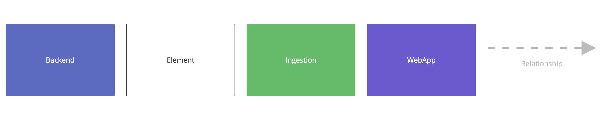


**Fleet Data Ingestion**

Este módulo procesa y normaliza la telemetría proveniente de distintas empresas de transporte.

- ConectorProveedorA/B: adaptadores específicos para cada fuente de datos.
- NormalizadorPosiciones: unifica formatos de GPS.
- ValidadorTelemetria: filtra datos inválidos.
- PublicadorEventos: emite eventos PosicionActualizada hacia el sistema de tiempo real.

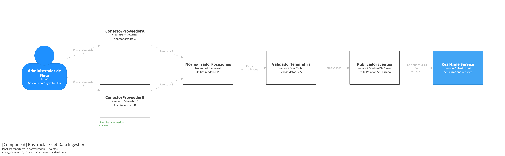

**Leyenda**


## 4.7. Software Object-Oriented Design

### 4.7.1. Class Diagrams


### 4.7.2. Class Dictionary

## Clase: **User** *(Abstracta)*  
**Descripción:** Usuario base del sistema  

| Nombre de Atributo | Descripción                  | Tipo de Dato     |
|--------------------|------------------------------|------------------|
| id                 | Identificador único          | UUID             |
| name               | Nombre completo              | String           |
| email              | Correo electrónico           | String           |
| password           | Contraseña encriptada        | String           |
| role               | Tipo de usuario              | enum (UserRole)  |
| profilePhoto       | Foto de perfil               | String (URL)     |

**Métodos**  
- `login()` — Autentica al usuario en el sistema  
- `logout()` — Cierra la sesión del usuario  
- `updateProfile()` — Actualiza información del perfil  

---

## Clase: **Passenger** *(Hereda de User)*  
**Descripción:** Usuario que utiliza el transporte público  

| Nombre de Atributo | Descripción                   | Tipo de Dato     |
|--------------------|-------------------------------|------------------|
| favoriteRoutes     | Rutas guardadas como favoritas | List<Route>      |
| travelHistory      | Historial de viajes realizados | List<Travel>     |
| currentTravel      | Viaje en curso                 | Travel           |

**Métodos**  
- `searchRoute(origin, destination)` — Busca rutas disponibles  
- `saveFavoriteRoute(route)` — Guarda una ruta como favorita  
- `startTravel(route)` — Inicia un viaje  
- `receiveNotification()` — Recibe notificaciones  

---

## Clase: **Driver** *(Hereda de User)*  
**Descripción:** Conductor de un bus  

| Nombre de Atributo | Descripción                  | Tipo de Dato       |
|--------------------|------------------------------|--------------------|
| licenseNumber      | Número de licencia de conducir | String            |
| assignedBus        | Bus asignado                 | Bus                |
| shiftStatus        | Estado del turno             | enum (ShiftStatus) |

**Métodos**  
- `startShift()` — Inicia turno de trabajo  
- `endShift()` — Finaliza turno de trabajo  
- `updateLocation()` — Actualiza ubicación en tiempo real  
- `reportIncident()` — Reporta incidentes en la ruta  

---

## Clase: **Bus**  
**Descripción:** Vehículo de transporte público  

| Nombre de Atributo | Descripción                  | Tipo de Dato      |
|--------------------|------------------------------|-------------------|
| id                 | Identificador único          | UUID              |
| licensePlate       | Placa del vehículo           | String            |
| capacity           | Capacidad de pasajeros       | int               |
| currentLocation    | Ubicación actual             | Location          |
| status             | Estado operativo             | enum (BusStatus)  |
| currentRoute       | Ruta actual                  | Route             |

**Métodos**  
- `updateLocation()` — Actualiza posición GPS  
- `changeStatus()` — Cambia estado del bus  
- `getArrivalTime(stop)` — Calcula tiempo de llegada  

---

## Clase: **Route**  
**Descripción:** Ruta de transporte con paradas definidas  

| Nombre de Atributo | Descripción                  | Tipo de Dato   |
|--------------------|------------------------------|----------------|
| id                 | Identificador único          | UUID           |
| name               | Nombre de la ruta            | String         |
| stops              | Lista de paradas             | List<Stop>     |
| estimatedTime      | Tiempo estimado de recorrido | int            |
| frequency          | Frecuencia de paso           | int            |

**Métodos**  
- `calculateArrivalTime()` — Calcula tiempo de llegada  
- `addStop()` — Agrega nueva parada  
- `removeStop()` — Elimina parada  

---

## Clase: **Stop**  
**Descripción:** Paradero o punto de parada  

| Nombre de Atributo | Descripción                  | Tipo de Dato   |
|--------------------|------------------------------|----------------|
| id                 | Identificador único          | UUID           |
| name               | Nombre del paradero          | String         |
| location           | Coordenadas GPS              | Location       |
| buses              | Buses que pasan por aquí     | List<Bus>      |

**Métodos**  
- `getNextBuses()` — Obtiene próximos buses  
- `updateBusArrival()` — Actualiza llegada de buses  

---

## Clase: **Travel**  
**Descripción:** Registro de un viaje realizado  

| Nombre de Atributo | Descripción                  | Tipo de Dato   |
|--------------------|------------------------------|----------------|
| id                 | Identificador único          | UUID           |
| passenger          | Pasajero que realiza el viaje | Passenger      |
| route              | Ruta utilizada               | Route          |
| startTime          | Hora de inicio               | DateTime       |
| endTime            | Hora de fin                  | DateTime       |
| duration           | Duración del viaje           | int            |

**Métodos**  
- `startTravel()` — Inicia el viaje  
- `endTravel()` — Finaliza el viaje  
- `calculateDuration()` — Calcula duración  

---

## Clase: **Notification**  
**Descripción:** Sistema de notificaciones  

| Nombre de Atributo | Descripción                     | Tipo de Dato                    |
|--------------------|---------------------------------|---------------------------------|
| id                 | Identificador único             | UUID                            |
| recipient          | Usuario destinatario            | User                            |
| message            | Contenido del mensaje           | String                          |
| sentAt             | Fecha y hora de envío           | DateTime                        |
| type               | Tipo de notificación            | enum (NotificationType)         |
| status             | Estado de la notificación       | enum (NotificationStatus)       |

**Métodos**  
- `send()` — Envía la notificación  
- `markAsRead()` — Marca como leída  
## 4.8. Database Design

En esta sección se diseñará e implementará la base de datos BusTrack con la información requerida de los usuarios y demás entidades para el duncionamiento correcto de la aplicación.

### 4.8.1. Database Diagram

En primer lugar, diseñanmos la base de datos en un diagrama Entidad-Relación (ER) usando el sitio web LucidChart. Este fue elegido debido a su practicidad e implementación de plantillas ER dentro de ella.
link: https://lucid.app/lucidchart/7b7fbca6-a61b-4653-8ea2-b8b1985b5e9f/edit?viewport_loc=-393%2C-62%2C3568%2C1532%2C0_0&invitationId=inv_7298d486-3846-4284-ac1c-f5b20085366e 

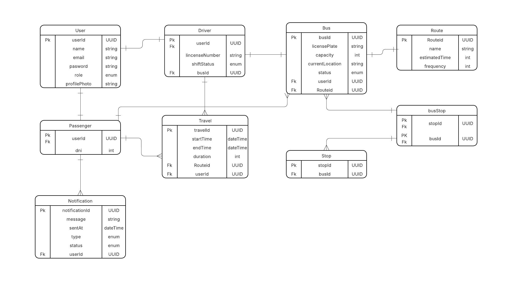

Luego de diseñar nuestro diagrama, implementamos nuestro script para crear la base de datos BusTrack, la cual una vez implementada nos muestra el mapa físico de la base de datos. Para este entregable trabajamos con MySQL Workbench.


# Base de Datos: BusTrack1

## 1. Tabla: `Users`
- Contiene la información principal de los usuarios del sistema.  
- **Campos:**  
  - `userId` (PK)  
  - `name`  
  - `email` (único)  
  - `password`  
  - `role` (PASSENGER, DRIVER, ADMIN)  
  - `profilePhoto`  

---

## 2. Tabla: `Passenger`
- Almacena información adicional de los pasajeros.  
- Relación **1:1** con `Users` (cada pasajero es un usuario).  
- **Campos:**  
  - `userId` (PK, FK → `Users.userId`)  
  - `dni`  

---

## 3. Tabla: `Notification`
- Registra las notificaciones enviadas a los usuarios.  
- Relación **N:1** con `Users` (cada notificación pertenece a un usuario).  
- **Campos:**  
  - `notificationId` (PK)  
  - `message`  
  - `sentAt`  
  - `type` (ARRIVAL_ALERT, DELAY_ALERT, SECURITY_ALERT)  
  - `status` (SENT, DELIVERED, READ)  
  - `userId` (FK → `Users.userId`)  

---

## 4. Tabla: `Route`
- Representa las rutas que realizan los buses.  
- **Campos:**  
  - `routeId` (PK)  
  - `name`  
  - `estimatedTime`  
  - `frequency`  

---

## 5. Tabla: `Stop`
- Define los paraderos de las rutas.  
- **Campos:**  
  - `stopId` (PK)  
  - `attribute1`  
  - `attribute2`  
  - `attribute3`  

---

## 6. Tabla: `Route_Stop`
- Representa la relación **N:M** entre `Route` y `Stop`.  
- **Campos:**  
  - `routeId` (PK, FK → `Route.routeId`)  
  - `stopId` (PK, FK → `Stop.stopId`)  

---

## 7. Tabla: `Bus`
- Almacena la información de los buses.  
- Relación **N:1** con `Route` (un bus pertenece a una ruta).  
- **Campos:**  
  - `busId` (PK)  
  - `licensePlate` (único)  
  - `capacity`  
  - `currentLocation`  
  - `status` (ACTIVE, INACTIVE, MAINTENANCE)  
  - `routeId` (FK → `Route.routeId`)  

---

## 8. Tabla: `Driver`
- Contiene los datos de los conductores.  
- Relación **1:1** con `Users` (cada conductor es un usuario).  
- Relación **N:1** con `Bus` (un conductor puede estar asignado a un bus).  
- **Campos:**  
  - `userId` (PK, FK → `Users.userId`)  
  - `licenseNumber`  
  - `shiftStatus` (ACTIVE, INACTIVE, BREAK)  
  - `busId` (FK → `Bus.busId`)  

---

## 9. Tabla: `Travel`
- Registra los viajes realizados.  
- Relación **N:1** con `Route` (un viaje corresponde a una ruta).  
- Relación **N:1** con `Passenger` (un viaje corresponde a un pasajero).  
- **Campos:**  
  - `travelId` (PK)  
  - `startTime`  
  - `endTime`  
  - `duration`  
  - `routeId` (FK → `Route.routeId`)  
  - `userId` (FK → `Passenger.userId`)  


<br><br>

# Capítulo V: Product Implementation, Validation & Deployment


## 5.1. Software Configuration Management

A continuación, se describe el proceso por el cual organizamos, gestionamos y controlamos los cambios de desarrollo de BusTrack.

### 5.1.1. Software Development Environment Configuration

Gestión de las necesidades
| Plataforma | Descripción | Enlace |
|------------|-------------|--------|
| Trello | Esta plataforma de gestión de proyectos ofrece funcionalidades para el seguimiento detallado del progreso (user stories). | [Inicio \| Trello](https://trello.com) |
| Uxpressia | Herramienta en línea que ayuda en el proceso de mapeo (user personas). | [https://uxpressia.com](https://uxpressia.com) |
| Canva | Es una aplicación web de diseño y comunicación visual donde los usuarios pueden diseñar lo que deseen y publicarlo. | [https://www.canva.com](https://www.canva.com) |
| Lucidchart | Sirve como un lienzo visual versátil para representar cualquier tipo de información estructurada o proceso, facilitando la comprensión. | [https://www.lucidchart.com](https://www.lucidchart.com) |


Diseño UX/UI
| Plataforma | Descripción | Enlace |
|------------|-------------|--------|
| Figma | Herramienta para el diseño de productos digitales que fomenta la colaboración y agiliza el flujo de trabajo. | [https://www.figma.com](https://www.figma.com) |


Desarrollo de software
| Plataforma           | Descripción                                                                                              | Link |
|----------------------|----------------------------------------------------------------------------------------------------------|------|
| HTML                 | Sirve para definir la estructura y el contenido de una página web.                                       | [HTML Tutorial](https://www.w3schools.com/html/) |
| CSS                  | Se encarga de la presentación visual y el estilo de la página web.                                       | [CSS Tutorial](https://www.w3schools.com/css/) |
| JS                   | Añade interactividad y dinamismo a la página web.                                                        | [JavaScript Tutorial](https://www.w3schools.com/js/) |
| Visual Studio Code   | Entorno de desarrollo que facilita la escritura, edición, depuración y gestión de código para una amplia gama de lenguajes y proyectos. | [Visual Studio Code - Code Editing. Redefined](https://code.visualstudio.com/) |


Implementación de software
| Plataforma | Descripción                                                                 | Link |
|------------|-----------------------------------------------------------------------------|------|
| GitHub     | Gestión de la documentación en función a repositorios y organizaciones.     | [https://github.com](https://github.com) |
| Markdown   | Formato base para la presentación y documentación del proyecto.             | [Markdown - La guía definitiva en español](https://markdown.es/) |
| Git        | Herramienta de control de versiones que facilita el registro y la gestión de las versiones distintas del programa. | [https://git-scm.com/](https://git-scm.com/) |


### 5.1.2. Source Code Management


# Flujo de trabajo y control de versiones

El proyecto sigue el flujo de trabajo **GitFlow** para el control de versiones, utilizando **GitHub** como plataforma de alojamiento y gestión del código. A continuación, se detalla la implementación de este modelo.

---

## Organización en GitHub
Se creó una organización para el equipo de trabajo:  
🔗 [Project-report-BusTrack-](https://github.com/2025-2-AplicacionesWeb-DalComp/Project-report-BusTrack-)

---

## Repositorios
- **Repositorio para el informe del trabajo**:  
  🔗 [Project-report-BusTrack-](https://github.com/2025-2-AplicacionesWeb-DalComp/Project-report-BusTrack-)  
- **Repositorio para la landing page**:  
  🔗 [Landing-page](https://github.com/2025-2-AplicacionesWeb-DalComp/Landing-page)

---

## Ramas principales

- **main (principal):**  
  Contiene el código estable y listo para la producción, correspondiente a las versiones oficiales de **BusTrack**.  
  Cada release se marca con etiquetas semánticas (ej. `v1.0.0`) o con etiquetas referentes a cada entregable (ej. `TB1`, `TP`, `TB2`, `TF`) para facilitar el rastreo y la aplicación de las actualizaciones.

- **develop (rama de desarrollo):**  
  Alberga la versión más reciente en estado de preproducción, donde se integran todas las funcionalidades completadas.  
  También funciona como base para pruebas internas y ajustes previos a su fusión con la rama `main`.  

---

## Ramas de soporte

- **feature/** → ramas para trabajar nuevas funcionalidades.  
- **release/** → ramas temporales para preparar una nueva versión estable.  
- **hotfix/** → ramas para corregir errores en producción.  

---

## Convención de mensajes de commits

El equipo seguirá la convención de mensajes de commits definida en **“Conventional Commits”**.  

### Ejemplos:
- `feat: agregar nuevo sistema de login`  
- `fix: corregir validación en formulario de registro`  
- `docs: actualizar README con instrucciones de despliegue`


### 5.1.3. Source Code Style Guide & Conventions


# Guía de Estilo de Desarrollo

El equipo adoptará nomenclatura en inglés para todas las variables, funciones, clases y archivos del proyecto, con el objetivo de mantener flexibilidad, escalabilidad y coherencia en el desarrollo.  

**HTML / CSS** se sigue el **Google HTML/CSS Style Guide**.  

Se utilizarán etiquetas semánticas, identificadores claros y descriptivos para accesibilidad y mantenimiento.  

---

## Normas de Estilo

## 1. HTML - Estructura básica

```html
<!DOCTYPE html>
<html lang="es">
``` 


# Reglas de Estilo

## 1. Reglas Generales

- Todos los elementos deben estar correctamente cerrados (ej: ``, `<div></div>`).  
- Usar comillas dobles (`" "`) en atributos que contengan espacios.  
- Incluir atributos esenciales en imágenes.  

---

## 2. CSS - Formato

- Sangría: 2 espacios (sin pestañas).  
- Minúsculas en selectores, propiedades y valores.  
- Evitar espacios en blanco innecesarios y líneas vacías redundantes.  

---

## 3. Frontend en Vue.js

## Reglas clave:
- **Nombres de componentes**: `PascalCase` (Ejemplo: `UserProfile.vue`).  
- **Props**: Definir tipos y valores por defecto.  


### 5.1.4. Software Deployment Configuration


# Despliegue en GitHub Pages

Hemos seleccionado **GitHub Pages** como plataforma para alojar nuestro sitio web estático.  
A continuación, se detalla el proceso realizado:

---

## Paso 1. Creación de un repositorio
- Crear un nuevo repositorio y subir la **landing page** en él.  
- Asegurarse de que el repositorio sea **público**.  

---

## Paso 2. Actualización de archivos
- Subir todos los archivos del proyecto (HTML, CSS, JavaScript, etc.).  
- Verificar que se encuentren en la **última versión de desarrollo**.  

---

## Paso 3. Configuración de GitHub Pages
1. Dirigirse a la **configuración** del repositorio en GitHub.  
2. Ir a la sección **Settings**.  
3. Desplazarse hasta la sección **Pages**.  
4. En el menú desplegable **Source**, seleccionar la rama `gh-pages` y la carpeta raíz (`/root`) o `docs/` si los archivos están organizados en esa carpeta.  

> Una vez seleccionado, GitHub Pages generará una **URL pública** para acceder al sitio web.  

---

## Paso 4. Verificación del despliegue
Se muestra a continuación la landing page desplegada en su primera versión:  

🔗 [Landing Page desplegada](https://2025-2-aplicacionesweb-dalcomp.github.io/Landing-page/)  


## 5.2. Landing Page, Services & Applications Implementation

### 5.2.1. Sprint 1


#### 5.2.1.1. Sprint Planning 1


#### Primer Sprint - Planificación

El equipo de desarrollo se reunió virtualmente para definir los **objetivos, tareas y entregables** del primer sprint, el cual tendrá una duración de **una semana**.  

El enfoque principal será el **desarrollo y despliegue de la landing page** del proyecto en **GitHub Pages**. Para ello, se deberán crear los **diseños previos** como *wireframes* y *mockups*.  

De esta manera, se asegura que el **producto inicial** esté operativo y sirva como base sólida para las siguientes iteraciones.  

#### Sprint 1 - Planning Background

| **Elemento**                       | **Detalle**                                                                                                                                               |
|------------------------------------|-----------------------------------------------------------------------------------------------------------------------------------------------------------|
| **Date**                           | 2025/09/06                                                                                                                                                |
| **Time**                           | 20:00 PM                                                                                                                                                   |
| **Location**                       | Se realizó virtualmente por la plataforma **Google Meet**                                                                                                  |
| **Prepared by**                    | Joaquin Alberto Cuentas Peña                                                                                                                               |
| **Attendees (to planning meeting)**| Mathias Andree Cárdenas Huaman, Elizabeth Noelia Apaza Bocanegra, Diego Andres Avalos Cordova, Joaquin Alberto Cuentas Peña, Fátima Belén Florez Shimabukuro |
| **Sprint n – 1 Review Summary**    | Se diseñarán **wireframes** y se desarrollará la **landing page** en **HTML y CSS** para esta primera versión.                                              |
| **Sprint n – 1 Retrospective Summary** | Se cumplió con los objetivos propuestos                                                                                                                 |
| **Sprint Goal & User Stories**     | Mostrar una buena primera impresión a los usuarios                                                                                                         |
| **Sprint 1 Goal**                  | Diseñar los **wireframes** del proyecto y desarrollar y desplegar la **landing page** funcional en **GitHub Pages**, garantizando que cumpla con los requisitos básicos de diseño. |
| **Sprint 1 Velocity**              | 8                                                                                                                                                          |
| **Sum of Story Points**            | 8                                                                                                                                                          |


#### 5.2.1.2. Aspect Leaders and Collaborators


# Sprint - Desarrollo de la Landing Page de BusTrack

Para el presente sprint, escogimos el desarrollo de la **Landing Page de BusTrack**, que representa un primer contacto entre el usuario y la plataforma.  

Se han identificado los siguientes aspectos clave:

- **Diseño visual de la landing page (wireframes)**
- **Sección "Quiénes somos"**
- **Sección "Cómo usar"**
- **Sección de beneficios**
- **Despliegue de la landing page**

Cada uno de estos aspectos ha sido asignado a un **líder (L)**, mientras que otros miembros del equipo cumplen roles de **colaboración (C)** para asegurar que el desarrollo cumpla con los objetivos del sprint en cuanto a **calidad, funcionalidad y tiempo**.

# Asignación de Roles - Sprint Landing Page

| **Team Member (Last Name, First Name)** | **GitHub Username**   | **Diseño visual de la landing page** | **Sección "Quiénes somos"** | **Sección "Cómo usar"** | **Sección de beneficios** | **Despliegue de la landing page** |
|-----------------------------------------|-----------------------|--------------------------------------|-----------------------------|--------------------------|-----------------------------|------------------------------------|
| Mathias Andree Cárdenas Huaman          | AndS56                | C                                    | L                           | C                        | C                           | C                                  |
| Elizabeth Noelia Apaza Bocanegra        | Elizabeth-Apaza       | C                                    | C                           | L                        | C                           | C                                  |
| Diego Andres Avalos Cordova             | DiegoAndresAvalos     | C                                    | C                           | C                        | L                           | C                                  |
| Joaquin Alberto Cuentas Peña            | JoaCUPE               | C                                    | C                           | C                        | C                           | L                                  |
| Fátima Belén Florez Shimabukuro         | PengwinKingdom        | L                                    | C                           | C                        | C                           | C                                  |


#### 5.2.1.3. Sprint Backlog 1


# Sprint Backlog 1

En esta sección se presenta el **Sprint Backlog 1**, que corresponde al primer ciclo de desarrollo del proyecto.  

Este backlog contiene las **tareas priorizadas y estimadas** que el equipo debe ejecutar para alcanzar el **objetivo principal del sprint**.  

El objetivo principal de este sprint es el **diseño y desarrollo de la landing page de BusTrack**, cuyo propósito es:

- Comunicar de manera clara y atractiva el valor de la web.  
- Generar confianza en los visitantes.  
- Explicar el funcionamiento del servicio.  
- Motivar a los usuarios a registrarse o explorar la plataforma.  

# Sprint Backlog 1 - User Stories y Tareas

| **User Story** | **Title**                    | **Task ID** | **Task Title**                                | **Description**                                            | **Estimation (hours)** | **Assigned to**    | **Status** |
|----------------|-------------------------------|-------------|-----------------------------------------------|------------------------------------------------------------|-------------------------|--------------------|------------|
| US13           | Cómo se usa la solución       | T01         | Desarrollar el contenido de buscar ruta        | Se detalla cómo el usuario encontrará una ruta              | 1                       | Fátima Florez      | done       |
| US13           | Cómo se usa la solución       | T02         | Desarrollar el contenido de recibir alertas    | Se detalla cómo se recibirán alertas                       | 1                       | Diego Avalos       | done       |
| US13           | Cómo se usa la solución       | T03         | Desarrollar el contenido de viajar más seguro  | Se detalla por qué se viaja más seguro usando la solución   | 1                       | Elizabeth Apaza    | done       |
| US14           | Beneficios de la aplicación   | T04         | Desarrollar el contenido de información en tiempo real | Se detalla cómo se obtiene el contenido en tiempo real | 1                       | Mathia Cardenas    | done       |
| US14           | Beneficios de la aplicación   | T05         | Desarrollar el contenido de guardar rutas favoritas | Se detalla cómo se guardan las rutas favoritas         | 1                       | Joaquin Cuentas    | done       |
| US14           | Beneficios de la aplicación   | T06         | Desarrollar el contenido de alertas y notificaciones | Se detalla cómo funcionan las notificaciones en la aplicación | 1                  | Fátima Florez      | done       |
| US15           | Misión y visión               | T07         | Desarrollar la misión de la empresa            | Se detalla la misión de la empresa                          | 1                       | Joaquin Cuentas    | done       |
| US15           | Misión y visión               | T08         | Desarrollar la visión de la empresa            | Se detalla la visión de la empresa                          | 1                       | Diego Avalos       | done       |


#### 5.2.1.4. Development Evidence for Sprint Review


En esta sección, se presentan los commits realizados en el repositorio report-BusTrack, correspondiente al entregable de la TB1.

| Repository      | Branch        | Commit Id                              | Commit Message                                                                 | Commit Message Body                                        | Committed on |
|-----------------|--------------|----------------------------------------|--------------------------------------------------------------------------------|------------------------------------------------------------|--------------|
| report-BusTrack | release/TB1  | 9be8d1246065a1df0bf31a8a6770ba6675eb18e3 | docs: Evidence insights                                                        | Agregadas evidencias de resultados del sprint              | 12/09        |
| report-BusTrack | release/TB1  | e4a0086192cec0ffc386ff31c4c1f32d50e8f0fb | docs: Evidence for deploy updated                                              | Actualizadas evidencias del despliegue                     | 15/09        |
| report-BusTrack | release/TB1  | 1749bd218bd45853bc535dbbd6f7e31559e84fa7 | docs: Product backlog updated                                                  | Backlog actualizado con nuevas historias                   | 16/09        |
| report-BusTrack | release/TB1  | 0e2b97949cdf82c5627b4d1d0cfc79c069daadf9 | docs: Chapter 5.2 updated until sprint 1                                       | Capítulo 5.2 documentado hasta el sprint 1                 | 18/09        |
| report-BusTrack | release/TB1  | 0736d75e03942ad4a5718524b782f3c247bf68d4 | docs: databases updated v.2                                                    | Actualización de la base de datos versión 2                | 20/09        |
| report-BusTrack | release/TB1  | e196437c3add54b353673b18f9537c478124cb43 | Add files via upload                                                           | Archivos agregados mediante carga directa                  | 12/09        |
| report-BusTrack | release/TB1  | 75c8e13e662df4302b2dac02e3a00e2c61500c06 | Rename Diagrama de Clases.png to classDiagram.png                              | Imagen de diagrama renombrada                              | 15/09        |
| report-BusTrack | release/TB1  | 0b34d4f3d6acb8bd4df75e2c32734443889e77a6 | docs: database chapter updated. 20/09                                          | Documento del capítulo de base de datos actualizado         | 20/09        |
| report-BusTrack | release/TB1  | e716344016ce1b0d198c41bb209151e309eee633 | docs: databases image added. 20-09                                             | Imagen de base de datos añadida                            | 20/09        |
| report-BusTrack | release/TB1  | d855ca194a4421ec94dfdfaafb1e77fedaf4b78b | docs: execution evidence for sprint updated                                    | Evidencia de ejecución del sprint actualizada              | 16/09        |
| report-BusTrack | release/TB1  | 52955accf8bb9f903e9ff9d44322b8c2330751f3 | docs: Outcome updated                                                          | Resultados del sprint actualizados                         | 18/09        |
| report-BusTrack | release/TB1  | b65edeaa23abe060b0ceb85ed865f61748186333 | Finalización del 2.4. Y 2.5.                                                   | Conclusión de las secciones 2.4 y 2.5                      | 20/09        |
| report-BusTrack | release/TB1  | 0d78a35a109f10da341ca847643fc2d9b7ded03e | Rename Organigrama Árbol de Jerarquías Sencillo Colorido Azul.png to Árbol.png | Organigrama renombrado                                     | 12/09        |
| report-BusTrack | release/TB1  | c58bcb660fb8d69bc77cfbbed85154be6e5cdd74 | Finalización del 4.2.1.                                                         | Se completó la sección 4.2.1                               | 15/09        |
| report-BusTrack | release/TB1  | c9fa7ba4b39ef3d7832e7fd769aebf1e389fa378 | Finalización del 4.2.                                                          | Se completó la sección 4.2                                 | 16/09        |
| report-BusTrack | release/TB1  | c58bcb660fb8d69bc77cfbbed85154be6e5cdd74 | Finalización del 4.2.1.                                                         | Documento de la sección 4.2.1 finalizado                   | 18/09        |
| report-BusTrack | release/TB1  | 0d78a35a109f10da341ca847643fc2d9b7ded03e | Rename Organigrama Árbol de Jerarquías Sencillo Colorido Azul.png to Árbol.png | Imagen de organigrama renombrada                          | 20/09        |
| report-BusTrack | release/TB1  | 9431c9904b497b877814f475956c5a4c83e43d59 | Fin de la 4.1.1.                                                               | Documento de la sección 4.1.1 finalizado                   | 12/09        |
| report-BusTrack | release/TB1  | ad60d03c7f831075ed9779c98df86c84176dd420 | Rename Blanco to Blanco.png                                                     | Archivo renombrado a Blanco.png                            | 15/09        |
| report-BusTrack | release/TB1  | 2894c859105f88930f604649c90b71d12578276e | Rename GrisOscuro to GrisOscuro.png                                            | Archivo renombrado a GrisOscuro.png                        | 16/09        |
| report-BusTrack | release/TB1  | 1fa4fd6609178b198e5a297e9d35bbd7e34682b5 | Rename VerdeClaro to VerdeClaro.png                                            | Archivo renombrado a VerdeClaro.png                        | 18/09        |
| report-BusTrack | release/TB1  | 1fa6ba3edacafdb20c69f54adb2268b8ac235566 | Rename VerdePrincipial to VerdePrincipial.png                                  | Archivo renombrado a VerdePrincipial.png                   | 20/09        |
| report-BusTrack | release/TB1  | 2c15f56e30e449d408e0dfc8f2711cbe2fed2b69 | Rename Captura de pantalla 2025-09-17 152551.png to GrisOscuro                 | Imagen renombrada a GrisOscuro                             | 12/09        |
| report-BusTrack | release/TB1  | 1e153713c4774680fa04bccb1b99d9d667be58d3 | Rename Captura de pantalla 2025-09-17 152520.png to VerdeClaro                 | Imagen renombrada a VerdeClaro                             | 15/09        |
| report-BusTrack | release/TB1  | 2c6554d29a1c1797c8273ed522c92b5a9d01abe7 | Rename Captura de pantalla 2025-09-17 152642.png to Blanco                     | Imagen renombrada a Blanco                                 | 16/09        |
| report-BusTrack | release/TB1  | c2878754db9b3968e619c3bc591c15b9e2dc9273 | Rename Captura de pantalla 2025-09-17 152415.png to VerdePrincipial            | Imagen renombrada a VerdePrincipial                        | 18/09        |
| report-BusTrack | release/TB1  | 74f5528ee851aba6848cca335ad41db1e764d44b | Actualización del 4.1. Style Guidelines                                        | Estilo actualizado en la sección 4.1                       | 20/09        |
| report-BusTrack | release/TB1  | a560e07bb811286a693a6a981f3ca521f0c2282f | Terminado el 3.2. User Stories                                                 | Historias de usuario de la sección 3.2 finalizadas         | 12/09        |
| report-BusTrack | release/TB1  | 3b2ad5bedc27358a10dcb7596f523efa896ebbae | Edición de User Stories                                                        | Modificación de historias de usuario                       | 15/09        |
| report-BusTrack | release/TB1  | 6f5ad8b546e69836c87c59d90698d855aec7c76a | Avance del To-Be Scenario Mapping                                              | Progreso en el mapeo del escenario To-Be                   | 16/09        |


#### 5.2.1.5. Execution Evidence for Sprint Review

# Avances en los Productos Desarrollados  

**Producto desarrollado:** Landing Page (versión estática)  

**Tecnologías utilizadas:** HTML, CSS  

- Se implementó una estructura básica de navegación con menú fijo y enlaces a las secciones: **NavBar, Hero, Cómo usar, Beneficios y Sobre nosotros**.  
- Se desarrolló una sección de **“Cómo usar”**, estructurada por pasos visuales.  
- Se diseñó la **sección introductoria**, donde se explica brevemente la finalidad de la plataforma.  
- Se creó una sección **“Beneficios de BusTrack”**, que presenta los beneficios diferenciales mediante listas e íconos decorativos.  
- Se añadió una **sección sobre nosotros**, en la que se expone la misión y visión de nuestra empresa y solución.  
- Se construyó un **footer simple**, que cumple con los créditos del autor.  
- Se aplicaron **estilos CSS** para lograr un diseño limpio, responsivo en pantallas móviles y legible.  

La landing page **no incluye funcionalidades dinámicas**, ni conexión con base de datos o servicios web, ya que se trata de un desarrollo inicial con **HTML y CSS puro**, orientado a validar la estructura visual y de contenido.  

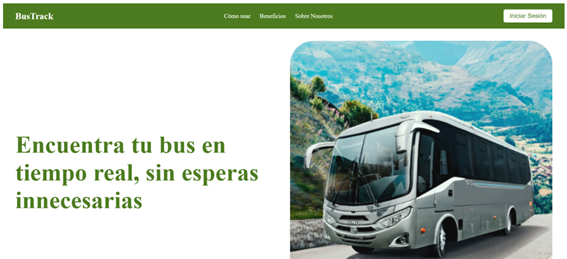
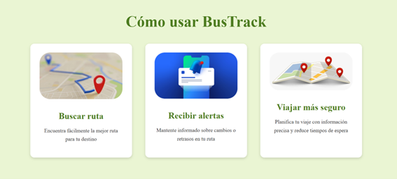
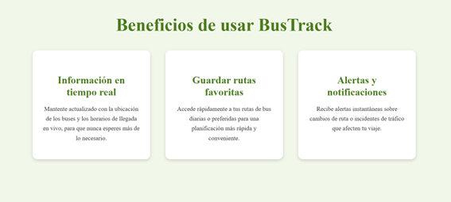
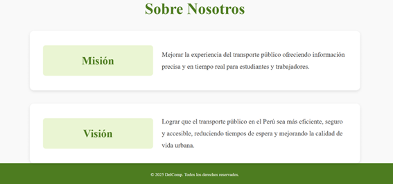


#### 5.2.1.6. Services Documentation Evidence for Sprint Review


# Desarrollo durante el Sprint  

Durante este Sprint, el equipo se enfocó exclusivamente en el desarrollo de la **Landing Page de BusTrack**, por lo tanto, **no se ha implementado ni documentado ningún Web Service** hasta el momento.  

La **documentación e implementación de endpoints REST** está planificada para los siguientes sprints, en los cuales se abordará la creación de los servicios **frontend y backend** necesarios para funcionalidades como:  

- Login  
- Registro  
- Gestión de usuarios  
- Pruebas vocacionales  
- Reservas de sesiones con psicólogos  


#### 5.2.1.7. Software Deployment Evidence for Sprint Review


# Sprint 1 - Desarrollo y Despliegue  

Durante el primer sprint, desarrollamos y desplegamos la **landing page** del proyecto.  

## Pasos para el despliegue  

1. **Creación de la Organización BusTrack**  
   Iniciamos creando una organización que albergará los repositorios del proyecto, entre ellos el de la landing page.
   [](https://postimg.cc/WqqmvJkL)


3. **Creación del Repositorio en GitHub**  
   Iniciamos creando un repositorio dedicado en GitHub para nuestro proyecto de landing page.
   [](https://postimg.cc/TpWQ8BVP)


5. **Despliegue Automático**  
   Accedemos a la opción de settings y posteriormente de pages. Configuramos el nombre de la web y le damos siguiente. GitHubdesplegó la landing page en la URL proporcionada por GitHub Pages.
   Link: https://2025-2-aplicacionesweb-dalcomp.github.io/Landing-page/
   [](https://postimg.cc/TyxtJQW5)


#### 5.2.1.8. Team Collaboration Insights during Sprint

# Distribución de Tareas - Sprint 1  

Para este sprint, las tareas de **diseño, implementación y documentación** de la landing page se distribuyeron entre todos los integrantes del equipo.  

La **implementación y despliegue** de la landing page fue llevada a cabo por **Joaquin Cuentas**.  

* Evidencias del repositorio de la landing page<br>
   [](https://postimg.cc/VJrxV764)


* Evidencias del repositorio del informe<br>
   [](https://postimg.cc/DJT3sq70)


* Network Graph<br>
   [](https://postimg.cc/CngXBYHB)


* Code Frequency<br>
   [](https://postimg.cc/nXh8GF8g)<br>


* Contribuitors<br>
   [](https://postimg.cc/w12q94zk)<br>

<br><br>

### 5.2.2. Sprint 2

#### 5.2.2.1. Sprint Planning 2

#### Primer Sprint - Planificación

El equipo de desarrollo se reunió virtualmente para definir los **objetivos, tareas y entregables** del primer sprint, el cual tendrá una duración de **una semana**.  

El enfoque principal será el **desarrollo y despliegue del fontend de la aplicación** del proyecto en **GitHub Pages**. Para ello, se deberán crear los **diseños previos** como *wireframes* y *mockups*.  

De esta manera, se asegura que el **producto inicial** esté operativo y sirva como base sólida para las siguientes iteraciones.  

#### Sprint 2 - Planning Background

| **Elemento**                       | **Detalle**                                                                                                                                               |
|------------------------------------|-----------------------------------------------------------------------------------------------------------------------------------------------------------|
| **Date**                           | 2025/10/06                                                                                                                                                |
| **Time**                           | 20:00 PM                                                                                                                                                   |
| **Location**                       | Se realizó virtualmente por la plataforma **Google Meet**                                                                                                  |
| **Prepared by**                    | Todos los integrantes de DalComp                                                                                                                               |
| **Attendees (to planning meeting)**| Mathias Andree Cárdenas Huaman, Elizabeth Noelia Apaza Bocanegra, Diego Andres Avalos Cordova, Joaquin Alberto Cuentas Peña, Fátima Belén Florez Shimabukuro |
| **Sprint n – 2 Review Summary**    | Se implementará el frontend de la aplicación web, desarrollando la interfaz de usuario con HTML, CSS y JavaScript para la segunda entrega                   |
| **Sprint n – 2 Retrospective Summary** | Se cumplió con los objetivos propuestos                                                                                                                 |
| **Sprint Goal & User Stories**     | Mostrar una buena primera impresión a los usuarios                                                                                                         |
| **Sprint 2 Goal**                  | Desarrollar y desplegar el frontend de la aplicación web en GitHub Pages, implementando los diseños de los mock-ups previamente creados y garantizando que cumpla con los requisitos de interactividad, diseño responsive y experiencia de usuario. |
| **Sprint 2 Velocity**              | 10                                                                                                                                                          |
| **Sum of Story Points**            | 21                                                                                                                                                          |


#### 5.2.2.2. Aspect Leaders and Collaborators

Cada uno de estos aspectos ha sido asignado a un **líder (L)**, mientras que otros miembros del equipo cumplen roles de **colaboración (C)** para asegurar que el desarrollo cumpla con los objetivos del sprint 2.

| **Team Member (Last Name, First Name)** | **GitHub Username**   | **Login, Sign In y Home** | **Sección "Notificaciones"** | **Sección "Perfil"** | **Sección "Paraderos Cercanos"** | **Sección "Buscar Ruta"** |
|-----------------------------------------|-----------------------|--------------------------------------|-----------------------------|--------------------------|-----------------------------|------------------------------------|
| Mathias Andree Cárdenas Huaman          | AndS56                | C                                    | L                           | C                        | C                           | C                                  |
| Elizabeth Noelia Apaza Bocanegra        | Elizabeth-Apaza       | C                                    | C                           | L                        | C                           | C                                  |
| Diego Andres Avalos Cordova             | DiegoAndresAvalos     | C                                    | C                           | C                        | L                           | C                                  |
| Joaquin Alberto Cuentas Peña            | JoaCUPE               | C                                    | C                           | C                        | C                           | L                                  |
| Fátima Belén Florez Shimabukuro         | PengwinKingdom        | L                                    | C                           | C                        | C                           | C                                  |


#### 5.2.2.3. Sprint Backlog 2

## Sprint Backlog 2

En esta sección se presenta el **Sprint Backlog 2**, correspondiente al segundo ciclo de desarrollo del proyecto.  

El objetivo principal de este sprint es **diseñar y maquetar las pantallas principales relacionadas con la búsqueda de rutas, visualización de horarios y alertas**, simulando los flujos principales que luego serán conectados al backend en sprints futuros.

---

### Sprint Backlog 2 - User Stories y Tareas

| **User Story** | **Title**                        | **Task ID** | **Task Title**                                         | **Description**                                                                                 | **Estimation (hours)** | **Assigned to**    | **Status** |
|----------------|------------------------------------|-------------|--------------------------------------------------------|--------------------------------------------------------------------------------------------------|-------------------------|--------------------|------------|
| US01           | Buscar rutas                       | T09         | Diseñar interfaz de búsqueda de rutas                   | Crear pantalla con campos de “origen” y “destino” y botón de búsqueda.                          | 3                       | Mathia Cárdenas    | done     |
| US01           | Buscar rutas                       | T10         | Implementar estado de resultado de búsqueda             | Simular resultado de rutas disponibles en lista o tarjetas.                                     | 3                       | Diego Avalos       | done     |
| US01           | Buscar rutas                       | T11         | Mostrar mensaje de “Ruta no encontrada”                 | Mostrar mensaje de error si no hay resultado simulado.                                          | 1                       | Fátima Florez      | done     |
| US02           | Visualizar horarios                 | T12         | Crear componente de horarios                            | Diseñar vista con horarios simulados para una ruta seleccionada.                                | 3                       | Joaquin Cuentas    | done     |
| US02           | Visualizar horarios                 | T13         | Simular mensajes de horarios no disponibles             | Mostrar mensaje “Horarios no disponibles” cuando no haya datos simulados.                       | 1                       | Diego Avalos       | done     |
| US03           | Guardar rutas frecuentes            | T14         | Añadir botón “Guardar ruta”                             | Crear botón de acción visual para guardar ruta (sin conexión real).                             | 2                       | Elizabeth Apaza    | done     |
| US03           | Guardar rutas frecuentes            | T15         | Mostrar mensaje de validación                           | Simular validación de ruta duplicada mediante mensajes en pantalla.                             | 1                       | Mathia Cárdenas    | done     |
| US04           | Ver ubicación del bus               | T16         | Integrar mapa embebido (mock)                            | Incluir un mapa estático o marcador simulado de ubicación.                                      | 3                       | Diego Avalos       | done     |
| US04           | Ver ubicación del bus               | T17         | Mostrar mensaje de “Ubicación no disponible”            | Mensaje visible cuando no hay información (sin lógica real).                                   | 1                       | Fátima Florez      | done     |
| US05           | Recibir notificaciones de retraso   | T18         | Crear UI para alertas de retraso                         | Maquetar componente visual de notificación o modal.                                            | 2                       | Joaquin Cuentas    | done    |
| US05           | Recibir notificaciones de retraso   | T19         | Simular alerta desactivada                              | Mostrar estado visual cuando las notificaciones están “desactivadas”.                           | 1                       | Mathia Cárdenas    | done     |
| US06           | Alertas de desvío                   | T20         | Maquetar UI para alertas de desvío                       | Crear interfaz visual que muestre alerta de cambio de ruta.                                     | 2                       | Elizabeth Apaza    | done     |
| US06           | Alertas de desvío                   | T21         | Mostrar mensaje de falta de conexión                     | Agregar mensaje cuando no se pueda mostrar alerta (simulado).                                  | 1                       | Diego Avalos       | done     |

#### 5.2.2.4. Development Evidence for Sprint Review
En esta sección, se presentan los commits realizados en el repositorio report-BusTrack, correspondiente al entregable de la TP.


| Repository                        | Branch                  | Commit Message                                 | Commited on  |
|------------------------------------|-------------------------|------------------------------------------------|--------------|
| JoaCUPE/BusTrack-Frontend | main    | initial commit  | 06/10/2025   |
| JoaCUPE/BusTrack-Frontend | main    | feat: Create a new front repository  | 06/10/2025   |
| AndS56/BusTrack-Frontend | develop    | Delete BusTrack-Frontend/src  | 09/10/2025   |
| AndS56/BusTrack-Frontend | develop    | Delete BusTrack-Frontend/server  | 09/10/2025   |
| AndS56/BusTrack-Frontend | develop    | Add files via upload  | 09/10/2025   |
| AndS56/BusTrack-Frontend | develop    | Create extensions.json  | 09/10/2025   |
| AndS56/BusTrack-Frontend | develop    | feat: Create a new front repository  | 09/10/2025   |
| AndS56/BusTrack-Frontend | develop    | Update MainToolbar.vue  | 10/10/2025   |
| AndS56/BusTrack-Frontend | develop    | Update layout.vue  | 10/10/2025   |
| AndS56/BusTrack-Frontend | develop    | Update en.json  | 10/10/2025   |
| AndS56/BusTrack-Frontend | develop    | Update es.json  | 10/10/2025   |
| AndS56/BusTrack-Frontend | develop    | add publishing  | 10/10/2025   |
| AndS56/BusTrack-Frontend | develop    | Update profile.vue  | 10/10/2025   |
| AndS56/BusTrack-Frontend | develop    | Update App.vue  | 10/10/2025   |
| AndS56/BusTrack-Frontend | develop    | Update main.js  | 10/10/2025   |
| AndS56/BusTrack-Frontend | develop    | Update router.js  | 10/10/2025   |
| Elizabeth-Apaza/BusTrack-Frontend | develop    | add notifications.vue travel-history.vue  | 10/10/2025   |
| Elizabeth-Apaza/BusTrack-Frontend | develop    | Delete BusTrack-Frontend/src directory  | 10/10/2025   |
| PengwinKingdom/BusTrack-Frontend | develop    | Update en.json  | 10/10/2025   |
| PengwinKingdom/BusTrack-Frontend | develop    | Update es.json  | 10/10/2025   |
| PengwinKingdom/BusTrack-Frontend | develop    | Create LoginForm.vue  | 10/10/2025   |
| PengwinKingdom/BusTrack-Frontend | develop    | Create RegisterForm.vue  | 10/10/2025   |
| PengwinKingdom/BusTrack-Frontend | develop    | Create HomePage.vue  | 10/10/2025   |
| PengwinKingdom/BusTrack-Frontend | develop    | Create LoginPage.vue  | 10/10/2025   |
| PengwinKingdom/BusTrack-Frontend | develop    | Create RegisterPage.vue  | 10/10/2025   |
| PengwinKingdom/BusTrack-Frontend | develop    | Add files via upload  | 10/10/2025   |
| PengwinKingdom/BusTrack-Frontend | develop    | Create Card.vue  | 10/10/2025   |
| PengwinKingdom/BusTrack-Frontend | develop    | Create LocationBadge.vue  | 10/10/2025   |
| PengwinKingdom/BusTrack-Frontend | develop    | Create MapEmbed.vue  | 10/10/2025   |
| PengwinKingdom/BusTrack-Frontend | develop    | Create TopNav.vue  | 10/10/2025   |
| PengwinKingdom/BusTrack-Frontend | develop    | Update router.js  | 10/10/2025   |


#### 5.2.2.5. Execution Evidence for Sprint Review

Durante este Sprint, nos enfocamos en el desarrollo del frontend del sistema web **BusTrack** utilizando **WebStorm** y siguiendo los principios de **Domain-Driven Design (DDD)** para organizar la estructura y responsabilidades del sistema. El objetivo principal de este Sprint fue implementar vistas funcionales que brinden a los usuarios una experiencia clara y amigable.  

- **Crear Cuenta:**


- **Log In:**


- **Buscar Ruta:**

  
- **Notificaciones:**


- **Paraderos Cercanos:**

  
- **Perfil de Usuario:**


#### 5.2.2.6. Services Documentation Evidence for Sprint Review

Durante este Sprint, nos enfocamos en documentar los servicios web (APIs) desarrollados para **BusTrack** utilizando **OpenAPI**. El objetivo fue asegurar que todos los endpoints relacionados con el alcance del Sprint estén correctamente descritos, incluyendo las acciones soportadas, parámetros, sintaxis de las solicitudes y ejemplos de respuestas. Esta documentación facilita la integración con el frontend y sirve como referencia para el mantenimiento futuro.  

### Logros alcanzados en este Sprint
- Documentación de los principales endpoints implementados: búsqueda de rutas, notificaciones, paraderos cercanos y gestión de perfil de usuario.  
- Inclusión de métodos HTTP, ejemplos de request y response, y especificación de parámetros para cada endpoint.  
- Generación de la documentación OpenAPI accesible localmente (o desplegada, si aplica).  
- Capturas de interacción con la API utilizando datos de muestra para demostrar respuestas correctas y funcionalidad.  

### Distribución de responsabilidades del equipo

| Área / Funcionalidad | Integrante(s) | Acciones Realizadas |
|---------------------|----------------|------------------|
| Inicio de sesión | 1 Integrante (Fátima Belén) | Implementación de login, registro y validaciones básicas. |
| Primera interfaz luego del inicio | 1 Integrante (Joaquín Cuentas) | Desarrollo de la interfaz principal tras el login y navegación inicial. |
| Perfil de usuario | 2 Integrantes (Elizabeth Apaza y Andree Cardenas) | Implementación de la vista de perfil, edición de información y gestión de preferencias. |
| Paraderos cercanos | 1 Integrante (Diego Avalos) | Desarrollo de la interfaz para mostrar paraderos cercanos y su interacción con la búsqueda de rutas. |

**Nota:** No se generaron commits relacionados con endpoints o documentación de servicios web en este Sprint, ya que estas tareas están planificadas para sprints futuros.  

### Tabla de Documentación de Endpoints

| Endpoint | Acciones | Método HTTP | Sintaxis / URL | Parámetros | Ejemplo de Respuesta | Enlace a Documentación |
|----------|---------|------------|----------------|------------|-------------------|----------------------|
| `/routes` | Listar todas las rutas | GET | `/routes` | Ninguno | `{ "routes": [ { "id": 1, "name": "Ruta A" } ] }` | [Doc OpenAPI](#) |
| `/routes/{id}` | Obtener detalles de una ruta | GET | `/routes/1` | `id` (ID de la ruta) | `{ "id": 1, "name": "Ruta A", "stops": [...] }` | [Doc OpenAPI](#) |
| `/notifications` | Listar notificaciones de usuario | GET | `/notifications?userId=1` | `userId` (obligatorio) | `[ { "id": 1, "message": "Retraso en Ruta A" } ]` | [Doc OpenAPI](#) |
| `/notifications` | Crear notificación | POST | `/notifications` | `userId`, `message` | `{ "id": 2, "message": "Nueva alerta" }` | [Doc OpenAPI](#) |
| `/stops/nearby` | Obtener paraderos cercanos | GET | `/stops/nearby?lat=-12.0464&lng=-77.0428` | `lat`, `lng` | `[ { "id": 1, "name": "Paradero A", "distance": 120 } ]` | [Doc OpenAPI](#) |
| `/users/{id}` | Obtener perfil de usuario | GET | `/users/1` | `id` (ID del usuario) | `{ "id": 1, "name": "Juan Pérez", "preferences": {...} }` | [Doc OpenAPI](#) |
| `/users/{id}` | Actualizar perfil de usuario | PUT | `/users/1` | `id` (ID del usuario), body con campos a actualizar | `{ "id": 1, "name": "Juan Pérez Actualizado" }` | [Doc OpenAPI](#) |

> Nota: Reemplazar `#` en el enlace de documentación con la URL real o ruta local de tus documentos OpenAPI.  

### Evidencia Visual


#### 5.2.2.7. Software Deployment Evidence for Sprint Review

## 1. Paso
Primero, nos aseguramos de que el código de la aplicación estuviera en GitHub y le cambiamos la dirección de la API, para que en lugar de buscar los datos en nuestra propia computadora (localhost), los buscara en la dirección pública del servidor que ya habíamos desplegado en Render.

## 2. Paso
Luego, creamos una cuenta en Vercel y conectamos nuestro repositorio de GitHub. Vercel fue lo suficientemente inteligente como para reconocer que era una aplicación de Vue/Vite y preparó casi todo automáticamente.

## 3. Paso
Para que la URL de la API no estuviera escrita directamente en el código, la guardamos como un "secreto" (una variable de entorno) en Vercel. Luego, le dijimos a nuestro código que leyera ese secreto. Así, si la URL cambia en el futuro, solo la actualizamos en Vercel sin tocar el código.

## 4. Paso
Finalmente, con todo configurado, volvimos a desplegar. Vercel nos dio un enlace público a nuestra aplicación y activó el "despliegue continuo". Esto significa que ahora, cada vez que actualicemos el código y lo subamos a GitHub, Vercel reconstruirá y actualizará el sitio web automáticamente.

link de la landing page: https://2025-2-aplicacionesweb-dalcomp.github.io/Landing-page/

link de la web: https://bustrackfront.vercel.app/

#### 5.2.2.8. Team Collaboration Insights during Sprint

Para este sprint, las tareas de diseño, implementación y documentación del frounted se distribuyeron entre todos los integrantes del equipo.

- #Evidencias del repositorio del fronted:#<br>
  [](https://postimg.cc/V5WNkNzM)<br>
- #Network Graph#<br>
  [](https://postimg.cc/5QVMM8Xz)<br>
- #Code Frequency#<br>
  [](https://postimg.cc/5jVYddpY)<br>
- #Contribuitors#<br>
  [](https://postimg.cc/KRtM3czp)<br>
<br><br>


### 5.2.3. Sprint 3

En esta parte, se registran y explican los avances del Sprint 3 en cuanto al desarrollo de la página y la colaboración del equipo. 

El objetivo de este sprint fue lograr la integración total entre el frontend, el backend y la base de datos.

#### 5.2.3.1. Sprint Planning 3

#### Primer Sprint - Planificación

A continuación, se muestra la planificación del equipo para llevar a cabo de manera exitosa el Sprint 3.

#### Sprint 3 - Planning Background

| **Elemento**                       | **Detalle**                                                                                                                                               |
|------------------------------------|-----------------------------------------------------------------------------------------------------------------------------------------------------------|
| **Date**                           | 2025/11/03                                                                                                                                                |
| **Time**                           | 20:00 PM                                                                                                                                                   |
| **Location**                       | Se realizó virtualmente por la plataforma **Google Meet**                                                                                                  |
| **Prepared by**                    | Todos los integrantes de DalComp                                                                                                                               |
| **Attendees (to planning meeting)**| Mathias Andree Cárdenas Huaman, Elizabeth Noelia Apaza Bocanegra, Diego Andres Avalos Cordova, Joaquin Alberto Cuentas Peña, Fátima Belén Florez Shimabukuro |
| **Sprint 2 Review Summary** | En el Sprint 2 se implementó el frontend de la aplicación web, incluyendo login, registro, perfil, notificaciones, paraderos cercanos y búsqueda de rutas. Además, se realizó el despliegue del frontend y la conexión con la API mediante variables de entorno                                                                                                                 |
| **Sprint 2 Retrospective Summary**     | Se identificó que la distribución de aspectos por pantallas y el uso de GitFlow facilitaron el trabajo en paralelo. Como oportunidades de mejora, el equipo detectó la necesidad de dedicar más tiempo a pruebas integrales y a la gestión de errores entre frontend y backend                                                                                                         |
| **Sprint 3 Goal**                  | Desplegar una versión integrada y estable de BusTrack, conectando completamente el frontend con el backend y la base de datos de BusTrack permitiendo la persistencia real de usuarios, rutas favoritas, historial de viajes y notificaciones |
| **Sprint 3 Velocity**              | 12                                                                                                                                                          |
| **Sum of Story Points**            | 16                                                                                                                                                          |


#### 5.2.3.2. Aspect Leaders and Collaborators

Para este sprint, se definieron aspectos clave centrados en la **integración funcional** y la **persistencia de datos.** Cada aspecto cuenta con un líder (L) y uno o más colaboradores (C).

| **Team Member (Last Name, First Name)** | **GitHub Username**   | **Login, Sign In y Home** | **Sección "Notificaciones"** | **Sección "Perfil"** | **Sección "Paraderos Cercanos"** | **Sección "Buscar Ruta"** |
|-----------------------------------------|-----------------------|--------------------------------------|-----------------------------|--------------------------|-----------------------------|------------------------------------|
| Mathias Andree Cárdenas Huaman          | AndS56                | C                                    | C                           | C                        | L                           | C                                  |
| Elizabeth Noelia Apaza Bocanegra        | Elizabeth-Apaza       | C                                    | L                           | L                        | C                           | C                                  |
| Diego Andres Avalos Cordova             | DiegoAndresAvalos     | C                                    | C                           | L                        | L                           | C                                  |
| Joaquin Alberto Cuentas Peña            | JoaCUPE               | C                                    | C                           | C                        | C                           | L                                  |
| Fátima Belén Florez Shimabukuro         | PengwinKingdom        | L                                    | C                           | C                        | C                           | C                                  |


#### 5.2.3.3. Sprint Backlog 3

El objetivo principal del Sprint 3 es consolidar la conexión del frontend con el backend y habilitando la persistencia en la base de datos. Se priorizaron historias de usuario relacionadas con:

- Gestión de cuenta (login, registro, edición de perfil)
- Historial de viajes
- Rutas favoritas
- Notificaciones relacionadas a la operación del bus
- Estabilidad y manejo de errores de la aplicación

## Sprint Backlog 3

| **User Story** | **Title**                        | **Task ID** | **Task Title**                                         | **Description**                                                                                 | **Estimation (hours)** | **Assigned to**    | **Status** |
|----------------|------------------------------------|-------------|--------------------------------------------------------|--------------------------------------------------------------------------------------------------|-------------------------|--------------------|------------|
| US03         | Guardar rutas frecuentes                    | T22         | Conectar botón “Guardar ruta” con backend| Enviar la ruta seleccionada al endpoint `/favorites` y mostrar mensajes de éxito / error | 2                       | Diego Avalos    | Done     |
| US03         | Guardar rutas frecuentes                    | T23         | Listar rutas favoritas del usuario| Consumir el endpoint `/favorites` y mostrar las rutas favoritas dentro de la sección de perfil | 2                       | Diego Avalos    | Done     |
| US05           | Recibir notificaciones de retraso                    | T24         | Conectar notificaciones de retraso | Integrar el backend para mostrar alertas cuando el bus supera el retraso >10 min | 3                       | Fátima Florez    | Done     |
| US10           | Registro de usuario                   | T25        | Conectar formulario de registro con backend | Integrar el formulario de registro con el endpoint `/users` para crear cuentas reales en la base de datos | 3                       | Elizabeth Apaza    | Done     |
| US11           | Calificar servicio                    | T26      | Integrar calificación de viaje | Conectar la vista de calificación con el endpoint `/ratings` y registrar calificaciones 1–5 estrellas | 2                       | Mathias Cárdenas   | Done     |
| US11           | Calificar servicio                    | T27      | Mostrar calificaciones previas | Consumir el endpoint `/ratings?userId={id}` y mostrar calificaciones del usuario | 2                       | Mathias Cárdenas   | Done     |
| US12           | Editar perfil                    | T28      | Actualización de datos del perfil | Integrar la vista “Editar perfil” con el endpoint `PUT /users/{id}` para actualizar correo, nombre y foto | 3                       | Elizabeth Apaza   | Done     |
| US12           | Editar perfil                    | T29      | Manejo global de errores | Implementar mensajes de error, estados vacíos y loaders en perfil, rutas, favoritos y notificaciones | 2                       | Joaquin Cuentas   | Done     |
| US12           | Editar perfil                    | T30      | Ajustar textos y validaciones | Revisar y estandarizar mensajes de validación para el usuario (éxito/error) | 2                       | Joaquin Cuentas   | Done     |


#### 5.2.3.4. Development Evidence for Sprint Review


| Repository                        | Branch                  | Commit Message                                                         | Commited on  |
|-----------------------------------|-------------------------|------------------------------------------------------------------------|--------------|
| PengwinKingdom/BusTrack-Backend | feature-notifications  | feat(notifications): implement notification bounded context (domain, application, infra & API) | 2025-11-16   |
| JoaCUPE/BusTrack-Backend | feature-searchroute  | feat(searchroute): add route search aggregate, repository and query services | 2025-11-16   |
| AndS56/BusTrack-Backend | feature-profile  | feat(profile): add user profile aggregate, repository and EF configuration | 2025-11-16   |
|  /BusTrack-Backend | feature-profile  | feat(profile): add user profile aggregate, repository and EF configuration | 2025-11-16   |
| JoaCUPE/BusTrack-Backend | feature-publishing  | feat(publishing): add announcements aggregate and /api/v1/publishing endpoints | 2025-11-16   |
| /BusTrack-Backend | feature-searchroute  | feat(searchroute): expose /api/v1/routes/search endpoint with filters and pagination | 2025-11-16   |


#### 5.2.3.5. Execution Evidence for Sprint Review

##### Notifications Endpoint


### 5.2.4. Sprint 4

En esta parte, se registran y explican los avances del Sprint 4 en cuanto al desarrollo de la página y la colaboración del equipo. El objetivo de este sprint fue consolidar la versión final de BusTrack, incorporando el acceso diferenciado para pasajeros y empresas de transporte, corrigiendo errores pendientes y preparando el despliegue, la documentación y la validación final del producto.

#### 5.2.4.1. Sprint Planning 4

<table> 
  <tr> 
    <th>Sprint #</th>
    <th>Sprint 4</th>
  </tr> 
  <tr>
    <td colspan="2">
      <b>Sprint Planning Background</b>
    </td>
  </tr>
  <tr> 
    <td>Date</td> 
    <td>24/11/2025</td> 
  </tr>
  <tr> 
    <td>Time</td>
    <td>10:00 AM</td>
  </tr> 
  <tr> 
    <td>Location</td> 
    <td>Reunión virtual vía Google Meet</td>
  </tr>
  <tr> 
    <td>Attendees</td>
    <td> Mathias Andree Cárdenas Huaman / Elizabeth Noelia Apaza Bocanegra / Diego Andrés Avalos Córdova / Joaquín Alberto Cuentas Peña / Fátima Belén Florez Shimabukuro </td>
  </tr>
  <tr> 
    <td>Sprint 3 Review Summary</td> 
    <td> Durante el Sprint 3 se logró una integración completa entre frontend, backend y base de datos, habilitando la persistencia real de usuarios, rutas favoritas, historial y notificaciones. La aplicación alcanzó un estado estable y funcional en sus flujos principales. Sin embargo, durante las entrevistas de validación surgió la necesidad de habilitar una experiencia también para empresas de buses, lo cual se incorpora como nueva prioridad para este último sprint. </td>
  </tr> 
  <tr> 
    <td>Sprint 3 Retrospective Summary</td>
    <td> El equipo resaltó como fortaleza su buena coordinación mediante GitFlow y la división del trabajo por pantallas. Las oportunidades de mejora identificadas fueron: aumentar las pruebas integrales, optimizar la gestión del tiempo para evitar acumulación de tareas, y asegurar la correcta integración de nuevas funcionalidades. Para el Sprint 4 se acordó priorizar correcciones, despliegue final e implementación de la nueva ruta de acceso para empresas. </td>
  </tr> 
  <tr>
    <td colspan="2">
      <b>Sprint Goal & User Stories</b>
    </td>
  </tr> 
  <tr> 
    <td>Sprint 4 Goal</td>
    <td> Nuestro objetivo es entregar la versión final, completamente integrada, accesible y lista para validación de BusTrack, incorporando además dos rutas diferenciadas para nuestros segmentos principales: pasajeros y empresas de transporte público. Asimismo, creemos que nuestra página brindara una experiencia sólida, profesional y lista para operación real, permitiendo que tanto ciudadanos como compañías de buses accedan a funcionalidades relevantes para su uso.
    </td> 
  </tr> 
  <tr> 
    <td>Sprint 4 Velocity</td>
        <td>14 </td>
      </tr>
  <tr>
    <td>Sum of Story Points</td>
    <td>14</td>
  </tr>
</table>

#### 5.2.4.2. Aspect Leaders and Collaborators

Cada uno de estos aspectos ha sido asignado a un **líder (L)**, mientras que otros miembros del equipo cumplen roles de **colaboración (C)** para asegurar que el desarrollo cumpla con los objetivos del sprint 4.

| **Team Member (Last Name, First Name)** | **GitHub Username**   | **Acceso diferenciado (Pasajeros / Empresas)** | **Módulo Web para Pasajeros (ajustes finales)** | **Módulo Web para Empresas de Transporte** | **Internacionalización (i18n) y accesibilidad** | **Documentación, despliegue y validación final** |
|-----------------------------------------|-----------------------|-----------------------------------------------|-------------------------------------------------|--------------------------------------------|---------------------------------------------------------|-------------------------------------------------|
| Mathias Andree Cárdenas Huaman          | AndS56                | C                                             | C                                               | **L**                                      | C                                                       | C                                               |
| Elizabeth Noelia Apaza Bocanegra        | Elizabeth-Apaza       | C                                             | C                                               | C                                          | **L**                                                   | C                                               |
| Diego Andres Avalos Cordova             | DiegoAndresAvalos     | C                                             | C                                               | C                                          | C                                                       | **L**                                           |
| Joaquin Alberto Cuentas Peña            | JoaCUPE               | **L**                                         | C                                               | C                                          | C                                                       | C                                               |
| Fátima Belén Florez Shimabukuro         | PengwinKingdom        | C                                             | **L**                                           | C                                          | C                                                       | C                                               |

#### 5.2.4.3. Sprint Backlog 4

En esta sección se presenta el **Sprint Backlog 4**, correspondiente al cuarto ciclo de desarrollo del proyecto BusTrack.

El objetivo principal de este sprint es **finalizar y consolidar la versión completa del sistema**, incorporando acceso diferenciado para pasajeros y empresas de transporte, corrigiendo errores identificados en las validaciones previas, aplicando internacionalización, accesibilidad, documentación técnica final y realizando el despliegue completo del producto.


### **Sprint Backlog 4**

| User Story | Title | Task ID | Task Title | Description | Estimation (hours) | Assigned to | Status |
|-----------|--------|----------|-------------|--------------|---------------------|--------------|--------|
| US16 | Acceso diferenciado (Pasajero/Empresa) | T31 | Crear vista de selección de tipo de usuario | Pantalla inicial para elegir entre tipo de usuario. | 3 | Joaquin Cuentas | Done |
| US16 | Acceso diferenciado | T32 | Configurar rutas independientes | Crear `/passenger` y `/company` en frontend. | 2 | Mathia Cardenas | Done |
| US17 | Módulo Web para Empresas | T33 | Diseñar pantalla empresa | Vista de beneficios, CTA y presentación del módulo empresarial. | 3 | Fátima Florez | Done |
| US17 | Módulo Empresa | T34 | Implementación funcional | Construcción del flujo accesible desde `/company`. | 4 | Elizabeth Apaza | Done |
| US07 | Panel de Monitoreo (empresa) | T35 | Ajustes finales panel de flota | Corrección de errores + mejoras de UI. | 3 | Diego Avalos | Done|
| US04 | Ubicación de buses (pasajero) | T36 | Optimización del mapa | Mejorar carga, marcadores y fallback visual. | 2 | Diego Avalos | Done |
| US04 | Ubicación | T37 | Mensaje “Ubicación no disponible” | Refinar mensaje y estilo visual. | 1 | Fátima Florez | Done |
| US05 | Notificaciones de retraso | T38 | Validar activación/desactivación | Ajustar lógica visual y estados. | 2 | Joaquin Cuentas | Done |
| US06 | Alertas de desvío | T39 | Manejo de error sin conexión | Mostrar mensaje correspondiente. | 1 | Mathia Cardenas | Done |
| US12 | Editar perfil | T40 | Mejorar validaciones | Ajustar reglas (email, campos vacíos). | 2 | Elizabeth Apaza | Done|
| US13 | Información de la solución | T41 | Ajustes finales landing | Corrección de textos e imágenes. | 2 | Fátima Florez | Done |
| US14 | Beneficios | T42 | Revisión visual y textual | Mejorar secciones y responsividad. | 1 | Mathia Cardenas | Done |
| US15 | Misión y visión | T43 | Ajustes UI/UX | Pulido estético final. | 1 | Elizabeth Apaza | Done |


#### 5.2.4.4. Development Evidence for Sprint Review

#### 5.2.4.5. Execution Evidence for Sprint Review

#### 5.2.4.6. Services Documentation Evidence for Sprint Review

#### 5.2.4.7. Software Deployment Evidence for Sprint Review

#### 5.2.4.8. Team Collaboration Insights during Sprint

## 5.3. Validation Interviews

En esta sección se registrarán y explicarán las actividades que abarcarán las entrevistas de validación para el desarrollo de BusTrack.

El objetivo principal será obtener retroalimentación directa de los segmentos objetivo, con el propósito de confirmar las hipótesis presentadas en el Lean UX Canvas y analizar la facilidad de uso, claridad y confiabilidad tanto del landing page como de la aplicación web.

Para lograrlo, se realizarán entrevistas en las que los participantes de ambos segmentos describirán su experiencia al interactuar con el landing page y la aplicación web. A través de estas entrevistas se buscará identificar cómo los usuarios perciben la facilidad de uso, comprenden el propósito de BusTrack y qué grado de confianza les genera esta solución tecnológica.

### 5.3.1. Diseño de Entrevistas

#### Preguntas Generales

- ¿Cuál es su nombre completo?

- ¿Qué edad tiene?

- ¿Cuál es su ocupación?

- ¿En qué distrito reside?

<br>

#### Preguntas Específicas


#### Segmento Objetivo 1: Pasajeros de Transporte Público (Estudiantes y Trabajadores)

- ¿Qué le pareció el diseño general de nuestra landing page y de la aplicación web BusTrack?

- ¿Cuál considera que es la parte más útil o interesante de ambas? ¿Por qué?

- Si tuviera la posibilidad de cambiar o añadir algo en la landing page o en la aplicación web, ¿qué modificaría o agregaría?

- ¿Cree que la información en tiempo real sobre la ubicación de los buses y el tiempo estimado de llegada le ayudaría a planificar mejor sus viajes? ¿Por qué?

- ¿La interfaz de la aplicación le pareció intuitiva y fácil de usar? ¿Por qué?

- ¿Le gustaría recibir notificaciones sobre la llegada del bus, retrasos o desvíos de ruta?

- ¿Usted utilizaría la aplicación BusTrack para sus desplazamientos diarios? ¿Por qué?

- ¿Nuestra página web le genera confianza? ¿Se registraría? ¿Por qué?

- ¿Recomendaría BusTrack a sus amigos o familiares? ¿Por qué?

<br>

#### Segmento Objetivo 2: Empresas de Transporte Urbano (Administradores y Supervisores de Flota)

- ¿Qué le pareció la presentación general de la landing page y de la aplicación web BusTrack?

- ¿Qué aspectos considera más relevantes o valiosos para su empresa? ¿Por qué?

- Si tuviera la posibilidad de mejorar alguna sección de la landing page o de la aplicación web, ¿qué cambiaría o agregaría?

- ¿Considera que la plataforma ayudaría a mejorar la gestión de flota y la puntualidad de las unidades? ¿Por qué?

- En cuanto a la landing page, ¿cree que comunica adecuadamente los beneficios y funcionalidades para las empresas de transporte?

- Sobre la aplicación web, ¿le pareció intuitiva y fácil de usar en lo referente al monitoreo de buses y reportes? ¿Por qué?

- ¿Considera que las alertas e informes automáticos facilitarían su trabajo diario como supervisor o administrador?

- ¿Su empresa estaría dispuesta a implementar BusTrack como herramienta tecnológica? ¿Por qué?

- ¿Recomendaría esta solución a otras empresas del rubro? ¿Por qué?


### 5.3.2. Registro de Entrevistas

### Segmento Objetivo 1: Pasajeros de Transporte Público

<table>
<colgroup>
</colgroup>
<thead>
  <tr>
    <th colspan="2">Entrevista #1<br></th>
  </tr>
</thead>
<tbody>
  <tr>
    <td>Nombre</td>
    <td>Carla</td>
  </tr>
  <tr>
    <td>Apellidos</td>
    <td>Ramirez</td>
  </tr>
  <tr>
    <td>Edad</td>
    <td>No especificado (Contexto: Trabajadora y Estudiante)</td>
  </tr>
  <tr>
    <td>Distrito</td>
    <td>San Miguel</td>
  </tr>
  <tr>
    <td>Aplicaciones Usadas</td>
    <td>Grabación de pantalla</td>
  </tr>
  <tr>
    <td>Evidencia</td>
    <td><div align="center"></div></td>
  </tr>
  <tr>
    <td>Link</td>
    <td><p><a target="_blank"  href="https://upcedupe-my.sharepoint.com/:v:/g/personal/u20231c197_upc_edu_pe/IQCjNKnAhNypSbqt894bbPwyAQYP6RomstVAooYRDJmPErk?nav=eyJyZWZlcnJhbEluZm8iOnsicmVmZXJyYWxBcHAiOiJPbmVEcml2ZUZvckJ1c2luZXNzIiwicmVmZXJyYWxBcHBQbGF0Zm9ybSI6IldlYiIsInJlZmVycmFsTW9kZSI6InZpZXciLCJyZWZlcnJhbFZpZXciOiJNeUZpbGVzTGlua0NvcHkifX0&e=BYVwZ0" title="Video Entrevista 1">Video 1</p></td>
  </tr>
  <tr>
    <td>Duracion<br></td>
    <td> 4:38 min </td>
  </tr>
  <tr>
    <td>Resumen</td>
    <td> La entrevistada, que es <b>trabajadora y estudiante universitaria</b>, valoró el diseño como "limpio y fácil de entender". Considera que la función más útil es la <b>información en tiempo real de los buses</b> para ir a su trabajo y universidad, ya que le permitiría ahorrar tiempo y estrés. Sugirió añadir una <b>opción de tema oscuro</b> y una vista previa del mapa. Confirmó que la interfaz es intuitiva, genera confianza por su aspecto profesional y que la recomendaría a amigos.
  </tr>
</tbody>
</table>

<table>
<colgroup>
</colgroup>
<thead>
  <tr>
    <th colspan="2">Entrevista #2<br></th>
  </tr>
</thead>
<tbody>
  <tr>
    <td>Nombre</td>
    <td>Alessandro</td>
  </tr>
  <tr>
    <td>Apellidos</td>
    <td>Bravo</td>
  </tr>
  <tr>
    <td>Edad</td>
    <td>No especificado</td>
  </tr>
  <tr>
    <td>Distrito</td>
    <td>San Martin</td>
  </tr>
  <tr>
    <td>Aplicaciones Usadas</td>
    <td>Grabación de pantalla</td>
  </tr>
  <tr>
    <td>Evidencia</td>
    <td><div align="center"></div></td>
  </tr>
  <tr>
    <td>Link</td>
    <td><p><a target="_blank"  href="https://upcedupe-my.sharepoint.com/:v:/g/personal/u20231c197_upc_edu_pe/IQDqj0410PX9TJyB4htEfpmwAf9LXqgAaMSsiGT_qBo6idA?nav=eyJyZWZlcnJhbEluZm8iOnsicmVmZXJyYWxBcHAiOiJPbmVEcml2ZUZvckJ1c2luZXNzIiwicmVmZXJyYWxBcHBQbGF0Zm9ybSI6IldlYiIsInJlZmVycmFsTW9kZSI6InZpZXciLCJyZWZlcnJhbFZpZXciOiJNeUZpbGVzTGlua0NvcHkifX0&e=yVbeg5" title="Video Entrevista 2">Video 2</p></td>
  </tr>
  <tr>
    <td>Duracion<br></td>
    <td> 2:23 min </td>
  </tr>
  <tr>
    <td>Resumen</td>
    <td> El usuario encontró la aplicación "bastante intuitiva". Destacó como más útil la <b>búsqueda de rutas y los paraderos cercanos</b>, especialmente para personas que no conocen la zona. Considera que la app es "bastante funcional" y no modificaría nada. Valoró la información en tiempo real y las notificaciones como "bastante importantes" debido al tráfico y los largos tiempos de espera. Confía en la plataforma por su entorno y la recomendaría a amigos que viven lejos.
  </tr>
</tbody>
</table>


<table>
<colgroup>
</colgroup>
<thead>
  <tr>
    <th colspan="2">Entrevista #3<br></th>
  </tr>
</thead>
<tbody>
  <tr>
    <td>Nombre</td>
    <td>Melissa</td>
  </tr>
  <tr>
    <td>Apellidos</td>
    <td>Sulca</td>
  </tr>
  <tr>
    <td>Edad</td>
    <td>23 (Contexto: Estudiante)</td>
  </tr>
  <tr>
    <td>Distrito</td>
    <td>Magdalena</td>
  </tr>
  <tr>
    <td>Aplicaciones Usadas</td>
    <td>Grabación de pantalla</td>
  </tr>
  <tr>
    <td>Evidencia</td>
    <td><div align="center"></div></td>
  </tr>
  <tr>
    <td>Link</td>
    <td><p><a target="_blank"  href="https://upcedupe-my.sharepoint.com/:v:/g/personal/u20201f788_upc_edu_pe/IQDjD6pJvYEEQqLwUomsUt3eAQa4ppQDKFYCW7ZiCzGb3iM?nav=eyJyZWZlcnJhbEluZm8iOnsicmVmZXJyYWxBcHAiOiJTdHJlYW1XZWJBcHAiLCJyZWZlcnJhbFZpZXciOiJTaGFyZURpYWxvZy1MaW5rIiwicmVmZXJyYWxBcHBQbGF0Zm9ybSI6IldlYiIsInJlZmVycmFsTW9kZSI6InZpZXcifX0%3D&e=hRTY4f">Video 3</p></td>
  </tr>
  <tr>
    <td>Duracion<br></td>
    <td> 10:00 min </td>
  </tr>
  <tr>
    <td>Resumen</td>
    <td> La entrevistada, que es <b>estudiante universitaria</b>, valoró el diseño como "colores atractivos y acordes". Considera que la aplicación aporta confianza y utilidad por la facilidad de la información que hay en ella <b>información en tiempo real de los buses</b> esto se evidencia en que a veces cuando ella no ha sabido qué bus tomar, no ha tenido con quién consultar; sin embargo, en la aplicación lo puede observar en tiempo real. Sugirió añadir una <b>opción de internacionalización con estilo similiar en la landing y la web</b> y una vista previa del mapa integrada. Confirmó que la interfaz es intuitiva, genera confianza por el contenido que hay en ella y la coherencia de las funcionalidades.
  </tr>
</tbody>
</table>


### Segmento Objetivo 2: Empresas de Transporte Urbano

<table>
<colgroup>
</colgroup>
<thead>
  <tr>
    <th colspan="2">Entrevista #3<br></th>
  </tr>
</thead>
<tbody>
  <tr>
    <td>Nombre</td>
    <td>Jean Paul </td>
  </tr>
  <tr>
    <td>Apellidos</td>
    <td>Condori</td>
  </tr>
  <tr>
    <td>Edad</td>
    <td>40 años</td>
  </tr>
  <tr>
    <td>Distrito</td>
    <td>Villa María del Triunfo</td>
  </tr>
  <tr>
    <td>Aplicaciones Usadas</td>
    <td>Zoom</td>
  </tr>
  <tr>
    <td>Evidencia</td>
    <td><div align="center"></div></td>
  </tr>
  <tr>
    <td>Link</td>
    <td><p><a target="_blank"  href="https://drive.google.com/file/d/15VTwUG2F1Gw29zwPIvR-8cGvkLp0O0Hr/view?usp=sharing" title="Title">Video</p></td>
  </tr>
  <tr>
    <td>Duracion<br></td>
    <td> 10:35 min </td>
  </tr>
  <tr>
    <td>Resumen</td>
    <td> El administrador destacó que la plataforma es fácil de navegar gracias a sus botones grandes y la estructura clara. Valoró especialmente funciones como paraderos cercanos y un mapa para visualizar la ubicación del bus. Sin embargo, sugirió mejorar la claridad de la landing page, ya que está dirigida solo a estudiantes y trabajadores. Asimismo, considera fundamental que la web permita monitorear tanto a los buses como a los choferes para mantener el orden operativo, idealmente mediante GPS integrado y notificaciones automáticas. Además, indicó que estaría dispuesto a pagar por una demo de un mes y que sí recomendaría la herramienta para probarla.
  </tr>
</tbody>
</table>


<table>
<colgroup>
</colgroup>
<thead>
  <tr>
    <th colspan="2">Entrevista #4<br></th>
  </tr>
</thead>
<tbody>
  <tr>
    <td>Nombre</td>
    <td>Octavio</td>
  </tr>
  <tr>
    <td>Apellidos</td>
    <td>Rodriguez</td>
  </tr>
  <tr>
    <td>Edad</td>
    <td>35 años</td>
  </tr>
  <tr>
    <td>Distrito</td>
    <td>Lima</td>
  </tr>
  <tr>
    <td>Aplicaciones Usadas</td>
    <td>Zoom</td>
  </tr>
  <tr>
    <td>Evidencia</td>
    <td><div align="center"></div></td>
  </tr>
  <tr>
    <td>Link</td>
    <td><p><a target="_blank"  href="https://drive.google.com/file/d/1qKKhOw2OZ8dCuMwnyJvNUXtmG2p_DWpJ/view?usp=sharing" title="Title">Video</p></td>
  </tr>
  <tr>
    <td>Duracion<br></td>
    <td> 7:23 min </td>
  </tr>
  <tr>
    <td>Resumen</td>
    <td> La presentación de BusTrack resulta clara, ordenada e intuitiva, tanto en la landing page como en la aplicación web. Destaca la sección de paraderos cercanos y la búsqueda de rutas. Como mejoras, sería útil añadir una sección exclusiva para empresas, un video demostrativo e indicadores de desempeño como reportes históricos y un mapa general de la flota. En general, la plataforma facilitaría la supervisión diaria, permitiría decisiones más rápidas y es totalmente recomendable para empresas que buscan optimizar su control de flota.
  </tr>
</tbody>
</table>


### 5.3.3. Evaluaciones según heurísticas

# Evaluación Heurística de Usabilidad y Diseño Inclusivo  
## Plataforma Web **“AutoFix”**

| Campo | Descripción |
|--------|--------------|
| **Carrera** | Ingeniería de Software |
| **Curso** | Aplicaciones Web |
| **Sección** | 7452 |
| **Profesores** | Todos |
| **Auditor(es)** | Grupo 3 |
| **Cliente(s)** | Grupo 4 (Prime-Fix) |
| **Sitio evaluado** | **AutoFix** |

---

## Tareas Evaluadas

Para esta auditoría revisamos la experiencia del usuario en tareas clave alineadas al objetivo de AutoFix: conectar a talleres con dueños de vehículos. Las tareas evaluadas fueron:

1. Entender la propuesta de valor al ingresar.  
2. Navegar entre las secciones principales.  
3. Identificar acciones importantes (registro, login, búsqueda).  
4. Buscar talleres por distrito o por tipo de servicio.  
5. Ver información de un taller: perfil, especialidades, precios.  
6. Solicitar un servicio o agendar una cita.  
7. Revisar historial de servicios (si está implementado).  
8. Acceder al panel del taller para gestionar solicitudes.  
9. Ver y editar el perfil del conductor o del taller.

---

## Escala de Severidad

| Nivel | Descripción |
|-------|-------------|
| **1** | Problema leve, no afecta el uso general. Mejora recomendable. |
| **2** | Problema menor, aparece con cierta frecuencia. Debe revisarse. |
| **3** | Problema importante, afecta la experiencia. Requiere prioridad. |
| **4** | Problema crítico, bloquea el uso normal. Corregir antes del lanzamiento. |

---

## Resumen General de Problemas

| # | Problema identificado | Sev. | Principio afectado |
|---|-----------------------|:---:|---------------------|
| 1 | Propuesta de valor poco clara al ingresar. | 3 | Information Architecture |
| 2 | Falta un CTA principal claro en el hero. | 3 | Prioridad visual |
| 3 | No se indica la sección activa en el menú. | 2 | Visibilidad del sistema |
| 4 | Mezcla de español e inglés. | 2 | Consistencia / Lenguaje |
| 5 | Búsqueda de talleres poco guiada. | 3 | Ayuda mínima |
| 6 | Imágenes sin texto alternativo accesible. | 3 | Diseño inclusivo |
| 7 | Formularios sin validación en tiempo real. | 3 | Prevención de errores |
| 8 | Falta feedback después de solicitar un servicio. | 2 | Feedback y visibilidad |
| 9 | Perfil sin claridad sobre qué se puede editar. | 2 | Control y libertad |
| 10 | Disponibilidad de talleres poco clara. | 3 | Correspondencia con el mundo real |

---

# Descripción de Problemas y Recomendaciones

---

### P1. Propuesta de valor poco clara
- **Severidad:** 3  
- **Heurística:** *Information Architecture – Is it usable?*  
- **Descripción:** El hero no explica claramente qué hace AutoFix ni a quién está dirigido. El usuario no entiende el propósito inicial.  
- **Recomendación:** Añadir mensaje directo (“Encuentra talleres confiables cerca de ti”) y un mini flujo (Registrarse → Buscar → Reservar).

---

### P2. Falta CTA principal en el hero
- **Severidad:** 3  
- **Heurística:** *Information Architecture – Prioridad visual*  
- **Descripción:** No existe un CTA principal que guíe la acción del usuario; se pierde el camino inicial.  
- **Recomendación:** Incorporar botones principales (“Buscar taller”, “Registrarme”) con color destacado y jerarquía clara.

---

### P3. Navegación sin estado activo
- **Severidad:** 2  
- **Heurística:** *Usability – Visibilidad del estado del sistema*  
- **Descripción:** El menú no muestra en qué sección se encuentra el usuario.  
- **Recomendación:** Resaltar el enlace activo y usar `aria-current="page"` para accesibilidad.

---

### P4. Inconsistencia de idioma (ES/EN)
- **Severidad:** 2  
- **Heurística:** *Consistencia – Lenguaje del usuario*  
- **Descripción:** La interfaz mezcla español e inglés en botones y etiquetas.  
- **Recomendación:** Unificar idioma o aplicar un sistema de internacionalización (i18n).

---

### P5. Búsqueda poco guiada
- **Severidad:** 3  
- **Heurística:** *Usability – Ayuda mínima*  
- **Descripción:** El buscador no indica qué se puede ingresar ni muestra mensajes útiles cuando no hay resultados.  
- **Recomendación:** Mejorar placeholder (“Busca por distrito, nombre o servicio”) y mostrar estados de búsqueda.

---

### P6. Imágenes sin texto alternativo
- **Severidad:** 3  
- **Heurística:** *Inclusive Design – Experiencias comparables*  
- **Descripción:** Las imágenes informativas no tienen `alt`, afectando accesibilidad.  
- **Recomendación:** Añadir `alt` descriptivos o `aria-hidden="true"` si son decorativas.

---

### P7. Formularios sin validación en tiempo real
- **Severidad:** 3  
- **Heurística:** *Usability – Prevención de errores*  
- **Descripción:** Los formularios no validan email, teléfono u obligatorios hasta el envío.  
- **Recomendación:** Implementar validación inline y mensajes de error claros bajo cada campo.

---

### P8. Falta de feedback después de solicitar un servicio
- **Severidad:** 2  
- **Heurística:** *Usability – Feedback del sistema*  
- **Descripción:** Tras enviar una solicitud no se muestra confirmación clara ni detalles del envío.  
- **Recomendación:** Agregar modal o toast indicando que la solicitud fue enviada y mostrar información del taller.

---

### P9. Perfil sin indicación de edición
- **Severidad:** 2  
- **Heurística:** *Usability – Control y libertad del usuario*  
- **Descripción:** Los campos del perfil no muestran claramente si son editables.  
- **Recomendación:** Incluir botón “Editar perfil” y diferenciar visualmente el modo edición.

---

### P10. Disponibilidad del taller poco clara
- **Severidad:** 3  
- **Heurística:** *Match with the real world – Comunicación clara*  
- **Descripción:** No se muestran horarios, disponibilidad ni días de atención del taller.  
- **Recomendación:** Añadir horarios visibles y estados de disponibilidad (abierto/cerrado, reserva en línea).

---

## 5.4. Video About-the-Product


# Conclusiones

## Conclusiones y recomendaciones
Durante el desarrollo de la plataforma, se logró entender en profundidad a los dos públicos principales: **estudiantes o trabajadores**, y **operadores y administradores de flota**. Esto permitió diseñar una solución centrada en sus necesidades reales, como la búsqueda eficiente de rutas, la validación de información, la comunicación directa y la gestión segura de datos.

A diferencia de otras alternativas, la aplicación destaca por su **enfoque local** y su **propuesta integral**, que va más allá de la simple consulta de rutas al integrar funciones que generan confianza, seguridad y facilidad de uso.

Las **entrevistas con usuarios** y las **pruebas de usabilidad** fueron fundamentales para identificar mejoras en la interfaz y los flujos. Gracias a ello, se están realizando ajustes para optimizar la navegación, mejorar el contraste visual y asegurar una **experiencia intuitiva**.

El uso de **metodologías ágiles** y de **Domain-Driven Design (DDD)** ha facilitado la evolución del producto, organizándolo en módulos clave como **rutas, gestión de paradas y seguimiento en vivo**, lo que mejora su escalabilidad y mantenimiento.

En conjunto, la plataforma no solo busca **facilitar el traslado seguro y eficiente de estudiantes o trabajadores**, sino también **optimizar la gestión operativa de los operadores y administradores de flota** mediante herramientas digitales prácticas y confiables.


<br><br>

# Bibliografía
Comexperu. (2024, abril 19). _Transporte público en Lima en riesgo de empeorar (aun) más._ https://www.comexperu.org.pe/articulo/transporte-publico-en-lima-en-riesgo-de-empeorar-aun-mas

Gob.pe. (2024, mayo 31). _Mayoría de usuarios en Lima y Callao se movilizan en 507 rutas autorizadas de transporte público convencional._ https://www.gob.pe/institucion/atu/noticias/964208-mayoria-de-usuarios-en-lima-y-callao-se-movilizan-en-507-rutas-autorizadas-de-transporte-publico-convencional 

TomTom. (2024). _TomTom traffic index 2024._ https://www.tomtom.com/traffic-index/ranking/


<br><br>

# Anexos
## Anexos  

- **URL de la organización del proyecto**  
  [https://github.com/2025-2-AplicacionesWeb-DalComp](https://github.com/2025-2-AplicacionesWeb-DalComp)  

- **URL del repositorio del reporte**  
  [https://github.com/2025-2-AplicacionesWeb-DalComp/Project-report-BusTrack-](https://github.com/2025-2-AplicacionesWeb-DalComp/Project-report-BusTrack-)  

- **URL del repositorio de la landing page**  
  [https://github.com/2025-2-AplicacionesWeb-DalComp/Landing-page](https://github.com/2025-2-AplicacionesWeb-DalComp/Landing-page)  

- **URL del figma wireframes**  
  [https://www.figma.com/design/gfihE4UEnoiFtzf54xXuL8/Untitled?node-id=0-1&t=drwWMkwR0WqztaeY-1](https://www.figma.com/design/gfihE4UEnoiFtzf54xXuL8/Untitled?node-id=0-1&t=drwWMkwR0WqztaeY-1)  

- **URL del despliegue**  
  [https://2025-2-aplicacionesweb-dalcomp.github.io/Landing-page/](https://2025-2-aplicacionesweb-dalcomp.github.io/Landing-page/)  
