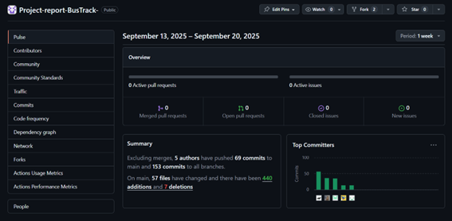

<h3 align="center"> Universidad Peruana de Ciencias Aplicadas <h3 align="center">

 

<h3 align="center"> Ingeniería de Software </h3>
<h3 align="center"> Ciclo 2025 - 2 </h3>

# Informe del Trabajo Final (TB1)  

<h3 align="center"> Aplicaciones Web</h3>
<h3 align="center"> Sección: 7452  </h3>
<h3 align="center"> Docente: Mori Paiva, Hugo Allan </h3>
<h3> Startup: DaL Company </h3>
<h3> Product: BusTrack </h3>

| Member                           |    Code    |
| :------------------------------- | :--------: |
| Fátima Belén Florez Shimabukuro | U202320610 |
| Mathias Andree Cardenas Huaman | U202316353 |
| Elizabeth Noelia Apaza Bocanegra | U20231c197 |
| Diego Andres Avalos Cordova | U202313922 |
| Joaquin Alberto Cuentas Peña | U20201f788 |

<h3 align="center">Septiembre, 2025</h3>

  

# Registro de Versiones del Informe

| Versión | Fecha | Autor | Descripción de modificación |
| :-----: | :---: | :---: | :-------------------------- |
|  |  |  |  |
| TB1 | 14/09 | Andree Cardenas | Desarrollo del capitulo 3 del informe |
| TB1 | 15/09 | Andree Cardenas | Desarrollo de los 4.1. y 4.2. |
| TB1 | 18/09 | Andree Cardenas | Revisión y corrección del Capítulo 2 |
| TB1 | 8/09 | Fátima Florez | Desarrollo del capitulo 1 del informe |
| TB1 | 13/09 | Fátima Florez | Desarrollo de los wireframes y mock-up de landing y web page |
| TB1 | 18/09 | Fátima Florez | Desarrollo de las entrevistas a empresas de transporte urbano y los puntos 4.6, 4.6.1, 4.6.2 y 4.6.3 |
| TB1 | 15/09 | Joaquin Cuentas | Desarrollo y desplieque de la landing page |
| TB1 | 18/09 | Joaquin Cuentas | Desarrollo de la capa de datos |
| TB1 | 20/09 | Joaquin Cuentas | Desarrollo del capítulo 5 |

  

# Project Report Collaboration Insights

| URL de la organización del proyecto |
| ----------------------------------- |
| [https://github.com/2025-2-AplicacionesWeb-DalComp](https://github.com/2025-2-AplicacionesWeb-DalComp) |

| URL del repositorio del reporte |
| ------------------------------- |
| [https://github.com/2025-2-AplicacionesWeb-DalComp/Project-report-BusTrack-](https://github.com/2025-2-AplicacionesWeb-DalComp/Project-report-BusTrack-) |

| URL del repositorio de la landing page |
| -------------------------------------- |
| [https://github.com/2025-2-AplicacionesWeb-DalComp/Landing-page](https://github.com/2025-2-AplicacionesWeb-DalComp/Landing-page) |

  

# Contenido

## Tabla de Contenidos

### [Registro de versiones del informe](#registro-de-versiones-del-informe)

### [Project Report Collaboration Insights](#project-report-collaboration-insights)

### [Contenido](#contenido)

### [Student Outcome](#student-outcome-1)

### [Capítulo I: Introducción](#capítulo-i-introducción-1)

- [1.1. Startup Profile](#11-startup-profile)
  - [1.1.1. Descripción de la Startup](#111-description-de-la-startup)
  - [1.1.2. Perfiles de integrantes del equipo](#112-perfiles-de-integrantes-del-equipo)
- [1.2. Solution Profile](#12-solution-profile)
  - [1.2.1 Antecedentes y problemática](#121-antecedentes-y-problemática)
  - [1.2.2 Lean UX Process](#122-lean-ux-process)
    - [1.2.2.1. Lean UX Problem Statements](#1221-lean-ux-problem-statements)
    - [1.2.2.2. Lean UX Assumptions](#1222-lean-ux-assumptions)
    - [1.2.2.3. Lean UX Hypothesis Statements](#1223-lean-ux-hypothesis-statements)
    - [1.2.2.4. Lean UX Canvas](#1224-lean-ux-canvas)
- [1.3. Segmentos objetivo](#13-segmentos-objetivo)

### [Capítulo II: Requirements Elicitation & Analysis](#capítulo-ii-requirements-elicitation--analysis-1)

- [2.1. Competidores](#21-competidores)
  - [2.1.1. Análisis competitivo](#211-análisis-competitivo)
  - [2.1.2. Estrategias y tácticas frente a competidores](#212-estrategias-y-tácticas-frente-a-competidores)
- [2.2. Entrevistas](#22-entrevistas)
  - [2.2.1. Diseño de entrevistas](#221-diseño-de-entrevistas)
  - [2.2.2. Registro de entrevistas](#222-registro-de-entrevistas)
  - [2.2.3. Análisis de entrevistas](#223-análisis-de-entrevistas)
- [2.3. Needfinding](#23-needfinding)
  - [2.3.1. User Personas](#231-user-personas)
  - [2.3.2. User Task Matrix](#232-user-task-matrix)
  - [2.3.3. User Journey Mapping](#233-user-journey-mapping)
  - [2.3.4. Empathy Mapping](#234-empathy-mapping)
- [2.4. Big Picture Event Storning](#24-big-picture-event-storning)
- [2.5. Ubiquitous Language](#25-ubiquitous-language)
 
### [Capítulo III: Requirements Specification](#capítulo-iii-requirements-specification-1)

- [3.1. To-Be Scenario Mapping](#31-to-be-scenario-mapping)
- [3.1. User Stories](#32-user-stories)
- [3.2. Impact Mapping](#33-impact-mapping)
- [3.3. Product Backlog](#34-product-backlog)

### [Capítulo IV: Product Design](#capítulo-iv-product-design-1)

- [4.1. Style Guidelines](#41-style-guidelines)
  - [4.1.1. General Style Guidelines](#411-general-style-guidelines)
  - [4.1.2. Web Style Guidelines](#412-web-style-guidelines)
- [4.2. Information Architecture](#42-information-architecture)
  - [4.2.1. Organization Systems](#421-organization-systems)
  - [4.2.2. Labeling Systems](#422-labeling-systems)
  - [4.2.3. SEO Tags and Meta Tags](#423-seo-tags-and-meta-tags)
  - [4.2.4. Searching Systems](#424-searching-systems)
  - [4.2.5. Navigation Systems](#425-navigation-systems)
- [4.3. Landing Page UI Design](#43-landing-page-ui-design)
  - [4.3.1. Landing Page Wireframe](#431-landing-page-wireframe)
  - [4.3.2. Landing Page Mock-up](#432-landing-page-mock-up)
- [4.4. Web Applications UX/UI Design](#44-web-applications-uxui-design)
  - [4.4.1. Web Applications Wireframes](#441-web-applications-wireframes)
  - [4.4.2. Web Applications Wireflow Diagrams](#442-web-applications-wireflow-diagrams)
  - [4.4.3. Web Applications Mock-ups](#443-web-applications-mock-ups)
  - [4.4.4. Web Applications User Flow Diagrams](#444-web-applications-user-flow-diagrams)
- [4.5. Web Applications Prototyping](#45-web-applications-prototyping)
- [4.6. Domain-Driven Software Architecture](#46-domain-driven-software-architecture)
  - [4.6.1. Design-Level Event Storming](#461-design-level-event-storming)
  - [4.6.2. Software Architecture Context Diagram](#462-software-architecture-context-diagram)
  - [4.6.3. Software Architecture Container Diagrams](#463-software-architecture-container-diagrams)
  - [4.6.4. Software Architecture Components Diagrams](#464-software-architecture-components-diagrams)
- [4.7. Software Object-Oriented Design](#47-software-object-oriented-design)
  - [4.7.1. Class Diagrams](#471-class-diagrams)
- [4.8. Database Design](#48-database-design)
  - [4.8.1. Database Diagram](#481-database-diagram)

### [Capítulo V: Product Implementation, Validation & Deployment](#capítulo-v-product-implementation-validation--deployment-1)

- [5.1. Software Configuration Management](#51-software-configuration-management)
  - [5.1.1. Software Development Environment Configuration](#511-software-development-environment-configuration)
  - [5.1.2. Source Code Management](#512-source-code-management)
  - [5.1.3. Source Code Style Guide & Conventions](#513-source-code-style-guide--conventions)
  - [5.1.4. Software Deployment Configuration](#514-software-deployment-configuration)
- [5.2. Landing Page, Services & Applications Implementation](#52-landing-page-services--applications-implementation)
  - [5.2.1. Sprint 1](#521-sprint-1)
    - [5.2.1.1. Sprint Planning 1](#5211-sprint-planning-1)
    - [5.2.1.2. Aspect Leaders and Collaborators](#5212-aspect-leaders-and-collaborators)
    - [5.2.1.3. Sprint Backlog 1](#5213-sprint-backlog-1)
    - [5.2.1.4. Development Evidence for Sprint Review](#5214-development-evidence-for-sprint-review)
    - [5.2.1.5. Execution Evidence for Sprint Review](#5215-execution-evidence-for-sprint-review)
    - [5.2.1.6. Services Documentation Evidence for Sprint Review](#5216-services-documentation-evidence-for-sprint-review)
    - [5.2.1.7. Software Deployment Evidence for Sprint Review](#5217-software-deployment-evidence-for-sprint-review)
    - [5.2.1.8. Team Collaboration Insights during Sprint](#5218-team-collaboration-insights-during-sprint)
- [5.3. Validation Interviews](#53-validation-interviews)
    - [5.3.1. Diseño de Entrevistas](#531-diseño-de-entrevistas)
    - [5.3.2. Registro de Entrevistas](#532-registro-de-entrevistas)
    - [5.3.3. Evaluaciones según heurísticas](#533-evaluaciones-según-heurísticas)
- [5.4. Video About the Product](#54-video-about-the-product)

  
# Student Outcome

### *ABET – EAC - Student Outcome 5*

| Criterio específico                                                                                                                                 | Acciones realizadas | Conclusiones |
| :-------------------------------------------------------------------------------------------------------------------------------------------------- | :------------------ | :----------- |
| Trabaja en equipo para proporcionar liderazgo en forma conjunta | **Mathias Andree Cardenas Huaman** Tomé un rol activo en las discusiones del equipo, proponiendo ideas y organizando apartados como las User Stories, Impact Mapping y Product Backlog, que sirvieron como guía de avance. Brindé apoyo a mis compañeros cuando tenían dudas, asegurando que todos pudiéramos contribuir.   | **Mathias Andree Cardenas Huaman** Mi participación permitió ejercer un liderazgo compartido, en el que no solo coordiné, sino que también motivé y complementé el trabajo de los demás, fortaleciendo la unión del equipo.   |
| Crea un entorno colaborativo e inclusivo, establece metas, planifica tareas y cumple objetivos. | **Mathias Andree Cardenas Huaman** En conjunto con el grupo establecimos metas semanales, y yo avancé secciones clave como las Style Guidelines, la Information Architecture y el EventStorming con Lenguaje Ubicuo. Siempre compartí mis avances para que todos estuvieran informados y alineados.   | **Mathias Andree Cardenas Huaman** Pude trabajar de forma colaborativa y organizada, cumpliendo con mis tareas en los tiempos previstos. Esto ayudó a que el equipo alcanzara los objetivos y mantuviera un ambiente de confianza e inclusión.   |

  

| Criterio específico                                                                                                                                 | Acciones realizadas | Conclusiones |
| :-------------------------------------------------------------------------------------------------------------------------------------------------- | :------------------ | :----------- |
| Trabaja en equipo para proporcionar liderazgo en forma conjunta | **Fátima Belén Florez Shimabukuro** Asumí un rol activo en la construcción de la documentación y diseño del proyecto, elaborando puntos clave como el Startup Profile, Solution Profile, wireframes, mock-ups y wireflows. Además, colaboré en la definición de la arquitectura del sistema mediante diagramas de contexto, contenedores y componentes.   | **Fátima Belén Florez Shimabukuro** Mi participación permitió definir con claridad la idea de la startup y aportar al diseño y arquitectura.   |
| Crea un entorno colaborativo e inclusivo, establece metas, planifica tareas y cumple objetivos. | **Fátima Belén Florez Shimabukuro** Junto con el equipo, definimos objetivos y estructuramos las tareas para alcanzar las metas de cada entrega. Para mantener al equipo alineado y obtener un feedback continuo, compartí los progresos de las entrevistas, diagramas y diseños.   | **Fátima Belén Florez Shimabukuro** .   |

  

| Criterio específico                                                                                                                | Acciones realizadas | Conclusiones |
| :--------------------------------------------------------------------------------------------------------------------------------- | :------------------ | :----------- |
| Trabaja en equipo para proporcionar liderazgo en forma conjunta | **Diego Andres Avalos Cordova** Asumí un rol activo en el análisis del proyecto, desarrollando apartados clave como el estudio de competidores (con sus estrategias y SWOT), la síntesis de entrevistas con resultados porcentuales, y los entregables de la User Task Matrix y el User Journey Mapping. Además, compartí constantemente mis avances para orientar al grupo y facilitar la coordinación.   | **Diego Andres Avalos Cordova** Mi aporte permitió que el equipo contara con insumos claros y organizados para la toma de decisiones, ejerciendo un liderazgo colaborativo en el que apoyé y motivé a mis compañeros mientras impulsábamos el progreso conjunto.   |
| Crea un entorno colaborativo e inclusivo, establece metas, planifica tareas y cumple objetivos. | **Diego Andres Avalos Cordova** En las reuniones grupales participé en la definición de metas y me encargué de avanzar en secciones críticas como el análisis competitivo, la matriz de tareas de usuario y los mapas de experiencia (User Journey). Siempre socialicé la información procesada para que todos tuvieran una visión compartida y se mantuviera el ritmo de trabajo.   | **Diego Andres Avalos Cordova** Pude integrarme de manera efectiva con el equipo, aportando resultados en los plazos acordados y ayudando a mantener un ambiente de confianza y organización. Esto contribuyó al logro de los objetivos generales y al fortalecimiento del trabajo colaborativo.   |

  

| Criterio específico                                                                                                                                 | Acciones realizadas | Conclusiones |
| :-------------------------------------------------------------------------------------------------------------------------------------------------- | :------------------ | :----------- |
| Trabaja en equipo para proporcionar liderazgo en forma conjunta | **Joaquin Alberto Cuentas Peña** Asumí el rol de líder al crear la organización de BusTrack y los repositorios de trabajp.Brindé indicaciones a mi equipo y viscevers acerca del proceso de gitflow para que todos podamos trabajar en github en equipo.   | **Joaquin Alberto Cuentas Peña** Mi participación permitió que todo el equipo presentara sus avances optimamente. Además las secciones que yo avancé, como la landing page permitieron que otros integrantes avanzaran oprtunamente sus partes.   |
| Crea un entorno colaborativo e inclusivo, establece metas, planifica tareas y cumple objetivos. | **Joaquin Alberto Cuentas Peña**  Con mis avances en el capítulo 5, pude brindar recordatorios a mis compañeros para que sus aportaciones aparezcan en las evidencias. Esto permitió, que todo el equipo nos pongamos las pilas para concluir el entregable.   | **Joaquin Alberto Cuentas Peña** Pude ejercer mi liderazgo colaborativo desde las tareas que me fueron asignadas y estas ayudaron a otros integrantes.   |

  

## Capítulo I: Introducción

## 1.1. StartUp Profile

### 1.1.1. Description de la StartUp

Descripción del producto: BusTrack es una plataforma web que ofrece información confiable y actualizada sobre rutas, horarios y tiempos de llegada de buses y transporte público en áreas urbanas de Lima Metropolitana. Los usuarios pueden buscar rutas, guardar trayectos frecuentes y recibir notificaciones en tiempo real sobre la llegada de los buses. Además, la aplicación incorpora servicios de mapas y APIs externas para brindar estimaciones más precisas de los tiempos de viaje, mejorando la planificación diaria de movilidad. Está especialmente diseñada para estudiantes y trabajadores que dependen del transporte público en zonas urbanas, facilitando sus viajes diarios y ofreciéndoles una experiencia más eficiente y agradable.

- Misión: Nuestra misión es desarrollar una plataforma web que optimice la experiencia del transporte público urbano, ofreciendo información precisa, en tiempo real y adaptada a las necesidades de estudiantes y trabajadores.

- Visión: Nuestra visión es contribuir a que el transporte público en el Perú sea más eficaz, seguro y accesible, reduciendo los tiempos de espera en zonas urbanas y mejorando la calidad de vida de los ciudadanos que dependen de este servicio.

### 1.1.2. Perfiles de integrantes del equipo

| Perfil | Alumno |
|--------|-------------|
|  | Nombre: Mathias Andree Cárdenas Huaman Código: U202316353 Descripción: Actualmente estoy cursando el sexto ciclo de la carrera de Ingeniería de Software. Soy proactivo y comunicativo, trabajo en equipo y resolución de problemas, también me gusta colocarme objetivos desafiantes para mejorar. Me encanta el curso y mi meta es completarla con la máxima nota posible. |
|  | Nombre: Elizabeth Noelia Apaza Bocanegra Código: U20231C197 Descripción: Tengo 19 años y me defino como una persona responsable, organizada y con facilidad para colaborar con los demás. Disfruto mucho del trabajo en equipo porque me permite intercambiar ideas y seguir aprendiendo de mi carrera. Me interesa desarrollar constantemente nuevas habilidades y busco aportar siempre con una comunicación clara y efectiva en cada proyecto. Mi objetivo es fortalecer mi formación académica y aprovechar cada experiencia para crecer tanto en lo profesional como en lo personal. |
|  |  |
|  | Nombre: Joaquin Alberto Cuentas Peña Código: U20201f788 Descripción: Soy estudiante de la UPC de la carrera de Ingeniería de Software y me encuentro cursando el 6to ciclo. Cuento con habilidades de programación en C++ y Python, así como aptitudes para el desarrollo en UX y UI. Asimismo, en cuanto a habilidades extracurriculares, he contribuido en proyectos con edición de video y fomentando una actitud colaborativa en equipo |
|  | Nombre: Diego Andres Ávalos Cordova Código: U202313922 Descripción: Soy estudiante de la carrera de Ingeniería de Software en la UPC y actualmente curso el sexto ciclo. Me apasiona el campo de la Ciberseguridad y mi objetivo es especializarme en esta área para convertirme en un profesional capaz de aportar soluciones innovadoras en la protección de la información. Tengo conocimientos en C++, JavaScript, HTML y Python, y me encuentro en constante aprendizaje de nuevos lenguajes y tecnologías que fortalezcan mis habilidades técnicas. Además, me interesa participar en proyectos que me permitan crecer tanto a nivel académico como profesional, desarrollando experiencia práctica y aportando valor en el ámbito tecnológico |

## 1.2. Solution Profile

### 1.2.1. Antecedentes y problemática

El transporte urbano en Lima Metropolitana se ha convertido, en los últimos años, en uno de los problemas más críticos de la ciudad, evidenciando deficiencias tanto en seguridad vial como en eficiencia del servicio. En 2023 se registraron 41,627 accidentes de tránsito, lo que representó un aumento del 10.2 % respecto al año anterior (ComexPerú, 2024). Además, Lima ocupa el quinto lugar en el ranking mundial de ciudades con peor tráfico, según el índice TomTom, un estudio internacional que mide la congestión vehicular en más de 380 ciudades del mundo. Esta situación tiene un impacto significativo en la calidad de vida de los limeños, que en su mayoría dependen de un transporte poco confiable: el 34.4 % se moviliza en coasters o combis y el 42.2 % de los usuarios se siente insatisfecho con el servicio (ComexPerú, 2024).

Por otro lado, la magnitud del sistema de transporte en la capital evidencia la complejidad del problema. Según la ATU, en Lima y Callao se realizan diariamente 24 millones de viajes, de los cuales el 87 % es cubierto por el transporte público convencional, que opera mediante 507 rutas y una flota de 22,000 vehículos. En contraste, solo el 12.1 % corresponde a sistemas formales como los corredores complementarios, el Metro de Lima y el Metropolitano (Gob.pe, 2024). Para afrontar esta situación, la ATU ha iniciado un proceso de reorganización de rutas y renovación gradual de la flota, promoviendo el uso de buses híbridos, eléctricos y a gas natural. Sin embargo, estos avances resultan insuficientes frente a la creciente demanda y el predominio del transporte informal, lo que mantiene el descontento ciudadano y refuerza la urgencia de implementar soluciones tecnológicas innovadoras que permitan mejorar la movilidad urbana. 

En este contexto, surge BusTrack como una propuesta tecnológica orientada a optimizar la planificación y experiencia de viaje de los usuarios, respondiendo a la urgencia de contar con soluciones innovadoras y confiables.

Para la elaboración de la descripción de los antecedentes y problemática, hemos aplicado la técnica de The 5´W´s y 2´H´s - Who, What, Where, When, Why, How & How Much: 

- **What (Qué):** El problema principal es la ineficiencia del sistema de transporte urbano en Lima Metropolitana, reflejada en altos índices de accidentes de tránsito, congestión vehicular e insatisfacción ciudadana. La mayoría de los viajes se realizan en sistemas convencionales con baja regulación, lo que genera inseguridad, informalidad y demoras constantes.

- **When (Cuándo):**  El problema se presenta a diario, especialmente en horas punta, cuando la congestión vehicular alcanza niveles críticos y los limeños enfrentan largas esperas para llegar a sus destinos.

- **Where (Dónde):**  La problemática se concentra en Lima Metropolitana y el Callao, zonas con alta densidad poblacional y más de 507 rutas de transporte convencional. La infraestructura vial es insuficiente y los sistemas formales, como el Metropolitano, los corredores complementarios y el Metro, solo cubren el 12.1 % de la demanda.

- **Who (Quién):**  El problema afecta principalmente a estudiantes y trabajadores que dependen de combis, coasters y buses convencionales, así como a la ciudadanía en general, que sufre las consecuencias en términos de tiempo perdido, inseguridad y menor productividad.

- **Why (Por qué):**  Este problema ocurre debido a la dependencia excesiva del transporte convencional, la superposición de rutas y la incapacidad de los sistemas formales de cubrir la demanda existente.

- **How (Cómo):** Los usuarios enfrentan largas esperas, vehículos inseguros y viajes en condiciones de exceso de pasajeros, donde los buses circulan sobrecargados y sin garantizar comodidad ni seguridad. La congestión incrementa los tiempos de desplazamiento y provoca un mayor número de accidentes. La falta de fiscalización permite que colectivos y unidades informales circulen sin controles técnicos ni seguros, elevando el riesgo para los pasajeros.

- **How much (Cuánto costará):** El impacto es considerable ya que cada limeño pierde en promedio 157 horas al año en congestión vehicular y la ciudad registra más de 41,000 accidentes de tránsito anuales. Además, estos problemas generan costos económicos, sociales y ambientales que afectan directamente la calidad de vida de los ciudadanos.

### 1.2.2. Lean UX Process

Los pasajeros de transporte público en Lima enfrentan incertidumbre diaria: no saben con precisión cuánto demorará en llegar un bus ni cuánto tiempo tomará el viaje. Esta falta de información genera estrés, pérdida de productividad y, en muchos casos, el uso de alternativas más costosas o inseguras.

A la par, las empresas de transporte carecen de herramientas para monitorear sus unidades en tiempo real, lo que impide mejorar el servicio y reduce la confianza de los usuarios.

Bustrack propone una solución que centraliza información en tiempo real sobre la ubicación de los buses, estimaciones precisas de llegada, rutas actualizadas y notificaciones de seguridad. A diferencia de las redes sociales o aplicaciones genéricas de mapas, nuestra plataforma está diseñada específicamente para las condiciones del transporte urbano local, generando confianza y seguridad en los usuarios.

Pregunta clave de diseño:
¿Cómo podemos desarrollar una plataforma que no solo brinde datos en tiempo real sobre el transporte público, sino que también aumente la confianza y reduzca la incertidumbre en los desplazamientos diarios?

#### 1.2.2.1. Lean UX Problem Statements

Los pasajeros de transporte público en Lima enfrentan incertidumbre diaria: no saben con precisión cuánto demorará en llegar un bus ni cuánto tiempo tomará el viaje. Esta falta de información genera estrés, pérdida de productividad y, en muchos casos, el uso de alternativas más costosas o inseguras.

A la par, las empresas de transporte carecen de herramientas para monitorear sus unidades en tiempo real, lo que impide mejorar el servicio y reduce la confianza de los usuarios.

Bustrack propone una solución que centraliza información en tiempo real sobre la ubicación de los buses, estimaciones precisas de llegada, rutas actualizadas y notificaciones de seguridad. A diferencia de las redes sociales o aplicaciones genéricas de mapas, nuestra plataforma está diseñada específicamente para las condiciones del transporte urbano local, generando confianza y seguridad en los usuarios.

Pregunta clave de diseño:
¿Cómo podemos desarrollar una plataforma que no solo brinde datos en tiempo real sobre el transporte público, sino que también aumente la confianza y reduzca la incertidumbre en los desplazamientos diarios?

#### 1.2.2.2. Lean UX Assumptions

# Supuestos principales para Bustrack

- Creemos que los pasajeros usarán la app de manera recurrente si la información de tiempos y rutas es precisa y confiable.  
- Creemos que los operadores de transporte adoptarán la plataforma si esta les permite monitorear flotas y mejorar la satisfacción del cliente.  
- Creemos que la confianza de los usuarios se fortalecerá mediante transparencia en los datos y notificaciones claras sobre retrasos o cambios de ruta.  
- Suponemos que la falta de información confiable es la principal causa de insatisfacción con el transporte público.  
- Asumimos que la implementación de herramientas tecnológicas puede contribuir a reducir la percepción de inseguridad al brindar alternativas claras y ordenadas de movilidad.  

---

## ¿Quién es el usuario?

**Primarios:**  
- Pasajeros frecuentes (estudiantes, trabajadores, familias).  

**Secundarios:**  
- Empresas de transporte que necesitan gestionar sus unidades.  

---

## Business Outcomes esperados

- Conseguir **50,000 usuarios activos** en el primer año.  
- Reducir en un **30% la percepción de incertidumbre** en los tiempos de espera.  
- Lograr que el **70% de las rutas principales** estén integradas en la app.  
- Aumentar en un **20% la satisfacción general** de los pasajeros en encuestas de movilidad urbana.  

---

## User Outcomes esperados

- Los pasajeros planifican sus viajes con mayor confianza y menos estrés.  
- Los operadores optimizan el control de sus flotas y mejoran su reputación.

#### 1.2.2.3. Lean UX Hypothesis Statements

# Hipótesis y criterios de validación para Bustrack

## 1. Geolocalización en tiempo real
- **Hipótesis:** Creemos que implementar un sistema de geolocalización en tiempo real de las unidades de transporte aumentará la confianza de los usuarios.  
- **Validación:** Sabremos que esto es cierto cuando observemos un **incremento en el uso recurrente de la aplicación dentro del primer mes** de lanzamiento.  

---

## 2. Notificaciones de llegada
- **Hipótesis:** Creemos que ofrecer notificaciones sobre la llegada de los buses reducirá el tiempo de espera percibido.  
- **Validación:** Sabremos que esto es cierto cuando **al menos el 60% de los usuarios reporten una disminución en su frustración** relacionada a los tiempos de espera.  

---

## 3. Interfaz intuitiva y accesible
- **Hipótesis:** Creemos que la incorporación de una interfaz intuitiva, simple y accesible facilitará la adopción tecnológica en distintos grupos de edad.  
- **Validación:** Sabremos que esto es cierto cuando **el 70% de los usuarios, independientemente de su rango etario, puedan completar las funciones principales sin necesidad de soporte**.  

---

## 4. Calificaciones de rutas y unidades
- **Hipótesis:** Creemos que permitir a los usuarios calificar las rutas y unidades fomentará la mejora del servicio por parte de las empresas de transporte.  
- **Validación:** Sabremos que esto es cierto cuando se registren **al menos 200 calificaciones en el primer trimestre**, y las empresas implementen mejoras a partir de esos datos.  

---

## 5. Historial de rutas frecuentes
- **Hipótesis:** Creemos que integrar un sistema de historial de rutas frecuentes aumentará la retención de usuarios.  
- **Validación:** Sabremos que esto es cierto cuando **el 50% de los usuarios registrados utilicen esta funcionalidad al menos una vez por semana**.

#### 1.2.2.4. Lean UX Canvas

# Bustrack - Lean UX Canvas

| **Sección** | **Contenido** |
|-------------|---------------|
| **Business Problem** | Los usuarios del transporte público en Lima Metropolitana enfrentan largos tiempos de espera, desinformación sobre los horarios y baja confianza en la puntualidad de las unidades. Esto genera frustración, pérdidas de tiempo y afecta la percepción de seguridad en el servicio. Al mismo tiempo, las empresas de transporte carecen de herramientas digitales que les permitan organizar mejor sus unidades y comunicarse eficazmente con los pasajeros. |
| **Business Outcomes** | - Conseguir 50,000 usuarios activos en el primer año. - Reducir en un 30% la percepción de incertidumbre en los tiempos de espera. - Lograr que el 70% de las rutas principales estén integradas en la app. - Aumentar en un 20% la satisfacción general de los pasajeros en encuestas de movilidad urbana. |
| **Users and Customers** | **Primarios:** Pasajeros que utilizan transporte público a diario. **Secundarios:** Empresas de transporte. |
| **User Benefits** | - Pasajeros: Mayor confianza, reducción de tiempos de espera y mejor planificación. - Empresas: Mejor gestión de flota, mayor satisfacción del cliente. |
| **Solution Ideas** | - Geolocalización en tiempo real de buses. - Estimaciones precisas de llegada. - Mapas interactivos con rutas alternativas. - Notificaciones sobre retrasos y cambios. - Panel de control para empresas de transporte. |
| **Hypotheses** | - Creemos que mostrar buses en tiempo real aumentará la confianza. - Creemos que enviar notificaciones sobre retrasos mejorará la satisfacción. - Creemos que integrar empresas de transporte reducirá los errores en la información. |
| **What's the most important thing we need to learn first?** | ¿Los pasajeros confían y usan de forma recurrente la información en tiempo real para planificar sus viajes? |
| **What’s the least amount of work we need to do to learn the next most important thing?** | MVP: Una app funcional con mapa de rutas principales, localización en tiempo real en una zona piloto y sistema básico de notificaciones. Validar si los usuarios usan la app en sus trayectos diarios. |

# 1.3. Segmentos Objetivo

# Segmentos Objetivo

## Segmento Objetivo #1: Pasajeros de Transporte Público (Estudiantes y Trabajadores)

### Aspectos demográficos
- Sexo: Masculino y femenino  
- Edades: Jóvenes y adultos entre 18 y 50 años  

### Aspectos geográficos
- Nacionalidad: Peruana  
- Zona geográfica: Principalmente Lima Metropolitana y Callao, donde se concentra el 87 % de los viajes en transporte convencional.  
- También con potencial en ciudades intermedias como Arequipa, Trujillo y Chiclayo.  

### Aspectos psicográficos
- Personas que dependen del transporte público como su principal medio de movilidad.  
- Buscan reducir la incertidumbre, los tiempos de espera y la inseguridad en sus trayectos diarios.  
- Valoran aplicaciones fáciles de usar, con información confiable y en tiempo real.  
- Su motivación principal es la puntualidad y la eficiencia para llegar a sus destinos, ya sea clases o centros laborales.  

---

## Segmento Objetivo #2: Empresas de Transporte Urbano (Operadores y Administradores de Flota)

### Aspectos demográficos
- Tipo de entidad: Empresas medianas y grandes que operan buses, coasters o combis.  
- Personal involucrado: Administradores de rutas, supervisores y propietarios de líneas.  

### Aspectos geográficos
- Ubicación: Lima Metropolitana y Callao, con posibilidad de expansión a otras ciudades de alta demanda.  

### Aspectos psicográficos
- Buscan herramientas tecnológicas que permitan optimizar la gestión de flotas y mejorar la eficiencia operativa.  
- Necesitan fortalecer la confianza de los pasajeros mediante transparencia en horarios, puntualidad y seguridad.  
- Están interesados en soluciones que integren datos de movilidad y faciliten la toma de decisiones.  
- Su motivación principal es mejorar la reputación, competitividad y rentabilidad en un mercado dominado por el transporte informal.  

  

# Capítulo II: Requirements Elicitation & Analysis

## 2.1. Competidores

El mercado de aplicaciones de transporte en Lima Metropolitana está en proceso de crecimiento, con actores internacionales y locales que buscan resolver los problemas de movilidad de los ciudadanos. Algunos priorizan la geolocalización, otros la venta de pasajes o la planificación de rutas, pero en conjunto conforman un ecosistema en el que **BusTrack** debe posicionarse con un enfoque diferencial en buses y transporte urbano en tiempo real.

## Principales Competidores

### Moovit (Internacional)
- Una de las aplicaciones de movilidad urbana más reconocidas a nivel mundial.  
- En Lima ofrece información sobre rutas de buses, trenes, corredores y otros medios de transporte público.  
- Aplicación con presencia global y disponible en Lima.  
- Permite planificar viajes en transporte público y muestra opciones intermodales (bus, tren, bicicleta, etc.).  
- Usa datos compartidos por la comunidad para estimar tiempos de llegada.  
- **Fortaleza:** escala internacional e integración con múltiples ciudades.
  
### Google Maps (Internacional)
- Servicio masivo y gratuito utilizado en todo el mundo.  
- Ofrece mapas, rutas y tráfico en tiempo real.  
- Integra opciones de transporte público, aunque en Lima su nivel de detalle en buses y colectivos es limitado.  
- **Fortaleza:** precisión cartográfica.  
- **Debilidad:** falta de especialización en transporte urbano limeño.  

### TuRuta (Perú)
- Aplicación peruana creada para ayudar a los limeños a encontrar rutas de transporte público.  
- Competidor directo al enfocarse en la experiencia de buses y colectivos.  
- Proyecto local pensado específicamente para Lima Metropolitana.  
- Se alimenta en gran medida de la colaboración de la comunidad.  
- **Fortaleza:** cercanía al público limeño.  
- **Debilidad:** dificultad para mantener datos actualizados y confiables.  

### RedBus (Perú – Interprovincial)
- Enfocado principalmente en la venta de pasajes interprovinciales.  
- Competidor indirecto, ya que digitaliza el acceso a información y reservas de transporte.  
- No compite en transporte urbano, pero es un referente en movilidad digitalizada.  
- **Fortalezas:** confianza en métodos de pago y amplia cobertura en el país.  
- **Debilidad:** orientado a viajes de larga distancia, no a transporte urbano.  

### 2.1.1. Análisis competitivo

- **Moovit**: Su fortaleza está en la integración global y la experiencia en movilidad urbana. Sin embargo, en Lima su desventaja es la falta de personalización para los usuarios locales y una limitada adaptación al transporte informal limeño.  

- **Google Maps**: Es fuerte en geolocalización y datos de tráfico, pero no está especializado en buses urbanos de Lima ni en la variabilidad del transporte público local.  

- **TuRuta**: Es el competidor más directo, con foco en Lima, pero su crecimiento y actualización de datos dependen mucho de la comunidad y carece de sistemas avanzados de notificaciones en tiempo real.  

- **RedBus**: No compite directamente en el transporte urbano, pero representa un referente en digitalización y confianza en servicios de movilidad en el Perú.  

| Competidor | Fortalezas                                   | Debilidades                                       | Oportunidad para BusTrack                        |
|------------|-----------------------------------------------|---------------------------------------------------|--------------------------------------------------|
| **Moovit** | Cobertura global, integración con otros transportes | Baja personalización local                         | Adaptar el servicio 100% a Lima                  |
| **Google Maps** | Precisión cartográfica, tráfico en tiempo real | No especializado en transporte urbano limeño       | Especializarse en buses y paraderos              |
| **TuRuta** | Orientado a Lima, interfaz sencilla           | Datos poco confiables, sin notificaciones en tiempo real | Diferenciarse con APIs oficiales y datos confiables |
| **RedBus** | Digitalización de transporte, confianza en pagos | No urbano, solo interprovincial                   | Replicar digitalización en el transporte urbano  |

BusTrack se distingue al enfocarse en información confiable, en tiempo real y adaptada al contexto limeño, integrando APIs externas y ofreciendo notificaciones personalizadas. Esta propuesta llena vacíos que sus competidores aún no cubren de manera completa.  

### 2.1.2. Estrategias y tácticas frente a competidores

Para destacar frente a las aplicaciones ya presentes en el mercado, **BusTrack** aplicará una estrategia de enfoque y personalización local, complementada con innovación progresiva:

### 1. Enfoque en la realidad limeña
- Integrar información de buses y paraderos formales e informales.  
- Incorporar APIs y datos oficiales de municipalidades para aumentar la confiabilidad.  

### 2. Alianzas estratégicas
- Trabajo conjunto con operadores de transporte urbano y universidades para captar usuarios frecuentes.  
- Posibles acuerdos con entidades públicas de transporte para mejorar la base de datos y validación de rutas.  

### 3. Valor agregado para el usuario
- Notificaciones en tiempo real sobre llegada de buses.  
- Guardado de rutas frecuentes y estimación de tiempos con base en tráfico local.  
- Alertas de seguridad (por ejemplo, paraderos recomendados o zonas de riesgo).  

### 4. Campañas de posicionamiento digital
- Presencia activa en redes sociales para atraer a estudiantes y trabajadores.  
- Estrategias de marketing enfocadas en el ahorro de tiempo y la seguridad del transporte.  
- Construcción de comunidad de usuarios que compartan información en la plataforma.  

### 5. Innovación tecnológica gradual
- Desarrollo futuro de una app móvil con geolocalización más precisa.  
- Implementación de funciones predictivas (estimación de tiempos basada en patrones históricos de tráfico).  

Con estas estrategias, **BusTrack** busca convertirse en una opción confiable y útil para los limeños, apostando por la innovación tecnológica y por ofrecer información clara y en tiempo real que realmente ayude a estudiantes y trabajadores a moverse mejor por la ciudad.  

## 2.2. Entrevistas

Como parte del proceso de validación del modelo de negocio de BusTrack, se plantean entrevistas semiestructuradas dirigidas a los dos segmentos objetivos: pasajeros de transporte público y empresas de transporte urbano. El propósito es identificar sus motivaciones, comportamientos, expectativas y principales frustraciones en relación con la movilidad urbana, así como validar la propuesta de valor de la plataforma.

### 2.2.1. Diseño de entrevistas

## Segmento 1: Pasajeros de Transporte Público

### Datos generales
- Nombre  
- Edad  
- Distrito de residencia  
- Ocupación (estudiante, trabajador, etc.)  
- Frecuencia de uso del transporte público (diaria, varias veces por semana, esporádica)  

### Motivaciones y comportamientos
- ¿Qué medio de transporte público usas con más frecuencia (bus, coaster, combi, Metropolitano, Metro)?  
- ¿Qué es lo que más te preocupa cuando viajas en transporte público?  
- ¿Cómo planificas actualmente tus viajes?  
- ¿Has usado alguna aplicación para movilizarte en la ciudad (Waze, Google Maps, Moovit, etc.)? ¿Cómo fue tu experiencia?  
- ¿Qué importancia le das a recibir información en tiempo real sobre la llegada de buses?  

### Miedos, expectativas y canales
- ¿Qué problemas enfrentas con mayor frecuencia en tus traslados (tiempo de espera, congestión, inseguridad, falta de información)?  
- ¿Qué haría que confíes en una aplicación como BusTrack para planificar tus viajes?  
- ¿Te gustaría recibir notificaciones sobre la llegada del bus, retrasos o desvíos de ruta?  
- ¿Qué redes sociales o aplicaciones móviles usas más para informarte en tu día a día?  
- ¿Cómo medirías que una aplicación realmente mejora tu experiencia de viaje?  

---

## Segmento 2: Empresas de Transporte Urbano

### Datos generales
- Nombre del entrevistado  
- Cargo (administrador, supervisor de rutas, propietario)  
- Empresa / línea de transporte  
- Número de unidades en operación  
- Zonas o rutas que cubren  

### Operaciones y herramientas
- ¿Cómo gestionan actualmente la ubicación y monitoreo de sus unidades?  
- ¿Qué herramientas digitales o manuales utilizan para el control de flotas?  
- ¿Qué información reciben de los conductores y cómo la gestionan?  
- ¿Han usado o considerado alguna aplicación para interactuar con pasajeros?  
- ¿Cuáles son los mayores retos para mantener la puntualidad y la seguridad de los viajes?  

### Expectativas y valor esperado
- ¿Qué tipo de datos o reportes serían más valiosos para su gestión diaria (tiempos de llegada, cantidad de pasajeros, retrasos)?  
- ¿Qué funcionalidades de una aplicación como BusTrack les motivarían a adoptarla?  
- ¿Cómo creen que una plataforma de información en tiempo real podría mejorar la confianza de los pasajeros?  
- ¿Qué beneficios esperan obtener al implementar una solución tecnológica (mayor satisfacción, competitividad, reducción de costos)?  
- ¿Qué barreras ven para adoptar una aplicación digital de gestión de transporte?  

### 2.2.2. Registro de entrevistas

### Segmento 2: Empresas de Transporte Urbano
### Entrevista 3
**Entrevistado:** Octavio

**Sexo:** Masculino   

**Edad:** 25  

**Resumen de entrevista:** La empresa administra sus unidades con registros en Excel, hojas de ruta y llamadas telefónicas, recibiendo datos básicos sobre tráfico y fallas mecánicas. Destacan como retos la falta de información en tiempo real y el tráfico. Valoran reportes automáticos y control en vivo de buses, aunque ven como barreras el costo y la adaptación de los conductores.

**Link de entrevista:**

### Entrevista 4
**Entrevistado:** Jean Paul Condori

**Sexo:** Masculino   

**Edad:** 40  

**Resumen de entrevista:** La empresa maneja sus unidades a través de grupos de WhatsApp y anotaciones manuales en cuadernos, obteniendo información sobre demoras, congestión vial y controles policiales. El tráfico, los bloqueos y la falta de modernización en los procesos son sus principales desafíos. En BusTrack ven una posibilidad de monitoreo en tiempo real y consideran útiles los informes sobre horarios, rutas y cantidad de pasajeros. Sin embargo, identifican obstáculos relacionados con la confianza y la adaptación a la tecnología.

**Link de entrevista:**

### 2.2.3. Análisis de entrevistas

### Segmento 1: Pasajeros de Transporte Público

### Segmento 2: Empresas de Transporte Urbano
| **Preguntas** | **Respuestas Generales** |
|---|---|
| ¿Cómo gestionan actualmente la ubicación y monitoreo de sus unidades? | No cuentan con un sistema especializado. Asimismo, usan grupos de WhatsApp para conocer la ubicación de los choferes. |
| ¿Qué herramientas digitales o manuales utilizan para el control de flotas? | Principalmente cuadernos, hojas de ruta y en algunos casos Excel. |
| ¿Qué información reciben de los conductores y cómo la gestionan? | Reciben retrasos, problemas en el tráfico, incidentes en ruta y fallas mecánicas, que se comunican por mensajes o llamadas y se registran manualmente. |
| ¿Han usado o considerado alguna aplicación para interactuar con pasajeros? | Actualmente no tienen contacto directo con pasajeros mediante apps. Algunos lo han considerado pero no lo aplican aún. |
| ¿Cuáles son los mayores retos para mantener la puntualidad y la seguridad de los viajes? | Los mayores retos son el tráfico, bloqueos, obras en las vías y la falta de información en tiempo real. |
| ¿Qué tipo de datos o reportes serían más valiosos para su gestión diaria (tiempos de llegada, cantidad de pasajeros, retrasos)? | Los horarios de salida y llegada, retrasos por incidentes, ubicación exacta en ruta y cantidad de pasajeros transportados. |
| ¿Qué funcionalidades de una aplicación como BusTrack les motivarían a adoptarla? | Funciones como monitoreo de los buses en tiempo real, reportes automáticos y alertas de incidencias. |
| ¿Cómo creen que una plataforma de información en tiempo real podría mejorar la confianza de los pasajeros? | Permitiéndoles planificar mejor sus tiempos al conocer la hora exacta de llegada y salida de los buses. |
| ¿Qué beneficios esperan obtener al implementar una solución tecnológica (mayor satisfacción, competitividad, reducción de costos)? | Esperan incrementar la satisfacción de los pasajeros, atraer más usuarios, reducir quejas y mejorar el control interno. |
| ¿Qué barreras ven para adoptar una aplicación digital de gestión de transporte? | Las barreras serían el costo de implementación, la adaptación de choferes y la desconfianza inicial frente a nuevas tecnologías. |

## 2.3. Needfinding

### 2.3.1. User Personas

## Segmento Objetivo 1: Pasajeros de Transporte Público

| **Atributo**     | **Valor** |
|------------------|-----------|
| **Name**         | Manuel Suarez |
| **Age**          | 29 años |
| **Occupation**   | Trabajo de oficina |
| **Status**       | Soltero |
| **Location**     | Lima, Perú |
| **Tier**         | Pasajero frecuente |
| **Archetype**    | Usuario Pragmático |
| **Image**        |  |
| **Quote**        | "Lo que más necesito es saber con certeza cuándo llegará el bus para no perder tiempo ni arriesgarme." |
| **Motivations**  | Incentive: 80/100 Fear: 70/100 Achievement: 75/100 Growth: 65/100 Power: 40/100 Social: 85/100 |
| **Goals**        | - Planificar viajes con menor incertidumbre. - Ahorrar tiempo en traslados. - Sentirse más seguro en sus trayectos diarios. |
| **Frustrations** | - No saber cuándo pasará el bus. - Pérdida de tiempo en paraderos inseguros. - Información poco confiable en apps genéricas. |
| **Biography**    | Manuel viaja dos veces al día en transporte público para ir a su trabajo en el centro de Lima. Gasta en promedio más de 1 hora diaria en esperas. Ha probado apps de mapas, pero no le resultan útiles porque no están adaptadas al sistema de transporte local. Busca una solución confiable y sencilla que le permita organizar mejor su día. |
| **Personality**  | Extrovert: 60/100 Thinking: 80/100 Judging: 70/100 |
| **Technology**   | IT and Internet: 85/100 Software: 70/100 Mobile Apps: 90/100 Social Networks: 95/100 |
| **Brands**       | WhatsApp, Google Maps, TikTok |

---

## Segmento Objetivo 2: Empresas de Transporte Urbano

| **Atributo**     | **Valor** |
|------------------|-----------|
| **Name**         | Rosa Palacios |
| **Age**          | 45 años |
| **Occupation**   | Administradora de empresas de transporte |
| **Status**       | Casada |
| **Location**     | Lima, Perú |
| **Tier**         | Empresa de transporte urbano |
| **Archetype**    | Gestora Eficiente |
| **Image**        |  |
| **Quote**        | "Si puedo monitorear mis buses en tiempo real, puedo ofrecer un mejor servicio y ganar más pasajeros." |
| **Motivations**  | Incentive: 85/100 Fear: 60/100 Achievement: 90/100 Growth: 80/100 Power: 75/100 Social: 70/100 |
| **Goals**        | - Monitorear las unidades en tiempo real. - Mejorar la puntualidad y satisfacción del cliente. - Optimizar costos operativos. |
| **Frustrations** | - No contar con datos centralizados. - Reclamaciones frecuentes por retrasos. - Falta de herramientas tecnológicas para competir con apps modernas. |
| **Biography**    | Rosa administra una empresa con 20 buses en Lima. Actualmente depende de llamadas de choferes para conocer incidencias, lo que le genera pérdidas de tiempo y poca precisión. Está interesada en adoptar soluciones digitales que le den control, transparencia y ventaja competitiva en el mercado. |
| **Personality**  | Extrovert: 65/100 Thinking: 85/100 Judging: 75/100 |
| **Technology**   | IT and Internet: 75/100 Software: 65/100 Mobile Apps: 70/100 Social Networks: 60/100 |
| **Brands**       | WhatsApp Business, Facebook, LinkedIn |

### 2.3.2. User Task Matrix

| Tarea / Funcionalidad                | Estudiante | Trabajador | Adulto mayor | Turista |
|--------------------------------------|------------|------------|--------------|---------|
| Consultar rutas y horarios           | Alta       | Alta       | Alta         | Alta    |
| Recibir notificaciones en tiempo real| Alta       | Alta       | Media        | Media   |
| Guardar trayectos frecuentes         | Alta       | Alta       | Media        | Baja    |
| Revisar estimaciones según tráfico   | Media      | Alta       | Baja         | Media   |
| Identificar paraderos cercanos       | Media      | Media      | Alta         | Alta    |
| Alertas de seguridad en paraderos    | Media      | Media      | Alta         | Media   |
| Consultar rutas hacia puntos turísticos | Baja    | Baja       | Baja         | Alta    |
| Administración de datos (rol admin)  | Baja       | Baja       | Baja         | Baja    |

En el User Task Matrix pudimos ver que cada grupo de usuarios tiene prioridades distintas: estudiantes y trabajadores buscan sobre todo rapidez e información en tiempo real; los adultos mayores se enfocan más en la seguridad y paraderos cercanos; y los turistas necesitan rutas claras hacia lugares de interés. Aunque las tareas administrativas no se notan directamente, son clave para mantener la información confiable. En general, BusTrack debe centrarse en ofrecer datos precisos, opciones personalizadas y una experiencia segura para todos.

### 2.3.3. User Journey Mapping

| Journey Phases        | Acción                                                   | Herramientas/Canales              | Emoción           | Punto de Dolor                                  |
|------------------------|----------------------------------------------------------|-----------------------------------|------------------|------------------------------------------------|
| Identificación de Necesidad | Se da cuenta de que necesita llegar a clases a tiempo  | Reloj, calendario personal         | Ansioso          | Desconoce horarios y frecuencia de buses        |
| Búsqueda de Información | Abre BusTrack y consulta rutas y horarios                | BusTrack web/app                   | Esperanzado      | Puede encontrar info incompleta o confusa       |
| Planificación del Viaje | Guarda su ruta frecuente y revisa el tiempo estimado     | Función de favoritos, notificaciones | Tranquilo        | Estimaciones pueden no ser totalmente precisas  |
| Espera en Paradero     | Llega al paradero y revisa notificación de llegada        | BusTrack en el celular             | Impaciente       | El bus se retrasa o no coincide con la app      |
| Viaje en Bus           | Revisa en tiempo real la ubicación y tiempo restante      | BusTrack GPS + mapas               | Confiado         | No siempre hay señal estable de GPS o internet  |
| Llegada al Destino     | Llega a la universidad a tiempo                          | Confirmación visual en la app      | Satisfecho       | Si hubo retraso, llega con estrés o cansancio   |

### 2.3.4. Empathy Mapping

Segmento 1: Pasajeros de Transporte Público (Ejemplo: Manuel Suárez)

Segmento 2: Empresas de Transporte Urbano (Ejemplo: Rosa Palacios)

## 2.4. Big Picture Event Storning

| **Actor**                 | **Evento**                                 | **Resultado**                                           |
| ------------------------- | ------------------------------------------ | ------------------------------------------------------- |
| **Pasajero**              | Busca una ruta ingresando origen y destino | El sistema recibe la solicitud de búsqueda              |
| **Sistema BusTrack**      | Procesa la búsqueda de rutas disponibles   | Muestra opciones de buses, horarios y tiempos estimados |
| **Pasajero**              | Selecciona una ruta                        | Puede guardarla como favorita para futuros viajes       |
| **Sistema BusTrack**      | Rastrea ubicación del bus en tiempo real   | Actualiza la posición en el mapa                        |
| **Sistema BusTrack**      | Envía notificación al pasajero             | Pasajero recibe alertas de retrasos o desvíos           |
| **Pasajero**              | Viaja en el bus consultando la app         | Accede a información de llegada en tiempo real          |
| **Pasajero**              | Califica el viaje                          | El sistema guarda comentarios y puntuaciones            |
| **Sistema BusTrack**      | Genera reportes de uso y eficiencia        | La empresa de transporte recibe métricas                |
| **Empresa de transporte** | Ajusta rutas y horarios según reportes     | Se mejora la calidad del servicio ofrecido              |

## 2.5. Ubiquitous Language

| **Término**                          | **Definición**                                                                                       |
| ------------------------------------ | ---------------------------------------------------------------------------------------------------- |
| **Pasajero**                         | Usuario final de BusTrack que consulta rutas, horarios y viaja en transporte público.                |
| **Empresa de transporte**            | Entidad que gestiona los buses, rutas y horarios registrados en la aplicación.                       |
| **Ruta**                             | Trayecto definido entre un origen y un destino que sigue un bus.                                     |
| **Horario**                          | Horas establecidas para salidas y llegadas de buses en una ruta.                                     |
| **Bus**                              | Vehículo de transporte público registrado en BusTrack con identificación y ubicación GPS.            |
| **Notificación**                     | Alerta enviada al pasajero sobre retrasos, desvíos o llegada próxima del bus.                        |
| **Reporte**                          | Documento generado automáticamente con datos de eficiencia, puntualidad y satisfacción del servicio. |
| **Favoritos**                        | Rutas que el pasajero guarda para consultarlas rápidamente en futuros viajes.                        |
| **Panel de control**                 | Interfaz usada por la empresa de transporte para monitorear la flota y generar reportes.             |
| **Tiempo estimado de llegada (ETA)** | Predicción calculada por el sistema sobre el tiempo que falta para que un bus llegue a la parada.    |

  

# Capítulo III: Requirements Specification

## 3.1. To-Be Scenario Mapping

El mapeo de escenarios To-Be permite visualizar la experiencia futura de los usuarios al utilizar BusTrack, comparando el estado actual con la experiencia mejorada gracias a la plataforma.

**Segemento Objetivo: Pasajeros.**
| Phases | Inicio de Uso | Planificación | Durante la espera | En el viaje | Post-viaje |
|--------|---------------|---------------|-------------------|-------------|------------|
| Doing | Abre Bustrack y se loguea con su cuenta. | Busca la ruta a su destino en el buscador de la app. | Revisa en el mapa la ubicación en tiempo real en la app | Consulta el tiempo estimado de llegada en la app. | Califica la ruta y guarda comentarios en la app |
| Thinking | “Quiero ver rápido mis rutas guardadas.” | “Espero que la app me muestre el bus más cercano.” | “Ya sé cuánto falta para que llegue, puedo organizarme mejor.” | “Voy a llegar a tiempo, puedo avisar de mi retraso.” | “Esto ayudará a mejorar el servicio." |
| Feeling | Confiado, siente simplicidad en el acceso | Tranquilo porque encuentra opciones claras | Seguro, menos ansiedad que antes | Cómodo y organizado. | Satisfecho, motivado a seguir usando Bustrack. |

**Segmento Objetivo: Empresas de Transporte**
| Phases | Inicio de Uso | Planificación | Durante la espera | En el viaje | Post-viaje |
|--------|---------------|---------------|-------------------|-------------|------------|
| Doing | Inicia sesión en el panel web de BusTrack. | Supervisa en el panel la ubicación y tiempos de cada bus en ruta. | Recibe notificaciones de tráfico o incidentes y redirige buses desde la app. | Genera reportes automáticos de eficiencia y puntualidad en el sistema. | Ajusta rutas en base al historial de datos que muestra la app. |
| Thinking | “Necesito revisar el estado de todos los buses antes de empezar.” | “Puedo detectar retrasos y tomar decisiones rápidas.” | “Con esto evito reclamos y mejorar la puntualidad del servicio.” | “Estos datos me servirán para justificar cambios de rutas y horarios.” | “Puedo reducir costos y mejorar la experiencia del pasajero. |
| Feeling | Seguro, con control de la operación. | Tranquilo, siente dominio. | Confiado, en control de la situación. | Satisfecho, motivado a optimizar. | Confiado en la mejora continua. |

## 3.2. User Stories

Para el caso de BusTrack, se han definido inicialmente 4 épicas, que representan grandes bloques funcionales de la aplicación: gestión de rutas y horarios, monitoreo en tiempo real, administración de flota y experiencia del usuario en la app. De cada épica se derivaron tres historias de usuario, sumando un total de 12 User Stories, las cuales buscan reflejar las interacciones clave de pasajeros y administradores de transporte con la aplicación.

Este enfoque asegura que las funcionalidades priorizadas estén alineadas con las necesidades reales de los actores identificados, brindando así una base sólida para la construcción del Product Backlog y el diseño de las próximas iteraciones del producto.

| Código | Nombre | Descripción |
|--------|--------|-------------|
| E01 | Gestión de rutas y horarios | Permitir a los pasajeros buscar, visualizar y guardar rutas y horarios para mejorar su planificación de viajes |
| E02 | Monitoreo en tiempo real | Brindar información en vivo sobre la ubicación de los buses y notificaciones de retrasos o desvíos para reducir la incertidumbre del usuario. |
| E03 | Administración de flota | Proporcionar a las empresas de transporte herramientas para monitorear buses, generar reportes y configurar alertas para optimizar la operación. |
| E04 | Experiencia del usuario en la app | Ofrecer a los pasajeros funciones de registro, personalización y retroalimentación para mejorar la interacción con la aplicación. |
| E05 | Desarrollo de Landing Page | Ofrecer a ambos usuarios una primera toma de contacto de nuestra aplicación web y darles a conocer de qué trata nuestra solución. |

**Historias de Usuario**

| ID   | Épica                        | Nombre | Historia                                                                                         | Criterios de Aceptación |
|------|------------------------------|--------|----------------------------------------------------------------------------|--------------------------|
| US01 | Gestión de rutas y horarios  | Buscar rutas | Como pasajero, quiero buscar una ruta en el mapa para encontrar la mejor opción de transporte.   | **Escenario positivo: Ruta encontrada correctamente**    **Dado** que el pasajero ingresa origen y destino, **cuando** hace clic en “Buscar ruta”, **entonces** la aplicación muestra las rutas disponibles.  **Escenario negativo: Ruta no encontrada**    **Dado** que el pasajero no ingresa un destino válido, **cuando** hace clic en “Buscar ruta”, **entonces** se muestra “Ruta no encontrada”. |
| US02 | Gestión de rutas y horarios  | Visualizar horarios | Como pasajero, quiero visualizar el horario del próximo bus para organizar mi tiempo.            | **Escenario positivo: Horarios disponibles**    **Dado** que selecciona una ruta, **cuando** presiona “Guardar como favorita”, **entonces** la ruta aparece en favoritos.  **Escenario negativo: Horarios no disponibles**   **Dado** que intenta guardar una ruta duplicada, **cuando** presiona “Guardar como favorita”, **entonces** aparece “Esta ruta ya está guardada”. |
| US03 | Gestión de rutas y horarios  | Guardar rutas frecuentes | Como pasajero, quiero guardar mis rutas frecuentes para acceder más rápido a ellas.              | **Escenario positivo: Ruta guardada como favorita**  **Dado** que el bus está en servicio, **cuando** abre la ruta, **entonces** se muestra su ubicación en el mapa.  **Escenario negativo: Ruta duplicada no permitida**   **Dado** que el bus no tiene datos GPS, **cuando** abre la ruta, **entonces** aparece “Ubicación no disponible”. |
| US04 | Monitoreo en tiempo real     | Ver ubicación del bus | Como pasajero, quiero ver la ubicación del bus en el mapa para saber cuánto tardará en llegar.   | **Escenario positivo: Ubicación mostrada en el mapa**   **Dado** que el bus está en servicio, **cuando** abre la ruta, **entonces** se muestra su ubicación en el mapa.  **Escenario negativo: Ubicación no disponible**   **Dado** que el bus no tiene datos GPS, **cuando** abre la ruta, **entonces** aparece “Ubicación no disponible”. |
| US05 | Monitoreo en tiempo real     | Recibir notificaciones de retraso | Como pasajero, quiero recibir notificaciones si hay un retraso para ajustar mi plan de viaje.    | **Escenario positivo: Retraso notificado correctamente**   **Dado** que el bus tiene un retraso >10 min, **cuando** ocurre, **entonces** la app envía una notificación.  **Escenario negativo: Notificación desactivada**   **Dado** que el pasajero desactivó notificaciones, **cuando** ocurre el retraso, **entonces** no recibe alerta. |
| US06 | Monitoreo en tiempo real     | Alertas de desvío | Como pasajero, quiero recibir alertas si un bus cambia de ruta para evitar confusiones.          | **Escenario positivo: Desvío notificado**   **Dado** que ocurre un desvío, **cuando** se actualiza la ruta, **entonces** la app envía una notificación.  **Escenario negativo: Desvío no notificado por falta de conexión**  **Dado** que no hay conexión a internet, **cuando** ocurre el desvío, **entonces** la app no envía notificación. |
| US07 | Administración de flota      | Monitorear buses en ruta | Como administrador de flota, quiero monitorear en tiempo real la ubicación de mis buses para asegurar la puntualidad. | **Escenario positivo: Monitoreo en tiempo real exitoso**   **Dado** que los buses están activos, **cuando** abre el panel, **entonces** se muestra el estado de cada bus.  **Escenario negativo: Error de conexión al servidor**   **Dado** que no hay conexión al servidor, **cuando** abre el panel, **entonces** aparece “Error de conexión”. |
| US08 | Administración de flota      | Generar reportes diarios | Como administrador de flota, quiero generar reportes diarios de eficiencia para mejorar el servicio. | **Escenario positivo: Reporte generado exitosamente**   **Dado** que selecciona “Generar reporte”, **cuando** finaliza, **entonces** obtiene estadísticas de puntualidad y recorridos.  **Escenario negativo: Reporte no generado por mantenimiento**   **Dado** que el servidor está en mantenimiento, **cuando** genera, **entonces** aparece “No se pudo generar el reporte”. |
| US09 | Administración de flota      | Configurar alertas internas | Como administrador de flota, quiero configurar alertas de tráfico para reaccionar rápidamente a incidentes. | **Escenario positivo: Alerta de tráfico recibida**   **Dado** que activa alertas, **cuando** ocurre un incidente, **entonces** recibe notificación en el panel.  **Escenario negativo: Alerta no recibida por estar desactivada**   **Dado** que desactiva alertas, **cuando** ocurre un incidente, **entonces** no recibe ninguna notificación. |
| US10 | Experiencia del usuario      | Registro de usuario | Como nuevo pasajero, quiero registrarme en la aplicación para personalizar mis rutas.            | **Escenario positivo: Registro exitoso**   **Dado** que completa los campos, **cuando** presiona “Registrarse”, **entonces** se crea la cuenta.  **Escenario negativo: Registro fallido por campos incompletos**   **Dado** que deja campos vacíos, **cuando** presiona “Registrarse”, **entonces** aparece “Complete todos los campos”. |
| US11 | Experiencia del usuario      | Calificar servicio | Como pasajero, quiero calificar el servicio después de mi viaje para contribuir a la mejora.     | **Escenario positivo: Calificación registrada**   **Dado** que selecciona una ruta, **cuando** presiona “Calificar”, **entonces** puede dar 1–5 estrellas y un comentario.  **Escenario negativo: Calificación no registrada por falta de selección**   **Dado** que no selecciona ruta, **cuando** presiona “Calificar”, **entonces** aparece “Seleccione un viaje realizado”. |
| US12 | Experiencia del usuario      | Editar perfil | Como pasajero, quiero editar mis datos personales para mantener mi información actualizada.      | **Escenario positivo: Perfil actualizado correctamente**   **Dado** que actualiza su correo, **cuando** presiona “Guardar cambios”, **entonces** se guarda correctamente.  **Escenario negativo: Correo inválido al actualizar perfil**   **Dado** que ingresa un correo inválido, **cuando** presiona “Guardar cambios”, **entonces** aparece “Correo no válido”. |
| US13 | Desarrollo de Landing Page   | Información de la solución   | Como visitante de la web, quiero ver información concisa de la solución para convencerme de volverme un usuario frecuente.                   | **Escenario positivo: Información concisa mostrada correctamente**  **Dado** que el visitante entra a la página principal, **cuando** visualiza la sección de la solución, **entonces** encuentra un resumen breve y claro de las funcionalidades principales.  **Escenario negativo: Información no disponible**  **Dado** que el visitante entra a la página principal, **cuando** la sección de la solución no carga, **entonces** aparece el mensaje “Información no disponible, intente más tarde”. |
| US14 | Desarrollo de Landing Page   | Beneficios de la aplicación  | Como visitante de la web interesado en solución de rutas, quiero conocer los beneficios de la aplicación para entender su utilidad en mi vida. | **Escenario positivo: Beneficios visibles**  **Dado** que el visitante accede a la sección de beneficios, **cuando** revisa la información, **entonces** visualiza al menos tres beneficios claros sobre la solución de rutas.  **Escenario negativo: Beneficios no claros**  **Dado** que el visitante accede a la sección de beneficios, **cuando** el contenido se muestra confuso o incompleto, **entonces** aparece el mensaje “Información en actualización”. |
| US15 | Desarrollo de Landing Page   | Misión y visión              | Como visitante de la web, quiero conocer la misión y visión de la empresa para saber si se orienta a mis necesidades.                        | **Escenario positivo: Misión y visión visibles**  **Dado** que el visitante ingresa a la sección “Nosotros”, **cuando** revisa la página, **entonces** encuentra claramente descritos la misión y la visión de la empresa.  **Escenario negativo: Misión y visión no disponibles**  **Dado** que el visitante ingresa a la sección “Nosotros”, **cuando** el contenido no se carga, **entonces** aparece el mensaje “Contenido no disponible actualmente”. |

## 3.3. Impact Mapping

El mapa de impactos busca conectar la visión del sistema mejorar la experiencia de movilidad urbana y optimizar la gestión del transporte público con las necesidades de sus principales actores: pasajeros, empresas de transporte y administradores de la plataforma. De esta manera, se identifican los comportamientos clave que se desean fomentar en cada actor y las funcionalidades específicas que la aplicación debe proveer para hacer posible dichos impactos.

| Objetivo | Actores | Impactos (comportamientos deseados) | Entregables (funcionalidades de BusTrack) |
|----------|---------|--------------------------------------|-------------------------------------------|
| Mejorar la experiencia de movilidad urbana y optimizar el transporte público. | Pasajeros (estudiantes, trabajadores, usuarios frecuentes) | - Consultan rutas y horarios antes de salir. - Guardan sus rutas favoritas para acceso rápido. - Califican los viajes para mejorar el servicio. | - Búsqueda de rutas en el mapa. - Visualización de horarios en tiempo real. - Guardado de rutas frecuentes. - Sistema de calificación y feedback. |
|          | Empresas de transporte (administradores de flota, operadores) | - Supervisan el estado de buses en tiempo real. - Ajustan rutas y horarios con base en datos. - Configuran alertas para incidentes y tráfico. | - Panel de monitoreo en vivo. - Generación de reportes diarios. - Configuración de alertas internas. |
|          | Plataforma BusTrack (administradores del sistema) | - Garantizan disponibilidad y escalabilidad de la app. - Gestionan cuentas de usuarios y accesos. | - Módulo de registro y autenticación. - Panel de administración del sistema. - Optimización de la infraestructura en la nube. |

## 3.4. Product Backlog

| ID   | User Story                                                                                  | Prioridad | Story Points |
|------|---------------------------------------------------------------------------------------------|-----------|--------------|
| US01 | Como pasajero, quiero buscar una ruta en el mapa para encontrar la mejor opción de transporte. | Alta      | 5            |
| US02 | Como pasajero, quiero visualizar el horario del próximo bus para organizar mi tiempo.        | Alta      | 3            |
| US03 | Como pasajero, quiero guardar mis rutas frecuentes para acceder más rápido a ellas.          | Media     | 2            |
| US04 | Como pasajero, quiero ver la ubicación del bus en el mapa para saber cuánto tardará en llegar. | Alta      | 5            |
| US05 | Como pasajero, quiero recibir notificaciones si hay un retraso para ajustar mi plan de viaje. | Alta      | 3            |
| US06 | Como pasajero, quiero recibir alertas si un bus cambia de ruta para evitar confusiones.      | Media     | 3            |
| US07 | Como administrador de flota, quiero monitorear en tiempo real la ubicación de mis buses para asegurar la puntualidad. | Alta      | 5 |
| US08 | Como administrador de flota, quiero generar reportes diarios de eficiencia para mejorar el servicio. | Media     | 3 |
| US09 | Como administrador de flota, quiero configurar alertas de tráfico para reaccionar rápidamente a incidentes. | Media     | 2 |
| US10 | Como nuevo pasajero, quiero registrarme en la aplicación para personalizar mis rutas.        | Alta      | 3            |
| US11 | Como pasajero, quiero calificar el servicio después de mi viaje para contribuir a la mejora. | Baja      | 2            |
| US12 | Como pasajero, quiero editar mis datos personales para mantener mi información actualizada.  | Baja      | 2            |
| US13 | Como visitante de la web, quiero ver información concisa de la solución para convencerme de volverme un usuario frecuente.        | Alta      | 3            |
| US14 | Como visitante de la web interesado en solución de rutas, quiero conocer los beneficios de la aplicación para entender la utilidad que tendría en mi vida. | Media      | 3            |
| US15 | Como visitante de la web quiero conocer la misión y visión de la empresa para saber si se orienta a mis necesidades.  | Media      | 2            |

  

# Capítulo IV: Product Design

## 4.1. Style Guidelines.

### 4.1.1. General Style Guidelines

Las directrices generales de estilo de BusTrack se definen a partir de la identidad visual reflejada en la landing page desarrollada. El objetivo es asegurar coherencia, legibilidad y accesibilidad en todas las plataformas.

- Paleta de colores
  * Verde principal (#4D7B2D aprox.): utilizado en encabezados, títulos, botones y barra de navegación. Representa sostenibilidad, confianza y movilidad. 
    
  * Verde claro (#EAF4E0 aprox.): empleado en fondos de secciones secundarias (Beneficios, Misión, Visión). Aporta frescura y ligereza. 
    
  * Blanco (#FFFFFF): color de fondo predominante para dar limpieza y contraste. 
    
  * Gris oscuro/Negro (#212121 aprox.): utilizado en textos secundarios y párrafos para la legibilidad. 
    

- Tipografía
  * Tipografía principal: Georgia, empleada en títulos y subtítulos, transmitiendo seriedad y profesionalismo. 
    
  * Jerarquía de uso:
    - H1: títulos principales (~36px, serif, negrita).
    - H2: subtítulos de secciones (~28px, serif, semibold).
    - H3: destacados en tarjetas o bloques (~20–22px).
    - Texto base: párrafos (~16px, sans-serif regular).

### 4.1.2. Web Style Guidelines

Las directrices específicas para la versión web de BusTrack buscan garantizar consistencia visual, accesibilidad y adaptabilidad en distintos dispositivos.

* Diseño responsive
  - Estructura modular con secciones claramente diferenciadas (Hero, Cómo usar, Beneficios, Sobre Nosotros).
  - Uso de grillas en desktop (ej. 3 columnas en Beneficios y Cómo usar), y reordenamiento en formato vertical en mobile.

* Botones y elementos interactivos
  - Botón primario (ejemplo: “Iniciar Sesión”) en fondo blanco con borde verde, que se rellena en verde al pasar el cursor (hover).
  - Tamaño mínimo: 44px para accesibilidad en pantallas táctiles.
  - Estados definidos: normal, hover, activo y deshabilitado.

* Jerarquía de textos
  - Encabezados en serif negrita (H1 y H2) para impacto visual.
  - Párrafos y descripciones en sans-serif para mejor legibilidad en pantalla.
  - Colores de texto adaptados al fondo: verde sobre blanco y negro/gris sobre verde claro.

* Imágenes y multimedia
  - Iconografía simple en SVG para escalabilidad.
  - Imágenes optimizadas con bordes redondeados.
 

## 4.2. Information Architecture

### 4.2.1. Organization Systems

La información en BusTrack se organiza en una estructura jerárquica y modular que facilita la navegación del usuario:

<h3 align="center"><h3 align="center">

### 4.2.2. Labeling Systems

Los sistemas de etiquetado emplean un lenguaje claro, breve y orientado a la acción:
Menú de navegación: “Cómo usar”, “Beneficios”, “Sobre Nosotros”.

* Botón principal: “Iniciar Sesión”.

* Secciones: “Misión”, “Visión”.

* Mensajes claros que transmiten utilidad inmediata, evitando tecnicismos.

### 4.2.3. SEO Tags and Meta Tags

Se emplearán etiquetas optimizadas para mejorar el posicionamiento en buscadores:

* Meta Title: BusTrack – Encuentra tu bus en tiempo real.

* Meta Description: Aplicación web que muestra ubicación de buses, horarios en vivo y alertas para viajar más seguro y sin esperas innecesarias.

* Keywords: transporte público, buses en tiempo real, rutas de bus, movilidad urbana, BusTrack Perú.

* Etiquetas alt en imágenes: describir de forma breve y precisa.

### 4.2.4. Searching Systems

BusTrack incorporará un sistema de búsqueda interno enfocado en la funcionalidad clave:

* Búsqueda de rutas → el usuario podrá ingresar su punto de origen y destino para obtener información de buses disponibles.

* Filtros → opción de guardar rutas favoritas para acceder rápidamente.

* Resultados en tiempo real → tiempos estimados de llegada, alertas de tráfico o desvíos.
  
### 4.2.5. Navigation Systems

El sistema de navegación busca ser intuitivo y accesible:

* Navegación principal (top bar): Inicio, Cómo usar, Beneficios, Sobre Nosotros, Iniciar Sesión.

* Navegación secundaria: botones de acción dentro de cada sección (ej. “Guardar rutas favoritas”).

* Estructura responsive: en dispositivos móviles, el menú se transforma en hamburguesa para ahorrar espacio.

* Flujo del usuario: el recorrido esperado es Inicio → Conocer cómo funciona → Revisar beneficios → Iniciar sesión → Usar BusTrack.

## 4.3. Landing Page UI Design

### 4.3.1. Landing Page Wireframe
Las imágenes muestran los wireframes iniciales de la landing page de BusTrack. El prototipo incluye secciones básicas y representativas. Además, se presentan accesos rápidos que permiten al usuario conocer cómo utilizar BusTrack, revisar sus principales ventajas y obtener información esencial de la startup.

### Desktop Web Browser

**Wireframe 1**

_Descripción:_ Este wireframe representa la página principal de la landing page de BusTrack. Incluye un botón para iniciar sesión y un menú de navegación en la parte superior con accesos a las secciones “Cómo usar”, “Beneficios” y “Sobre Nosotros”. En el cuerpo central se ubica un espacio para una imagen acompañada de un texto introductorio que presenta la plataforma.

**Wireframe 2**

_Descripción:_ Este wireframe pertenece a la sección “Cómo usar”. El propósito es explicar de manera simple el funcionamiento de la plataforma. Cada paso incluye un espacio para una imagen representativa, un encabezado y una breve descripción.

**Wireframe 3**

_Descripción:_ Este wireframe corresponde a la sección “Beneficios”. Presenta tres bloques que destacan las principales ventajas de la plataforma. Cada bloque incluye un espacio para un título, una breve descripción y una imagen.

**Wireframe 4**

_Descripción:_ Este wireframe corresponde a la sección “Sobre Nosotros”. Presenta la misión y visión de BusTrack, cada una acompañada de texto e imágenes representativas. Asimismo, incorpora un footer con la información de contacto de BusTrack, incluyendo correo electrónico, WhatsApp y enlaces a redes sociales.

### Mobile Web Browser

**Wireframe 1**

**Wireframe 2**

**Wireframe 3**

**Wireframe 4**

### 4.3.2. Landing Page Mock-up
En esta sección se presentan los mockups finales del Landing Page de BusTrack, desarrollados a partir de los wireframes previos. 

### Desktop Web Browser

### Mobile Web Browser

Link del figma: https://www.figma.com/design/gfihE4UEnoiFtzf54xXuL8/

## 4.4. Web Applications UX/UI Design

### 4.4.1. Web Applications Wireframes
En esta sección se presentan los wireframes de la aplicación web.

_Descripción:_ Este wireframe corresponde a la pantalla de inicio de sesión. Presenta campos para ingresar correo electrónico y contraseña, un enlace para recuperar la contraseña, y un botón para continuar con el inicio de sesión. Además incluye un botón de registro si el usuario aún no tiene una cuenta.

_Descripción:_ Este wireframe corresponde a la pantalla de registro. Incluye la opción de continuar con Google, así como campos para ingresar correo, usuario y contraseña. Cuenta con un botón para crear la cuenta de usuario y un enlace para que los usuarios que ya tienen cuenta puedan iniciar sesión.

_Descripción:_ Este wireframe corresponde a la página de inicio que aparece al iniciar sesión. Incluye un menú superior con accesos directos a las funciones "Buscar Ruta", "Notificaciones", "Paraderos cercanos" y "Perfil". En el centro hay un campo de búsqueda y un mapa interactivo que permite al usuario visualizar rutas, ubicaciones y paraderos en tiempo real.

_Descripción:_ Este wireframe corresponde a la sección “Buscar Ruta”. Contiene dos campos de entrada para que el usuario ingrese el punto de origen y el destino, junto con un botón de búsqueda. 

_Descripción:_ Este wireframe representa la vista de resultados en la sección “Buscar Ruta”. Después de ingresar origen y destino, el sistema muestra una lista de opciones con la información básica de cada ruta y un botón de “Detalles”.

_Descripción:_ Este wireframe corresponde a la vista de “Detalles” dentro de la sección “Buscar Ruta”. Al seleccionar una opción de ruta, se muestra un mapa interactivo acompañado de un panel lateral que presenta información más detallada sobre la ruta elegida.

_Descripción:_ Este wireframe corresponde a la sección “Notificaciones”. Muestra una lista de notificaciones en tiempo real organizadas de la más reciente a la más antigua.

_Descripción:_ Este wireframe corresponde a la sección “Paraderos Cercanos”. Muestra un mapa interactivo donde el usuario puede visualizar la ubicación de los paraderos más cercanos, acompañado de una lista lateral que detalla el nombre de cada paradero y los buses que pasan por ellos.

_Descripción:_ Este wireframe corresponde a la sección “Perfil”. Permite al usuario visualizar y gestionar su información personal. Además, cuenta con un botón para cerrar sesión.

_Descripción:_ Este wireframe corresponde a la vista de “Detalles” dentro de la sección “Rutas favoritas”. Permite al usuario visualizar y gestionar las rutas que ha guardado previamente como favoritas. Además, cuenta con un botón de retorno para volver al perfil principal.

_Descripción:_ Este wireframe corresponde a la vista de “Detalles” dentro de la sección “Historial de viajes”. Presenta un registro visual de los viajes realizados por el usuario. Además, cuenta con un botón de retorno para volver al perfil principal.

_Descripción:_ Este wireframe corresponde a la vista de “Detalles” dentro de la sección “Notificaciones”. Permite al usuario personalizar los tipos de notificaciones que desea recibir, como alertas de llegada de buses, retrasos en las rutas, paraderos cercanos e inicio de viaje. Además, cuenta con un botón de retorno para volver al perfil principal.

_Descripción:_ Este wireframe corresponde a la vista de “Detalles” dentro de la sección “Configuración de cuenta”. Permite al usuario actualizar su información personal, incluyendo nombre, correo y contraseña, así como cambiar su foto de perfil. Además, cuenta con un botón para guardar los cambios y otro para de retorno para volver al perfil principal.

### 4.4.2. Web Applications Wireflow Diagrams
En esta sección se presentan los Wireflow Diagrams de BusTrack. Cada diagrama combina wireframes y flujos de navegación para representar de manera visual cómo los usuarios interactúan con la aplicación web.

### 4.4.3. Web Applications Mock-ups

Link del figma: https://www.figma.com/design/gfihE4UEnoiFtzf54xXuL8/

### 4.4.4. Web Applications User Flow Diagrams

## 4.5. Web Applications Prototyping

## 4.6. Domain-Driven Software Architecture
La arquitectura de software orientada al dominio nos permite estructurar el sistema en torno a los conceptos fundamentales del transporte urbano, asegurando que la lógica de negocio se ajuste con precisión a las necesidades de los usuarios. En esta sección aplicaremos Bounded Contexts para la gestión de usuarios, rutas, paraderos y notificaciones.

### 4.6.1. Design-Level Event Storming
En esta sección se detallan los procesos clave del dominio, identificando los segmentos objetivos junto con los sucesos, comandos y errores relevantes. Además, las funcionalidades se organizaron en bounded contexts, lo que permite reflejar la lógica del sistema de manera estructurada.

Link del miro: https://miro.com/app/board/uXjVJFjoDJw=/

### 4.6.2. Software Architecture Context Diagram

**Elementos**

- BusTrack: Plataforma central que gestiona rutas, paraderos y notificaciones en tiempo real
- Usuario Estudiante: Consulta rutas, paraderos cercanos y recibe notificaciones sobre los buses
- Empresa de Transporte: Proporciona datos de buses y gestiona información de flotas
- Google Maps API: Servicio externo de mapas y geolocalización
- ATU / Flotas de Transporte: Fuente oficial de datos de rutas y buses
- Servicio de Notificaciones: Permite el envío de alertas en tiempo real a los usuarios

### 4.6.3. Software Architecture Container Diagrams
En esta sección se muestra cómo se organiza BusTrack en contenedores de alto nivel y sus interacciones. La arquitectura incluye el frontend (PWA), servicios de backend (API), la ingesta de datos de flota y el envío de notificaciones, soportados por una base de datos y un sistema de caché. También se integran sistemas externos como mapas y proveedores de notificaciones, garantizando información confiable y en tiempo real.

### 4.6.4. Software Architecture Components Diagrams

## 4.7. Software Object-Oriented Design

### 4.7.1. Class Diagrams

  

### 4.7.2. Class Dictionary

## Clase: **User** *(Abstracta)*  
**Descripción:** Usuario base del sistema  

| Nombre de Atributo | Descripción                  | Tipo de Dato     |
|--------------------|------------------------------|------------------|
| id                 | Identificador único          | UUID             |
| name               | Nombre completo              | String           |
| email              | Correo electrónico           | String           |
| password           | Contraseña encriptada        | String           |
| role               | Tipo de usuario              | enum (UserRole)  |
| profilePhoto       | Foto de perfil               | String (URL)     |

**Métodos**  
- `login()` — Autentica al usuario en el sistema  
- `logout()` — Cierra la sesión del usuario  
- `updateProfile()` — Actualiza información del perfil  

---

## Clase: **Passenger** *(Hereda de User)*  
**Descripción:** Usuario que utiliza el transporte público  

| Nombre de Atributo | Descripción                   | Tipo de Dato     |
|--------------------|-------------------------------|------------------|
| favoriteRoutes     | Rutas guardadas como favoritas | List<Route>      |
| travelHistory      | Historial de viajes realizados | List<Travel>     |
| currentTravel      | Viaje en curso                 | Travel           |

**Métodos**  
- `searchRoute(origin, destination)` — Busca rutas disponibles  
- `saveFavoriteRoute(route)` — Guarda una ruta como favorita  
- `startTravel(route)` — Inicia un viaje  
- `receiveNotification()` — Recibe notificaciones  

---

## Clase: **Driver** *(Hereda de User)*  
**Descripción:** Conductor de un bus  

| Nombre de Atributo | Descripción                  | Tipo de Dato       |
|--------------------|------------------------------|--------------------|
| licenseNumber      | Número de licencia de conducir | String            |
| assignedBus        | Bus asignado                 | Bus                |
| shiftStatus        | Estado del turno             | enum (ShiftStatus) |

**Métodos**  
- `startShift()` — Inicia turno de trabajo  
- `endShift()` — Finaliza turno de trabajo  
- `updateLocation()` — Actualiza ubicación en tiempo real  
- `reportIncident()` — Reporta incidentes en la ruta  

---

## Clase: **Bus**  
**Descripción:** Vehículo de transporte público  

| Nombre de Atributo | Descripción                  | Tipo de Dato      |
|--------------------|------------------------------|-------------------|
| id                 | Identificador único          | UUID              |
| licensePlate       | Placa del vehículo           | String            |
| capacity           | Capacidad de pasajeros       | int               |
| currentLocation    | Ubicación actual             | Location          |
| status             | Estado operativo             | enum (BusStatus)  |
| currentRoute       | Ruta actual                  | Route             |

**Métodos**  
- `updateLocation()` — Actualiza posición GPS  
- `changeStatus()` — Cambia estado del bus  
- `getArrivalTime(stop)` — Calcula tiempo de llegada  

---

## Clase: **Route**  
**Descripción:** Ruta de transporte con paradas definidas  

| Nombre de Atributo | Descripción                  | Tipo de Dato   |
|--------------------|------------------------------|----------------|
| id                 | Identificador único          | UUID           |
| name               | Nombre de la ruta            | String         |
| stops              | Lista de paradas             | List<Stop>     |
| estimatedTime      | Tiempo estimado de recorrido | int            |
| frequency          | Frecuencia de paso           | int            |

**Métodos**  
- `calculateArrivalTime()` — Calcula tiempo de llegada  
- `addStop()` — Agrega nueva parada  
- `removeStop()` — Elimina parada  

---

## Clase: **Stop**  
**Descripción:** Paradero o punto de parada  

| Nombre de Atributo | Descripción                  | Tipo de Dato   |
|--------------------|------------------------------|----------------|
| id                 | Identificador único          | UUID           |
| name               | Nombre del paradero          | String         |
| location           | Coordenadas GPS              | Location       |
| buses              | Buses que pasan por aquí     | List<Bus>      |

**Métodos**  
- `getNextBuses()` — Obtiene próximos buses  
- `updateBusArrival()` — Actualiza llegada de buses  

---

## Clase: **Travel**  
**Descripción:** Registro de un viaje realizado  

| Nombre de Atributo | Descripción                  | Tipo de Dato   |
|--------------------|------------------------------|----------------|
| id                 | Identificador único          | UUID           |
| passenger          | Pasajero que realiza el viaje | Passenger      |
| route              | Ruta utilizada               | Route          |
| startTime          | Hora de inicio               | DateTime       |
| endTime            | Hora de fin                  | DateTime       |
| duration           | Duración del viaje           | int            |

**Métodos**  
- `startTravel()` — Inicia el viaje  
- `endTravel()` — Finaliza el viaje  
- `calculateDuration()` — Calcula duración  

---

## Clase: **Notification**  
**Descripción:** Sistema de notificaciones  

| Nombre de Atributo | Descripción                     | Tipo de Dato                    |
|--------------------|---------------------------------|---------------------------------|
| id                 | Identificador único             | UUID                            |
| recipient          | Usuario destinatario            | User                            |
| message            | Contenido del mensaje           | String                          |
| sentAt             | Fecha y hora de envío           | DateTime                        |
| type               | Tipo de notificación            | enum (NotificationType)         |
| status             | Estado de la notificación       | enum (NotificationStatus)       |

**Métodos**  
- `send()` — Envía la notificación  
- `markAsRead()` — Marca como leída  
## 4.8. Database Design

En esta sección se diseñará e implementará la base de datos BusTrack con la información requerida de los usuarios y demás entidades para el duncionamiento correcto de la aplicación.

### 4.8.1. Database Diagram

En primer lugar, diseñanmos la base de datos en un diagrama Entidad-Relación (ER) usando el sitio web LucidChart. Este fue elegido debido a su practicidad e implementación de plantillas ER dentro de ella.
link: https://lucid.app/lucidchart/7b7fbca6-a61b-4653-8ea2-b8b1985b5e9f/edit?viewport_loc=-393%2C-62%2C3568%2C1532%2C0_0&invitationId=inv_7298d486-3846-4284-ac1c-f5b20085366e 

Luego de diseñar nuestro diagrama, implementamos nuestro script para crear la base de datos BusTrack, la cual una vez implementada nos muestra el mapa físico de la base de datos. Para este entregable trabajamos con MySQL Workbench.

# Base de Datos: BusTrack1

## 1. Tabla: `Users`
- Contiene la información principal de los usuarios del sistema.  
- **Campos:**  
  - `userId` (PK)  
  - `name`  
  - `email` (único)  
  - `password`  
  - `role` (PASSENGER, DRIVER, ADMIN)  
  - `profilePhoto`  

---

## 2. Tabla: `Passenger`
- Almacena información adicional de los pasajeros.  
- Relación **1:1** con `Users` (cada pasajero es un usuario).  
- **Campos:**  
  - `userId` (PK, FK → `Users.userId`)  
  - `dni`  

---

## 3. Tabla: `Notification`
- Registra las notificaciones enviadas a los usuarios.  
- Relación **N:1** con `Users` (cada notificación pertenece a un usuario).  
- **Campos:**  
  - `notificationId` (PK)  
  - `message`  
  - `sentAt`  
  - `type` (ARRIVAL_ALERT, DELAY_ALERT, SECURITY_ALERT)  
  - `status` (SENT, DELIVERED, READ)  
  - `userId` (FK → `Users.userId`)  

---

## 4. Tabla: `Route`
- Representa las rutas que realizan los buses.  
- **Campos:**  
  - `routeId` (PK)  
  - `name`  
  - `estimatedTime`  
  - `frequency`  

---

## 5. Tabla: `Stop`
- Define los paraderos de las rutas.  
- **Campos:**  
  - `stopId` (PK)  
  - `attribute1`  
  - `attribute2`  
  - `attribute3`  

---

## 6. Tabla: `Route_Stop`
- Representa la relación **N:M** entre `Route` y `Stop`.  
- **Campos:**  
  - `routeId` (PK, FK → `Route.routeId`)  
  - `stopId` (PK, FK → `Stop.stopId`)  

---

## 7. Tabla: `Bus`
- Almacena la información de los buses.  
- Relación **N:1** con `Route` (un bus pertenece a una ruta).  
- **Campos:**  
  - `busId` (PK)  
  - `licensePlate` (único)  
  - `capacity`  
  - `currentLocation`  
  - `status` (ACTIVE, INACTIVE, MAINTENANCE)  
  - `routeId` (FK → `Route.routeId`)  

---

## 8. Tabla: `Driver`
- Contiene los datos de los conductores.  
- Relación **1:1** con `Users` (cada conductor es un usuario).  
- Relación **N:1** con `Bus` (un conductor puede estar asignado a un bus).  
- **Campos:**  
  - `userId` (PK, FK → `Users.userId`)  
  - `licenseNumber`  
  - `shiftStatus` (ACTIVE, INACTIVE, BREAK)  
  - `busId` (FK → `Bus.busId`)  

---

## 9. Tabla: `Travel`
- Registra los viajes realizados.  
- Relación **N:1** con `Route` (un viaje corresponde a una ruta).  
- Relación **N:1** con `Passenger` (un viaje corresponde a un pasajero).  
- **Campos:**  
  - `travelId` (PK)  
  - `startTime`  
  - `endTime`  
  - `duration`  
  - `routeId` (FK → `Route.routeId`)  
  - `userId` (FK → `Passenger.userId`)  

  

# Capítulo V: Product Implementation, Validation & Deployment

## 5.1. Software Configuration Management

A continuación, se describe el proceso por el cual organizamos, gestionamos y controlamos los cambios de desarrollo de BusTrack.

### 5.1.1. Software Development Environment Configuration

Gestión de las necesidades
| Plataforma | Descripción | Enlace |
|------------|-------------|--------|
| Trello | Esta plataforma de gestión de proyectos ofrece funcionalidades para el seguimiento detallado del progreso (user stories). | [Inicio \| Trello](https://trello.com) |
| Uxpressia | Herramienta en línea que ayuda en el proceso de mapeo (user personas). | [https://uxpressia.com](https://uxpressia.com) |
| Canva | Es una aplicación web de diseño y comunicación visual donde los usuarios pueden diseñar lo que deseen y publicarlo. | [https://www.canva.com](https://www.canva.com) |
| Lucidchart | Sirve como un lienzo visual versátil para representar cualquier tipo de información estructurada o proceso, facilitando la comprensión. | [https://www.lucidchart.com](https://www.lucidchart.com) |

Diseño UX/UI
| Plataforma | Descripción | Enlace |
|------------|-------------|--------|
| Figma | Herramienta para el diseño de productos digitales que fomenta la colaboración y agiliza el flujo de trabajo. | [https://www.figma.com](https://www.figma.com) |

Desarrollo de software
| Plataforma           | Descripción                                                                                              | Link |
|----------------------|----------------------------------------------------------------------------------------------------------|------|
| HTML                 | Sirve para definir la estructura y el contenido de una página web.                                       | [HTML Tutorial](https://www.w3schools.com/html/) |
| CSS                  | Se encarga de la presentación visual y el estilo de la página web.                                       | [CSS Tutorial](https://www.w3schools.com/css/) |
| JS                   | Añade interactividad y dinamismo a la página web.                                                        | [JavaScript Tutorial](https://www.w3schools.com/js/) |
| Visual Studio Code   | Entorno de desarrollo que facilita la escritura, edición, depuración y gestión de código para una amplia gama de lenguajes y proyectos. | [Visual Studio Code - Code Editing. Redefined](https://code.visualstudio.com/) |

Implementación de software
| Plataforma | Descripción                                                                 | Link |
|------------|-----------------------------------------------------------------------------|------|
| GitHub     | Gestión de la documentación en función a repositorios y organizaciones.     | [https://github.com](https://github.com) |
| Markdown   | Formato base para la presentación y documentación del proyecto.             | [Markdown - La guía definitiva en español](https://markdown.es/) |
| Git        | Herramienta de control de versiones que facilita el registro y la gestión de las versiones distintas del programa. | [https://git-scm.com/](https://git-scm.com/) |

### 5.1.2. Source Code Management

# Flujo de trabajo y control de versiones

El proyecto sigue el flujo de trabajo **GitFlow** para el control de versiones, utilizando **GitHub** como plataforma de alojamiento y gestión del código. A continuación, se detalla la implementación de este modelo.

---

## Organización en GitHub
Se creó una organización para el equipo de trabajo:  
🔗 [Project-report-BusTrack-](https://github.com/2025-2-AplicacionesWeb-DalComp/Project-report-BusTrack-)

---

## Repositorios
- **Repositorio para el informe del trabajo**:  
  🔗 [Project-report-BusTrack-](https://github.com/2025-2-AplicacionesWeb-DalComp/Project-report-BusTrack-)  
- **Repositorio para la landing page**:  
  🔗 [Landing-page](https://github.com/2025-2-AplicacionesWeb-DalComp/Landing-page)

---

## Ramas principales

- **main (principal):**  
  Contiene el código estable y listo para la producción, correspondiente a las versiones oficiales de **BusTrack**.  
  Cada release se marca con etiquetas semánticas (ej. `v1.0.0`) o con etiquetas referentes a cada entregable (ej. `TB1`, `TP`, `TB2`, `TF`) para facilitar el rastreo y la aplicación de las actualizaciones.

- **develop (rama de desarrollo):**  
  Alberga la versión más reciente en estado de preproducción, donde se integran todas las funcionalidades completadas.  
  También funciona como base para pruebas internas y ajustes previos a su fusión con la rama `main`.  

---

## Ramas de soporte

- **feature/** → ramas para trabajar nuevas funcionalidades.  
- **release/** → ramas temporales para preparar una nueva versión estable.  
- **hotfix/** → ramas para corregir errores en producción.  

---

## Convención de mensajes de commits

El equipo seguirá la convención de mensajes de commits definida en **“Conventional Commits”**.  

### Ejemplos:
- `feat: agregar nuevo sistema de login`  
- `fix: corregir validación en formulario de registro`  
- `docs: actualizar README con instrucciones de despliegue`

### 5.1.3. Source Code Style Guide & Conventions

# Guía de Estilo de Desarrollo

El equipo adoptará nomenclatura en inglés para todas las variables, funciones, clases y archivos del proyecto, con el objetivo de mantener flexibilidad, escalabilidad y coherencia en el desarrollo.  

**HTML / CSS** se sigue el **Google HTML/CSS Style Guide**.  

Se utilizarán etiquetas semánticas, identificadores claros y descriptivos para accesibilidad y mantenimiento.  

---

## Normas de Estilo

## Normas de Estilo

## 1. HTML - Estructura básica

html
<!DOCTYPE html>
<html lang="es">

# Reglas de Estilo

## 1. Reglas Generales

- Todos los elementos deben estar correctamente cerrados (ej: ``, `

`).  
- Usar comillas dobles (`" "`) en atributos que contengan espacios.  
- Incluir atributos esenciales en imágenes.  

---

## 2. CSS - Formato

- Sangría: 2 espacios (sin pestañas).  
- Minúsculas en selectores, propiedades y valores.  
- Evitar espacios en blanco innecesarios y líneas vacías redundantes.  

---

## 3. Frontend en Vue.js

## Reglas clave:
- **Nombres de componentes**: `PascalCase` (Ejemplo: `UserProfile.vue`).  
- **Props**: Definir tipos y valores por defecto.  

### 5.1.4. Software Deployment Configuration

# Despliegue en GitHub Pages

Hemos seleccionado **GitHub Pages** como plataforma para alojar nuestro sitio web estático.  
A continuación, se detalla el proceso realizado:

---

## Paso 1. Creación de un repositorio
- Crear un nuevo repositorio y subir la **landing page** en él.  
- Asegurarse de que el repositorio sea **público**.  

---

## Paso 2. Actualización de archivos
- Subir todos los archivos del proyecto (HTML, CSS, JavaScript, etc.).  
- Verificar que se encuentren en la **última versión de desarrollo**.  

---

## Paso 3. Configuración de GitHub Pages
1. Dirigirse a la **configuración** del repositorio en GitHub.  
2. Ir a la sección **Settings**.  
3. Desplazarse hasta la sección **Pages**.  
4. En el menú desplegable **Source**, seleccionar la rama `gh-pages` y la carpeta raíz (`/root`) o `docs/` si los archivos están organizados en esa carpeta.  

> Una vez seleccionado, GitHub Pages generará una **URL pública** para acceder al sitio web.  

---

## Paso 4. Verificación del despliegue
Se muestra a continuación la landing page desplegada en su primera versión:  

🔗 [Landing Page desplegada](https://2025-2-aplicacionesweb-dalcomp.github.io/Landing-page/)  

## 5.2. Landing Page, Services & Applications Implementation

### 5.2.1. Sprint 1

#### 5.2.1.1. Sprint Planning 1

# Primer Sprint - Planificación

El equipo de desarrollo se reunió virtualmente para definir los **objetivos, tareas y entregables** del primer sprint, el cual tendrá una duración de **una semana**.  

El enfoque principal será el **desarrollo y despliegue de la landing page** del proyecto en **GitHub Pages**. Para ello, se deberán crear los **diseños previos** como *wireframes* y *mockups*.  

De esta manera, se asegura que el **producto inicial** esté operativo y sirva como base sólida para las siguientes iteraciones.  

# Sprint 1 - Planning Background

| **Elemento**                       | **Detalle**                                                                                                                                               |
|------------------------------------|-----------------------------------------------------------------------------------------------------------------------------------------------------------|
| **Date**                           | 2025/09/06                                                                                                                                                |
| **Time**                           | 20:00 PM                                                                                                                                                   |
| **Location**                       | Se realizó virtualmente por la plataforma **Google Meet**                                                                                                  |
| **Prepared by**                    | Joaquin Alberto Cuentas Peña                                                                                                                               |
| **Attendees (to planning meeting)**| Mathias Andree Cárdenas Huaman, Elizabeth Noelia Apaza Bocanegra, Diego Andres Avalos Cordova, Joaquin Alberto Cuentas Peña, Fátima Belén Florez Shimabukuro |
| **Sprint n – 1 Review Summary**    | Se diseñarán **wireframes** y se desarrollará la **landing page** en **HTML y CSS** para esta primera versión.                                              |
| **Sprint n – 1 Retrospective Summary** | Se cumplió con los objetivos propuestos                                                                                                                 |
| **Sprint Goal & User Stories**     | Mostrar una buena primera impresión a los usuarios                                                                                                         |
| **Sprint 1 Goal**                  | Diseñar los **wireframes** del proyecto y desarrollar y desplegar la **landing page** funcional en **GitHub Pages**, garantizando que cumpla con los requisitos básicos de diseño. |
| **Sprint 1 Velocity**              | 8                                                                                                                                                          |
| **Sum of Story Points**            | 8                                                                                                                                                          |

#### 5.2.1.2. Aspect Leaders and Collaborators

# Sprint - Desarrollo de la Landing Page de BusTrack

Para el presente sprint, escogimos el desarrollo de la **Landing Page de BusTrack**, que representa un primer contacto entre el usuario y la plataforma.  

Se han identificado los siguientes aspectos clave:

- **Diseño visual de la landing page (wireframes)**
- **Sección "Quiénes somos"**
- **Sección "Cómo usar"**
- **Sección de beneficios**
- **Despliegue de la landing page**

Cada uno de estos aspectos ha sido asignado a un **líder (L)**, mientras que otros miembros del equipo cumplen roles de **colaboración (C)** para asegurar que el desarrollo cumpla con los objetivos del sprint en cuanto a **calidad, funcionalidad y tiempo**.

# Asignación de Roles - Sprint Landing Page

| **Team Member (Last Name, First Name)** | **GitHub Username**   | **Diseño visual de la landing page** | **Sección "Quiénes somos"** | **Sección "Cómo usar"** | **Sección de beneficios** | **Despliegue de la landing page** |
|-----------------------------------------|-----------------------|--------------------------------------|-----------------------------|--------------------------|-----------------------------|------------------------------------|
| Mathias Andree Cárdenas Huaman          | AndS56                | C                                    | L                           | C                        | C                           | C                                  |
| Elizabeth Noelia Apaza Bocanegra        | Elizabeth-Apaza       | C                                    | C                           | L                        | C                           | C                                  |
| Diego Andres Avalos Cordova             | DiegoAndresAvalos     | C                                    | C                           | C                        | L                           | C                                  |
| Joaquin Alberto Cuentas Peña            | JoaCUPE               | C                                    | C                           | C                        | C                           | L                                  |
| Fátima Belén Florez Shimabukuro         | PengwinKingdom        | L                                    | C                           | C                        | C                           | C                                  |

#### 5.2.1.3. Sprint Backlog 1

# Sprint Backlog 1

En esta sección se presenta el **Sprint Backlog 1**, que corresponde al primer ciclo de desarrollo del proyecto.  

Este backlog contiene las **tareas priorizadas y estimadas** que el equipo debe ejecutar para alcanzar el **objetivo principal del sprint**.  

El objetivo principal de este sprint es el **diseño y desarrollo de la landing page de BusTrack**, cuyo propósito es:

- Comunicar de manera clara y atractiva el valor de la web.  
- Generar confianza en los visitantes.  
- Explicar el funcionamiento del servicio.  
- Motivar a los usuarios a registrarse o explorar la plataforma.  

# Sprint Backlog 1 - User Stories y Tareas

| **User Story** | **Title**                    | **Task ID** | **Task Title**                                | **Description**                                            | **Estimation (hours)** | **Assigned to**    | **Status** |
|----------------|-------------------------------|-------------|-----------------------------------------------|------------------------------------------------------------|-------------------------|--------------------|------------|
| US13           | Cómo se usa la solución       | T01         | Desarrollar el contenido de buscar ruta        | Se detalla cómo el usuario encontrará una ruta              | 1                       | Fátima Florez      | done       |
| US13           | Cómo se usa la solución       | T02         | Desarrollar el contenido de recibir alertas    | Se detalla cómo se recibirán alertas                       | 1                       | Diego Avalos       | done       |
| US13           | Cómo se usa la solución       | T03         | Desarrollar el contenido de viajar más seguro  | Se detalla por qué se viaja más seguro usando la solución   | 1                       | Elizabeth Apaza    | done       |
| US14           | Beneficios de la aplicación   | T04         | Desarrollar el contenido de información en tiempo real | Se detalla cómo se obtiene el contenido en tiempo real | 1                       | Mathia Cardenas    | done       |
| US14           | Beneficios de la aplicación   | T05         | Desarrollar el contenido de guardar rutas favoritas | Se detalla cómo se guardan las rutas favoritas         | 1                       | Joaquin Cuentas    | done       |
| US14           | Beneficios de la aplicación   | T06         | Desarrollar el contenido de alertas y notificaciones | Se detalla cómo funcionan las notificaciones en la aplicación | 1                  | Fátima Florez      | done       |
| US15           | Misión y visión               | T07         | Desarrollar la misión de la empresa            | Se detalla la misión de la empresa                          | 1                       | Joaquin Cuentas    | done       |
| US15           | Misión y visión               | T08         | Desarrollar la visión de la empresa            | Se detalla la visión de la empresa                          | 1                       | Diego Avalos       | done       |

#### 5.2.1.4. Development Evidence for Sprint Review

En esta sección, se presentan los commits realizados en el repositorio report-BusTrack, correspondiente al entregable de la TB1.

| Repository      | Branch        | Commit Id                              | Commit Message                                                                 | Commit Message Body                                        | Committed on |
|-----------------|--------------|----------------------------------------|--------------------------------------------------------------------------------|------------------------------------------------------------|--------------|
| report-BusTrack | release/TB1  | 9be8d1246065a1df0bf31a8a6770ba6675eb18e3 | docs: Evidence insights                                                        | Agregadas evidencias de resultados del sprint              | 12/09        |
| report-BusTrack | release/TB1  | e4a0086192cec0ffc386ff31c4c1f32d50e8f0fb | docs: Evidence for deploy updated                                              | Actualizadas evidencias del despliegue                     | 15/09        |
| report-BusTrack | release/TB1  | 1749bd218bd45853bc535dbbd6f7e31559e84fa7 | docs: Product backlog updated                                                  | Backlog actualizado con nuevas historias                   | 16/09        |
| report-BusTrack | release/TB1  | 0e2b97949cdf82c5627b4d1d0cfc79c069daadf9 | docs: Chapter 5.2 updated until sprint 1                                       | Capítulo 5.2 documentado hasta el sprint 1                 | 18/09        |
| report-BusTrack | release/TB1  | 0736d75e03942ad4a5718524b782f3c247bf68d4 | docs: databases updated v.2                                                    | Actualización de la base de datos versión 2                | 20/09        |
| report-BusTrack | release/TB1  | e196437c3add54b353673b18f9537c478124cb43 | Add files via upload                                                           | Archivos agregados mediante carga directa                  | 12/09        |
| report-BusTrack | release/TB1  | 75c8e13e662df4302b2dac02e3a00e2c61500c06 | Rename Diagrama de Clases.png to classDiagram.png                              | Imagen de diagrama renombrada                              | 15/09        |
| report-BusTrack | release/TB1  | 0b34d4f3d6acb8bd4df75e2c32734443889e77a6 | docs: database chapter updated. 20/09                                          | Documento del capítulo de base de datos actualizado         | 20/09        |
| report-BusTrack | release/TB1  | e716344016ce1b0d198c41bb209151e309eee633 | docs: databases image added. 20-09                                             | Imagen de base de datos añadida                            | 20/09        |
| report-BusTrack | release/TB1  | d855ca194a4421ec94dfdfaafb1e77fedaf4b78b | docs: execution evidence for sprint updated                                    | Evidencia de ejecución del sprint actualizada              | 16/09        |
| report-BusTrack | release/TB1  | 52955accf8bb9f903e9ff9d44322b8c2330751f3 | docs: Outcome updated                                                          | Resultados del sprint actualizados                         | 18/09        |
| report-BusTrack | release/TB1  | b65edeaa23abe060b0ceb85ed865f61748186333 | Finalización del 2.4. Y 2.5.                                                   | Conclusión de las secciones 2.4 y 2.5                      | 20/09        |
| report-BusTrack | release/TB1  | 0d78a35a109f10da341ca847643fc2d9b7ded03e | Rename Organigrama Árbol de Jerarquías Sencillo Colorido Azul.png to Árbol.png | Organigrama renombrado                                     | 12/09        |
| report-BusTrack | release/TB1  | c58bcb660fb8d69bc77cfbbed85154be6e5cdd74 | Finalización del 4.2.1.                                                         | Se completó la sección 4.2.1                               | 15/09        |
| report-BusTrack | release/TB1  | c9fa7ba4b39ef3d7832e7fd769aebf1e389fa378 | Finalización del 4.2.                                                          | Se completó la sección 4.2                                 | 16/09        |
| report-BusTrack | release/TB1  | c58bcb660fb8d69bc77cfbbed85154be6e5cdd74 | Finalización del 4.2.1.                                                         | Documento de la sección 4.2.1 finalizado                   | 18/09        |
| report-BusTrack | release/TB1  | 0d78a35a109f10da341ca847643fc2d9b7ded03e | Rename Organigrama Árbol de Jerarquías Sencillo Colorido Azul.png to Árbol.png | Imagen de organigrama renombrada                          | 20/09        |
| report-BusTrack | release/TB1  | 9431c9904b497b877814f475956c5a4c83e43d59 | Fin de la 4.1.1.                                                               | Documento de la sección 4.1.1 finalizado                   | 12/09        |
| report-BusTrack | release/TB1  | ad60d03c7f831075ed9779c98df86c84176dd420 | Rename Blanco to Blanco.png                                                     | Archivo renombrado a Blanco.png                            | 15/09        |
| report-BusTrack | release/TB1  | 2894c859105f88930f604649c90b71d12578276e | Rename GrisOscuro to GrisOscuro.png                                            | Archivo renombrado a GrisOscuro.png                        | 16/09        |
| report-BusTrack | release/TB1  | 1fa4fd6609178b198e5a297e9d35bbd7e34682b5 | Rename VerdeClaro to VerdeClaro.png                                            | Archivo renombrado a VerdeClaro.png                        | 18/09        |
| report-BusTrack | release/TB1  | 1fa6ba3edacafdb20c69f54adb2268b8ac235566 | Rename VerdePrincipial to VerdePrincipial.png                                  | Archivo renombrado a VerdePrincipial.png                   | 20/09        |
| report-BusTrack | release/TB1  | 2c15f56e30e449d408e0dfc8f2711cbe2fed2b69 | Rename Captura de pantalla 2025-09-17 152551.png to GrisOscuro                 | Imagen renombrada a GrisOscuro                             | 12/09        |
| report-BusTrack | release/TB1  | 1e153713c4774680fa04bccb1b99d9d667be58d3 | Rename Captura de pantalla 2025-09-17 152520.png to VerdeClaro                 | Imagen renombrada a VerdeClaro                             | 15/09        |
| report-BusTrack | release/TB1  | 2c6554d29a1c1797c8273ed522c92b5a9d01abe7 | Rename Captura de pantalla 2025-09-17 152642.png to Blanco                     | Imagen renombrada a Blanco                                 | 16/09        |
| report-BusTrack | release/TB1  | c2878754db9b3968e619c3bc591c15b9e2dc9273 | Rename Captura de pantalla 2025-09-17 152415.png to VerdePrincipial            | Imagen renombrada a VerdePrincipial                        | 18/09        |
| report-BusTrack | release/TB1  | 74f5528ee851aba6848cca335ad41db1e764d44b | Actualización del 4.1. Style Guidelines                                        | Estilo actualizado en la sección 4.1                       | 20/09        |
| report-BusTrack | release/TB1  | a560e07bb811286a693a6a981f3ca521f0c2282f | Terminado el 3.2. User Stories                                                 | Historias de usuario de la sección 3.2 finalizadas         | 12/09        |
| report-BusTrack | release/TB1  | 3b2ad5bedc27358a10dcb7596f523efa896ebbae | Edición de User Stories                                                        | Modificación de historias de usuario                       | 15/09        |
| report-BusTrack | release/TB1  | 6f5ad8b546e69836c87c59d90698d855aec7c76a | Avance del To-Be Scenario Mapping                                              | Progreso en el mapeo del escenario To-Be                   | 16/09        |

#### 5.2.1.5. Execution Evidence for Sprint Review

# Avances en los Productos Desarrollados  

**Producto desarrollado:** Landing Page (versión estática)  

**Tecnologías utilizadas:** HTML, CSS  

- Se implementó una estructura básica de navegación con menú fijo y enlaces a las secciones: **NavBar, Hero, Cómo usar, Beneficios y Sobre nosotros**.  
- Se desarrolló una sección de **“Cómo usar”**, estructurada por pasos visuales.  
- Se diseñó la **sección introductoria**, donde se explica brevemente la finalidad de la plataforma.  
- Se creó una sección **“Beneficios de BusTrack”**, que presenta los beneficios diferenciales mediante listas e íconos decorativos.  
- Se añadió una **sección sobre nosotros**, en la que se expone la misión y visión de nuestra empresa y solución.  
- Se construyó un **footer simple**, que cumple con los créditos del autor.  
- Se aplicaron **estilos CSS** para lograr un diseño limpio, responsivo en pantallas móviles y legible.  

La landing page **no incluye funcionalidades dinámicas**, ni conexión con base de datos o servicios web, ya que se trata de un desarrollo inicial con **HTML y CSS puro**, orientado a validar la estructura visual y de contenido.  

#### 5.2.1.6. Services Documentation Evidence for Sprint Review

# Desarrollo durante el Sprint  

Durante este Sprint, el equipo se enfocó exclusivamente en el desarrollo de la **Landing Page de BusTrack**, por lo tanto, **no se ha implementado ni documentado ningún Web Service** hasta el momento.  

La **documentación e implementación de endpoints REST** está planificada para los siguientes sprints, en los cuales se abordará la creación de los servicios **frontend y backend** necesarios para funcionalidades como:  

- Login  
- Registro  
- Gestión de usuarios  
- Pruebas vocacionales  
- Reservas de sesiones con psicólogos  

#### 5.2.1.7. Software Deployment Evidence for Sprint Review

# Sprint 1 - Desarrollo y Despliegue  

Durante el primer sprint, desarrollamos y desplegamos la **landing page** del proyecto.  

## Pasos para el despliegue  

1. **Creación de la Organización BusTrack**  
   Iniciamos creando una organización que albergará los repositorios del proyecto, entre ellos el de la landing page.
   

3. **Creación del Repositorio en GitHub**  
   Iniciamos creando un repositorio dedicado en GitHub para nuestro proyecto de landing page.
   

5. **Despliegue Automático**  
   Accedemos a la opción de settings y posteriormente de pages. Configuramos el nombre de la web y le damos siguiente. GitHubdesplegó la landing page en la URL proporcionada por GitHub Pages.
   Link: https://2025-2-aplicacionesweb-dalcomp.github.io/Landing-page/
   

#### 5.2.1.8. Team Collaboration Insights during Sprint

# Distribución de Tareas - Sprint 1  

Para este sprint, las tareas de **diseño, implementación y documentación** de la landing page se distribuyeron entre todos los integrantes del equipo.  

La **implementación y despliegue** de la landing page fue llevada a cabo por **Joaquin Cuentas**.  

* Evidencias del repositorio de la landing page
   

* Evidencias del repositorio del informe
   

* Network Graph
   

* Code Frequency
   

* Contribuitors
   

## 5.3. Validation Interviews 

### 5.3.1. Diseño de entrevistas
### 5.3.2. Registro de entrevistas
### 5.3.3. Evaluaciones según heurísticas

## 5.4. Video About-The-Product

  

# Conclusiones

## Conclusiones y recomendaciones

  

# Bibliografía

  

# Anexos
